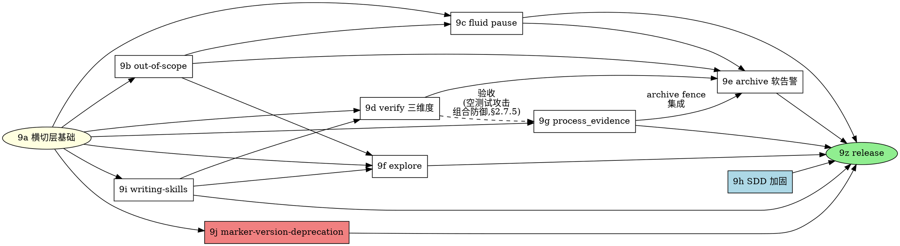

# Plan 9 — forge v1.0 fusion completion 实施 master plan

> **For agentic workers:** REQUIRED SUB-SKILL: superpowers:subagent-driven-development(推荐)或 superpowers:executing-plans。Steps 用 checkbox(`- [ ]`)语法跟踪。**本 master plan 仅做总览 + 依赖图 + sub-plan 索引;每个 sub-plan(9a..9z)在该 phase 实施前单独 invoke writing-plans 展开**(沿 forge v0.4 plan-8 模式)。

**Goal**:实施 forge v1.0 fusion completion 设计 — OpenSpec UX 哲学全恢复 + superpowers process discipline 反向覆盖修复;9 个子模块单议题深做,标志 forge fusion 真正达成产品定位。

**Architecture**:9 个子模块按依赖关系分 phase 实施。§2.3 横切层(三级分级 + critical_candidate + JCS + ack 两步协议)+ §2.7.6 CLI helper 框架是**基础**(其他子模块依赖)。§2.6 out-of-scope 协议提供 fence 数据形态(被 §2.1 / §2.4 / §2.5 引用)。§2.9 writing-skills 协议是新 skill 开发前提(被 §2.2 / §2.5 引用)。9h SDD / 9g process_evidence 相对独立(仅依赖 9a)。

**Tech Stack**:Node 20+ / TypeScript ESM / commander 12 / yaml / @anthropic-ai/sdk(若 §2.2 LLM-judge 路径)/ **canonicalize npm 包**(B-4 修订 JCS,RFC 8785 实现,新增依赖)/ **git worktree 操作**(BLOCKER #3 修订,通过 child_process 调 git CLI)/ **junit-xml-parser 或等价 reporter parser**(MAJOR #20 修订,新增依赖,具体包在 9g 选定)。

**Spec 引用**:[`2026-05-10-v1.0-fusion-completion-design.md`](../specs/2026-05-10-v1.0-fusion-completion-design.md) v3(1892 行;§1 动机 + 横切架构总览;§2 9 子模块详细设计;§3 非目标 + enforcement matrix + deprecation)

**前置**:
- v0.4.0 已发布(2026-05-10),`forge migrate` 已可用
- feature branch `feature/v1.0-fusion-completion-design` 已 commit design v3(`b823f6e`)
- superpowers v5.1.0 用户级安装(用于 §2.9 bootstrap exception)

---

## 0. 总览(10 phase + release phase,codex 审查 BLOCKER #4 + #2 + 多 MAJOR 修订)

| Phase | 子 plan 文件 | spec 引用 | P50 工日 | P90 工日 | 关键依赖 |
|---|---|---|---|---|---|
| **9a** | [plan-9a-cross-cutting-base.md](2026-05-10-plan-9a-cross-cutting-base.md) | §2.3 全节 + §2.7.6 CLI helper 框架 + **§2.3.7 validate/archive 横切 fence 集成**(BLOCKER #1 修订,补) | **6** | 8 | 无(基础) |
| **9b** | [plan-9b-out-of-scope.md](2026-05-10-plan-9b-out-of-scope.md) | §2.6 全节 + **三 skill 区分指引接口**(MAJOR 修订:9b 末段产出 exploring/receiving-code-review/verifying-three-dimensions 三 skill 共用的区分指引文档) | **3.5** | 4.5 | 9a |
| **9c** | [plan-9c-fluid-pause.md](2026-05-10-plan-9c-fluid-pause.md) | §2.1 全节(pause_decisions + Fluid Pause Decision Point) | **2.5** | 3.5 | 9a, 9b |
| **9d** | [plan-9d-verify-three-dimensions.md](2026-05-10-plan-9d-verify-three-dimensions.md) | §2.2 全节 + **`commands/verify.md` 修订**(MAJOR 修订:补)+ LLM-judge 集成 | **5.5** | 7 | 9a, 9i |
| **9e** | [plan-9e-archive-soft-warning.md](2026-05-10-plan-9e-archive-soft-warning.md) | §2.4 全节(archive_summary + 三级 fence + handoff_to_backlog) | **3.5** | 4.5 | 9a, 9b, 9c, 9d, **9g**(archive fence 集成,MAJOR 修订:补依赖) |
| **9f** | [plan-9f-explore.md](2026-05-10-plan-9f-explore.md) | §2.5 全节 | **3** | 4 | 9a, 9b, 9i |
| **9g** | [plan-9g-process-evidence.md](2026-05-10-plan-9g-process-evidence.md) | §2.7 全节(process_evidence + 13 不变量 + worktree 重跑 + reporter parsing) | **7** | 9 | 9a;**9d 验收依赖**(沿 v3 §2.7.5 第 8 攻击场景需 §2.7 + §2.2 组合防御,BLOCKER #3 修订) |
| **9h** | [plan-9h-sdd-discipline.md](2026-05-10-plan-9h-sdd-discipline.md) | §2.8 全节 | **2.5** | 3.5 | 无(独立);与 9c/9g 在 `commands/apply.md` 有串行合并点 |
| **9i** | [plan-9i-writing-skills.md](2026-05-10-plan-9i-writing-skills.md) | §2.9 全节 | **2.5** | 3.5 | 9a |
| **9j**(BLOCKER #2 修订:从 9z 分出独立 phase) | [plan-9j-marker-version-deprecation.md](2026-05-10-plan-9j-marker-version-deprecation.md) | §3.4 全节(`created_by_tool_version` 字段 + `forge upgrade --resign-markers` 子命令 + legacy 精确豁免表 + version retrograde fence) | **2.5** | 3.5 | 9a |
| **9z** | [plan-9z-release.md](2026-05-10-plan-9z-release.md) | CHANGELOG + release-gate-checklist § v1.0 + `init.ts:38` 文本更新 + 全 verification + npm publish | **0.5** | 1 | 9a-9j 全部 |

**总计**:**P50 39 工日 / P90 52 工日**(BLOCKER 二轮 #1 修订:v2 加入 9j 后总计未跟新,本次算术修正:6+3.5+2.5+5.5+3.5+3+7+2.5+2.5+2.5+0.5=39 P50;8+4.5+3.5+7+4.5+4+9+3.5+3.5+3.5+1=52 P90)。

**P50 / P90 工日重估理由**:
- 原 v1 估算 25.5 工日按 v0.4 plan-8 的 1.75x 直接放大,**乐观偏差**
- v3 design §1.4 显式说"议题 1 单独 ≈ v0.4 forge migrate 全部 14.5 工日";v1.0 是 9 子模块远超议题 1,工程量约 v0.4 的 2.7x → P50 ≈ 39
- v0.4 plan-8 spec 写"~16-18 浮动",实际经历 60+ 修订(沿 CHANGELOG `## [0.4.0]` 段),实际工日 ≥ spec 估算 ≥ 14.5;v1.0 同样会经历类似 review-修订循环 → P90 ≈ 52(P50 + 33% buffer)
- 各 sub-plan 工日按"实施 + 测试 + forge-eval scenario + 文档"四要素估算,sub-plan 实施时若发现新设计漏洞触发 v3.X minor revision,需另算工日

**版本号叙事**(沿 v3 design §1.4):走 v1.0 而非 v0.5,标志 fusion 完成。

**版本拆分选项**(MAJOR 修订:重新定义边界,避免命名冲突):

- **选项 A — 一次性发 v1.0.0**(全 P50 39 工日):9a-9z 串行 / 部分并行,**单人 8 周(P50)/ 10-11 周(P90)**(BLOCKER 二轮 #7 修订:重算);**多 agent + 接口冻结后 5-6 周**。release notes 一次性
- **选项 B — 拆 alpha/rc 序列发布**(BLOCKER 二轮 #1 修订:slice 重算闭合):
  - `v1.0.0-alpha.1`(P50 17 工日):9a(6)+ 9j(2.5)+ 9b(3.5)+ 9h(2.5)+ 9i(2.5)— 基础层 + deprecation + 行为塑造前置 + SDD 加固
  - `v1.0.0-rc.1`(P50 13.5 工日):9c(2.5)+ 9d(5.5)+ 9f(3)+ 9e1 archive 最小闭环(2.5)— rc1 必须含 archive enforcement 否则 verify 协议无终态
  - `v1.0.0-rc.2`(P50 8 工日):9g(7)+ 9e2 process_evidence 集成(1)— archive 完整(反伪造 + handoff_to_backlog)
  - `v1.0.0`(P50 0.5 工日):9z — release tag + CHANGELOG + npm publish
  - **slice 总和 = 17 + 13.5 + 8 + 0.5 = 39**(与 §0 总计闭合)
- **选项 C — 拆 alpha/rc 序列**(原选项 C 命名 v1.0.0 / v1.0.1 / v1.0.2 与 fusion completion 语义冲突;BLOCKER 二轮 #1 修订:重命名 + slice 重算):
  - `v1.0.0-alpha.1`(P50 14.5 工日):9a(6)+ 9b(3.5)+ 9j(2.5)+ 9h(2.5)— 基础协议层
  - `v1.0.0-alpha.2`(P50 10.5 工日):9c(2.5)+ 9d(5.5)+ 9i(2.5)— 协议层
  - `v1.0.0-rc.1`(P50 10.5 工日):9e(3.5)+ 9g(7)— 完整 fence 体系
  - `v1.0.0`(P50 3.5 工日):9f(3)+ 9z(0.5)— explore + release tag,**fusion completion 完整**
  - **slice 总和 = 14.5 + 10.5 + 10.5 + 3.5 = 39**(与 §0 总计闭合)

**推荐**:**选项 A 单人路径**(P50 5-7 周)— 一次性 v1.0.0 发布最符合"fusion completion"叙事;但实施过程允许 v3.1 minor revision 兜底。选项 B/C 仅在中途发现重大设计漏洞需多次 user feedback 时启动。本 master plan 不锁定版本号拆分,实施时 9z phase 根据 9a-9j 完成情况决定。

---

## 1. 实施依赖图(BLOCKER #3 修订:加 9d → 9g 验收依赖 + 9g → 9e archive 集成 + 9j 独立 phase)



**可并行的 phase**(假设多 agent 实施):
- **9h SDD** 独立(无前置),可与 9a 并行启动
- **9j marker-version-deprecation** 仅依赖 9a,可与 9b-9d 并行
- **9i writing-skills** 仅依赖 9a,可与 9b-9c 并行
- **9b out-of-scope** 是 9c / 9e / 9f 的前置,需先于这三个完成
- **9g process_evidence** 实施可与 9b-9c 并行(schema/helper 部分),但**验收里程碑 M5 必须等 9d 完成**(沿 BLOCKER #3 修订:空测试攻击需 §2.7 + §2.2 三维度组合防御)
- **`commands/apply.md` 有 9c / 9g / 9h 三方修改合并点**(MAJOR 修订:三 sub-plan 都改这个文件,需安排串行 merge 顺序,推荐:9h → 9c → 9g)

**关键路径**(单人 / 单 agent 串行):**9a(6) → 9i(2.5) → 9d(5.5) → 9g(7) → 9e(3.5) → 9z(0.5)= 25 工日 P50**(BLOCKER #3 修订关键:9g 进了关键路径,因为 9e archive fence 集成依赖 9g)。

P90 关键路径:9a(8) → 9i(3.5) → 9d(7) → 9g(9) → 9e(4.5) → 9z(1) = **33 工日 P90**。

---

## 2. File Structure(全部 9 phase 完成时仓库改动汇总)

### 2.1 新增 src/ 文件

```
src/core/canonical-json.ts                      ← 9a:JCS / RFC 8785 序列化器
src/core/schemas/severity.ts                    ← 9a:三级 enum + candidate_type 6 类 enum
src/core/schemas/process-evidence.ts            ← 9g:`forge-process-evidence/v1`(13 不变量)
src/core/schemas/scope-entries.ts               ← 9b:`forge-scope-entries/v1`(8 字段)
src/core/schemas/archive-summary.ts             ← 9e:`forge-archive-summary/v1`
src/core/markers/content-hash.ts                ← 9b 修订:section 解析改 anchor ID 而非标题字面
src/core/worktree.ts                            ← 9g:git worktree 隔离重跑帮助函数
src/core/test-reporters/junit.ts                ← 9g:JUnit XML reporter parser
src/core/test-reporters/index.ts                ← 9g:reporter 注册 + factory(支持 junit / tap / vitest-json)
src/cli/commands/ack.ts                         ← 9a:propose / confirm / reject 三子命令
src/cli/commands/evidence.ts                    ← 9a:record-tdd / record-verify / record-review 三子命令
src/cli/commands/preflight.ts                   ← 9h:branch-check 子命令
src/cli/commands/scope.ts                       ← 9b:scan-archived-followups 子命令
```

### 2.2 新增 skills/ 文件

```
skills/verifying-three-dimensions/SKILL.md      ← 9d:三维度分析 skill(~250-400 LOC)
skills/exploring/SKILL.md                       ← 9f:explore skill(~300-500 LOC)
skills/writing-skills/SKILL.md                  ← 9i:forge writing-skills(~150-200 LOC,reference superpowers)
skills/writing-skills/forge-eval-integration.md ← 9i 配套
skills/writing-skills/frontmatter-conventions.md← 9i 配套
```

### 2.3 新增 commands/ 文件

```
commands/explore.md                             ← 9f:`/forge:explore` slash(~30 LOC)
commands/ack-confirm.md                         ← 9a:`/forge:ack-confirm` slash(~50 LOC)
```

### 2.4 修改的现有文件

```
src/cli/commands/archive.ts                     ← 9e + 9g:fence 13 不变量 + 三级分级 + worktree + ack-log + pending-acks 残留检测 + legacy 豁免 + version retrograde 拒签
src/cli/commands/validate.ts                    ← 9a + 9b + 9d + 9g:CRITICAL finding_hash + scope YAML 校验 + 三维度 LLM 调用 + process_evidence 子检
src/cli/commands/init.ts                        ← 9z:warning 文本 "v0.4 移除" → "v1.2 移除"(B-7 修订)
src/core/archive/transaction.ts                 ← 9e:Move 前 archive_summary `.tmp` 写入 + Move 后 rename + 失败回滚
src/core/schemas/types.ts                       ← 9a:统一 severity enum + candidate_type;9b:scope-entries 引用;9g:process_evidence 引用
src/core/parse/yaml.ts                          ← 9b:加 fenced YAML block 提取(scope-entries)
forge/config.yaml schema                        ← 9g:process_verification + test.reporter + ack.allow_ci_mode;9h:protected_branches

commands/apply.md                               ← 9c + 9h + 9g:Fluid Pause Decision Point + Critical Plan Review + STOP triggers + record-tdd helper 调用
commands/verify.md                              ← 9d + 9g:三维度分析协议 + record-verify helper 调用
commands/review.md                              ← 9a:severity 全名约束(沿 §2.3.5 简码迁移)
commands/archive.md                             ← 9e + 9g:三级分级行为 + archive_summary 生成 + 13 不变量校验
commands/propose.md                             ← 9b:扫 archived followups + 写 superseding_entries

skills/subagent-driven-development/SKILL.md     ← 9c + 9g + 9h:DESIGN_ISSUE_FOUND 第 5 档 + Main Agent STOP Triggers + record-tdd 报告字段
skills/test-driven-development/SKILL.md         ← 9g:RED commit 不可省略硬约束 + tdd_exemption 路径
skills/receiving-code-review/SKILL.md           ← 9a + 9b:severity 全名 + 区分指引(SUGGESTION vs out-of-scope)
skills/using-forge/SKILL.md                     ← 9f + 9i:explore 入口 + writing-skills 入口
```

### 2.5 新增 forge-eval/ 文件

```
forge-eval/scenarios/verifying-three-dimensions.yaml  ← 9d
forge-eval/scenarios/exploring.yaml                   ← 9f
forge-eval/scenarios/writing-skills.yaml              ← 9i(bootstrap_exception: true)
forge-eval/scenarios/process-evidence.yaml            ← 9g(7 攻击场景 RED + 1 GREEN)
forge-eval/scenarios/main-agent-stop.yaml             ← 9h
```

### 2.6 新增 tests/ 文件

```
tests/cli/ack-cli.test.ts                       ← 9a:CI 模式拒绝 / propose-confirm 流 / pending file 协议
tests/cli/evidence-helpers.test.ts              ← 9a:三 helper 语义 + ack-log append-only
tests/cli/severity-fence.test.ts                ← 9a:candidate 验证 / 篡改 finding_hash 拒签 / 降级 ack
tests/cli/process-evidence-fence.test.ts        ← 9g:13 不变量 × 7 攻击场景 + 三档 mode + worktree
tests/cli/archive-three-level-fence.test.ts     ← 9e:CRITICAL 拒签 / WARNING acked / SUGGESTION 持挂
tests/cli/archive-summary.test.ts               ← 9e:YAML schema + handoff_to_backlog
tests/cli/apply-preflight.test.ts               ← 9h:分支保护
tests/cli/verify-findings-fence.test.ts         ← 9d:三维度 fence
tests/core/canonical-json.test.ts               ← 9a:JCS 确定性
tests/core/scope-entries.test.ts                ← 9b:YAML 解析 + anchor + content_hash 排除
tests/core/worktree.test.ts                     ← 9g:worktree 隔离
tests/skills/critical-plan-review.test.ts       ← 9h
tests/eval/writing-skills-protocol.test.ts      ← 9i
```

### 2.7 修改 forge-repo 根级 / docs/

```
docs/release-gate-checklist.md                  ← 9z:加 § v1.0 段
CHANGELOG.md                                    ← 9z:v1.0.0 段
package.json                                    ← 9a:加 canonicalize 依赖;9g:加 reporter parser 依赖
```

---

## 3. 各 sub-plan 概览(codex 审查 BLOCKER + MAJOR 修订)

每个 sub-plan 在该 phase 实施前**单独 invoke writing-plans skill 展开**(避免现在写好但实施时 codebase 已变);**实施前必须先完成 §3.12 Interface Freeze Appendix 的接口冻结**(MAJOR §3 修订:lazy 策略风险缓解)。

### 3.1 plan-9a 横切层基础(P50 6 工日 / P90 8 工日,BLOCKER #1 修订:从 4 上调,补 §2.3.7 全部条目)

**Goal**:critical_candidate 协议 + 三级分级 + JCS canonical-json + ack 两步协议 + CLI helper 框架 + **validate/archive 横切 fence 集成**。

**核心交付**:
- `src/core/canonical-json.ts` + tests
- `src/core/schemas/severity.ts`(三级 enum + candidate_type 6 类 enum)
- `src/cli/commands/ack.ts`(propose / confirm / reject)+ `commands/ack-confirm.md` slash
- `src/cli/commands/evidence.ts`(record-tdd / record-verify / record-review)
- `forge/changes/<id>/.evidence/{ack-log.jsonl, pending-acks/}` 目录协议
- **`src/cli/commands/validate.ts`**:加自动产 CRITICAL finding 时输出 `finding_hash`(JCS,沿 §2.3.6);candidate 路径独立验证算法骨架(BLOCKER #1 修订)
- **`src/cli/commands/archive.ts`**:横切 fence 调用入口(具体 13 不变量在 9g 实现,框架在 9a 立)
- **`skills/receiving-code-review/SKILL.md`**:severity 字段从装饰升级参与门禁;加判定指引段(沿 §2.3.4)
- **`src/cli/commands/upgrade.ts`**:**9a 不修改本文件**(BLOCKER 二轮 #5 修订:9a/9j 边界明确化 — `--resign-markers` 子命令完全归 9j 独立实施,9j 接入时直接在 v0.3 现有 `--dry-run/--recover/--gc` option 后加 `--resign-markers`)
- **archive fence stub 合约**(BLOCKER 二轮 #6 修订:9a→9g 过渡期行为定义):9a 立"横切 fence 调用入口"框架,但 9g 完成前 13 不变量未实现。9a 实施时定义 fence stub 合约:
  - 未实现的不变量返回 `{ status: 'not_implemented', invariant_id: <id> }`
  - archive 命令默认遇到 `not_implemented` → **fail with exit code 2**(io 类,沿 §3.12.3)+ stderr 提示"fence not ready, complete 9g first"
  - 加 `--allow-stub-fence` flag(开发期 only,**不出现在 release CLI**),9a 测试时使用此 flag 绕开未实现 fence;CI 的 release gate 拒绝该 flag
  - 9g 完成时移除 `--allow-stub-fence` flag,fence 全实现进 production
- 单元测试覆盖三组 fence(JCS / severity / ack-log)+ pending-acks 残留检测拒签 + fence stub 合约(`not_implemented` 行为)

**风险**:
- canonicalize 包跨平台 / Node 版本兼容性(需在 Linux + Windows runner 测)
- AskUserQuestion 在 OpenCode / Codex harness 的 fallback(沿 §2.3.3 B 两步协议)
- 9a 是 9b/9c/9d/9f/9g/9i/9j 的基础,实施延误会级联

### 3.2 plan-9b out-of-scope 协议(P50 3.5 工日 / P90 4.5 工日,MAJOR 修订:补缺失交付项)

**Goal**:scope-entries schema + anchor ID + content_hash 排除三段 + propose 阶段扫 archived followups + **三 skill 区分指引共用文档**。

**核心交付**:
- `src/core/schemas/scope-entries.ts`(`forge-scope-entries/v1`)
- proposal.md / design.md 模板加 anchor ID(`{#forge-oos}` / `{#forge-non-goals}` / `{#forge-future-work}`)
- `src/core/markers/content-hash.ts` 修订(section 解析改 anchor ID)
- `src/cli/commands/scope.ts scan-archived-followups`
- `commands/propose.md` 加 §"Pending follow-ups 扫描"段
- `src/cli/commands/validate.ts` 加 scope YAML schema 校验(语法错产 CRITICAL finding,MAJOR 修订:补)
- **`skills/_shared/scope-category-guidance.md`**(BLOCKER 二轮 #8 修订:从 `docs/skill-shared/` 移到 `skills/_shared/` — `docs/` 不在 `copy-templates.mjs` / `forge update` 部署路径内,runtime 三 skill 引用会 404;`skills/_shared/` 在部署路径内,沿现有 skills/ 同步规则);**实施时同步扩展 `scripts/copy-templates.mjs` 识别 `_shared/` 子目录 + 文档化 `forge update` 部署清单加 `_shared/`**;被 9d/9f + receiving-code-review 三 skill reference
- 单元测试覆盖 anchor 识别 / content_hash 排除 / superseding_entries forward-reference

### 3.3 plan-9c apply fluid pause(P50 2.5 工日 / P90 3.5 工日)

**Goal**:pause_decisions schema + Fluid Pause Decision Point + AskUserQuestion 模板 + DESIGN_ISSUE_FOUND 第 5 档 status。

**核心交付**:
- pause_decisions schema(在 marker schema 内 superset additive)
- `commands/apply.md` 加 §"Fluid Pause Decision Point"段(注:与 9g/9h 在 apply.md 有合并点,推荐 merge 顺序 9h → 9c → 9g)
- `skills/subagent-driven-development/SKILL.md` 加 DESIGN_ISSUE_FOUND status
- fence 五类校验(option 1-4 + non_blocking_rationale 必填)
- **`tests/cli/archive-pause-fence.test.ts`**(MAJOR 修订:补,覆盖五 chosen_option × CRITICAL 重定向 × marker 缺失老兼容 × non_blocking_rationale 缺失拒签)

### 3.4 plan-9d verify 三维度(P50 5.5 工日 / P90 7 工日,MAJOR 修订:从 3.5 上调,补 commands/verify.md)

**Goal**:`forge:verifying-three-dimensions` skill + verify_findings schema + 三维度分析(Completeness / Correctness / Coherence)+ LLM-judge 集成 + **`commands/verify.md` 重构**。

**核心交付**:
- 走 §2.9 / 9i 协议开发新 skill(RED → GREEN scenario)
- `skills/verifying-three-dimensions/SKILL.md`(~250-400 LOC,4-6 标定 example,引用 9b 区分指引)
- verify_findings schema(在 .verify-passed marker 内 superset)
- `src/cli/commands/validate.ts` 加 LLM 调用路径(用 `@anthropic-ai/sdk`,沿 v0.1 forge-eval 模式 + AbortController + budget)
- finding_hash 自动产 + 篡改拒签
- **`commands/verify.md`**(MAJOR 修订:补)— 加 §"三维度分析"段调新 skill;原"测试 pass + log_hash"步骤保留作为 Completeness 的 task-completion 子项
- **`src/cli/commands/archive.ts`**:fence 加 verify_findings 三类校验(沿 §2.2.4)
- forge-eval scenario `verifying-three-dimensions.yaml`(RED + GREEN)

**风险**:
- LLM-judge 调用成本(本地开发 vs CI 限流);可参考 v0.1 forge-eval 的 budget 实现
- 9i 必须先完成(用 `forge:writing-skills` 协议开发本 skill)
- **9d 完成后才能验收 9g M5 里程碑**(沿 BLOCKER #3 修订:空测试攻击需组合防御)

### 3.5 plan-9e archive 软告警放行(P50 3.5 工日 / P90 4.5 工日,MAJOR 修订:从 2.5 上调,加 9g 依赖)

**Goal**:archive_summary.yaml + 三级 fence + handoff_to_backlog + `.tmp` 草稿生命周期。

**核心交付**:
- `src/core/schemas/archive-summary.ts`
- `src/core/archive/transaction.ts` 修订(Move 前 `.tmp` 写入 + Move 后 rename + 失败回滚)
- `src/cli/commands/archive.ts` 三级判定 + `--resume-summary` flag + handoff_to_backlog 三类 input 聚合(沿 §2.4.3)
- `commands/archive.md` 加 §"v1.0 三级分级行为"段 + §"archive_summary 输出"段
- `src/cli/commands/validate.ts` 加孤立 `.tmp` 扫描
- 单元测试 + fixture(模拟 acked-warning + pending-suggestion + pause-decision 的 change)

**关键依赖**(MAJOR 修订:补):
- **9g 完成前 9e 只能完成"summary/transaction/三级判定"基础部分**;`process_evidence` 13 不变量校验 archive 集成在 9g 完成后才能验收
- 实施时建议拆 9e1(基础 archive_summary + 三级 fence,~2.5 工日)和 9e2(process_evidence archive 集成,~1 工日);9e2 必须在 9g 完成后启动

### 3.6 plan-9f explore 命令(P50 3 工日 / P90 4 工日)

**Goal**:`/forge:explore` 新命令 + `forge:exploring` skill + capture decisions 协议。

**核心交付**:
- 走 §2.9 / 9i 协议开发 skill
- `skills/exploring/SKILL.md`(~300-500 LOC,4-6 标定 example)
- `commands/explore.md` slash
- `skills/using-forge/SKILL.md` skill chain 加 explore + 红旗清单
- forge-eval scenario `exploring.yaml`(3 scenarios:vague idea / mid-implementation / option compare)
- 不引入 CLI fence(沿 §2.5.8)

### 3.7 plan-9g process_evidence(P50 7 工日 / P90 9 工日,**最高风险**;MAJOR 修订:从 5 上调,显式分三阶段)

**Goal**:process_evidence schema + 13 fence 不变量 + worktree 隔离重跑 + 结构化 reporter parsing + 7 攻击场景 RED scenario。

**实施分阶段**(MAJOR 修订:9g 范围大,显式拆三阶段):

- **9g.1 schema + helper**(~2 工日,P50):`process-evidence.ts` schema;`worktree.ts` helpers;`evidence record-tdd` helper 内部跑测试 + 结构化 reporter 输出
- **9g.2 reporter parsing**(~2 工日,P50):`junit.ts` / `tap.ts` / `vitest-json.ts` parser + factory + tests(覆盖 vitest / jest / mocha 三家 JUnit XML 差异)
- **9g.3 archive integration + RED scenario**(~3 工日,P50):`archive.ts` 加 13 不变量 fence(含 worktree 重跑 + ack-log 校验 + legacy 豁免);forge-eval `process-evidence.yaml`(7 攻击 RED + 1 GREEN);集成测试 fixture 项目跑 archive end-to-end

**核心交付**(总):
- `src/core/schemas/process-evidence.ts`(13 不变量定义)
- `src/core/worktree.ts`(git worktree add / remove + cleanup)
- `src/core/test-reporters/{junit,tap,vitest-json}.ts` + `index.ts` factory
- `src/cli/commands/archive.ts` fence 加 13 不变量校验(含 worktree 重跑 + reporter parse + ack-log 校验 + legacy 豁免 + version retrograde 沿 9j)
- `forge/config.yaml` 加 `process_verification` + `test.reporter` 配置
- `commands/{apply,verify}.md` 加 record-tdd / record-verify helper 调用(注:apply.md 与 9c/9h 有合并点)
- `skills/{subagent-driven-development,test-driven-development}/SKILL.md` 修订(report fields + RED 不可省略)
- forge-eval scenario `process-evidence.yaml`(7 攻击 RED + 1 GREEN)
- 单元测试 + 集成测试

**风险**(最高,P50→P90 加 28% buffer 但仍可能超):
- worktree 隔离在 Windows + Linux 行为差异(磁盘空间 / 路径 / 权限 / git lock)
- 实际重跑测试时长(用户项目可能很大,full mode 默认会让 archive 跑很久)
- 不同测试框架 reporter 格式差异(vitest / jest / mocha 各家 JUnit XML 格式略有不同)
- 7 攻击 RED scenario 设计成本(每个攻击需 fixture + 期望 fence 行为)
- **验收依赖 9d**(沿 BLOCKER #3 修订:M5 必须等 9d verify 三维度完成才能宣称)

### 3.8 plan-9h SDD 实施前置纪律加固(P50 2.5 工日 / P90 3.5 工日,MAJOR 修订:从 1.5 上调)

**Goal**:Critical Plan Review + Main Agent STOP triggers + 分支保护 CLI preflight。

**核心交付**:
- `src/cli/commands/preflight.ts` `branch-check` 子命令
- `forge/config.yaml` 加 `protected_branches`
- `commands/apply.md` 步骤 0 调 preflight + 步骤 3.5 加 Critical Plan Review + 禁止行为段(注:apply.md 与 9c/9g 有合并点,推荐 merge 顺序 9h → 9c → 9g)
- `skills/subagent-driven-development/SKILL.md` 加 §"Main Agent STOP Triggers"
- `tests/cli/apply-preflight.test.ts` + `tests/skills/critical-plan-review.test.ts`
- forge-eval scenario `main-agent-stop.yaml`(RED:AI 在 main 直跑 / 重试失败 task ≥ 3 次绕过 / GREEN:正常前置 review 通过)

### 3.9 plan-9i forge 化 writing-skills(P50 2.5 工日 / P90 3.5 工日)

**Goal**:`forge:writing-skills` skill + bootstrap exception + RED-GREEN-REFACTOR 协议落地。

**核心交付**:
- `skills/writing-skills/SKILL.md`(~150-200 LOC,reference superpowers 上游)
- `skills/writing-skills/forge-eval-integration.md` + `frontmatter-conventions.md`
- `skills/using-forge/SKILL.md` 加 writing-skills 入口
- forge-eval scenario `writing-skills.yaml`(`bootstrap_exception: true` 标记)
- **bootstrap 实施**:用 superpowers `writing-skills` 开发 forge `writing-skills`(走完整 RED → SKILL → GREEN → REFACTOR)

**注**:9i 必须早于 9d / 9f(因为 9d / 9f 的新 skill 用 9i 协议开发);若 9i 延迟,9d / 9f 退回 ad-hoc 开发(作为 fallback,但不推荐)。

### 3.10 plan-9j marker version + deprecation(P50 2.5 工日 / P90 3.5 工日;BLOCKER #2 修订:从 9z release 分出独立 phase)

**Goal**:marker `created_by_tool_version` 字段 + `forge upgrade --resign-markers` 子命令 + legacy 精确豁免 + version retrograde fence。

**核心交付**:
- marker schema 加 `created_by_tool_version` 字段(沿 §3.4.1)
- `src/cli/commands/upgrade.ts` 扩展 `--resign-markers` 子命令(沿 v0.3 已有 `forge upgrade`):
  - 简码 severity 处理(`S → CRITICAL` / `L → SUGGESTION` 自动;`C` 走两步 propose/confirm 询问;`blocking` 字符串 same)
  - 不自动填空 process_evidence / verify_findings / pause_decisions(沿 §3.4.4 B-3 修订)
  - 改标 `process_evidence_unavailable_legacy: true`
  - 写 ack-log.jsonl(action=resign + 用户 confirm)
- `src/cli/commands/archive.ts` 加 legacy 精确豁免表(13 不变量中 #1-#8/#10/#13 跳,#9/#11/#12 保留 + 反向加固;legacy ⊥ version >= 1.0.0 互斥,沿 §3.4.4.1)
- `src/cli/commands/archive.ts` 加 version retrograde fence(沿 §3.4.4.3:不接受 version 字段从高版本回降低版本;git history 检查;legacy=true 与 version>=1.0.0 互斥)
- 单元测试覆盖三类 marker 情景(沿 §3.4.2:archived old / active old / new)

**风险**:
- 与 v0.4 用户 active change 兼容(测试 fixture 含 v0.4 marker 真实样本)
- 交互式询问 `C` 简码在 CI 模式拒绝 → 用户必须本地走 resign

**DoD**(NIT 二轮 #10 修订:补,沿其他 sub-plan 格式):
- `forge upgrade --resign-markers` CLI test 通过(三类 marker 情景:archived old / active old / new)
- ack-log.jsonl 写入验收(action=resign 行字段全)
- exit code 验收(沿 §3.12.3:0/1/2 三档)
- 与 9a 共享接口冻结(`upgrade.ts` 接入点不重定义)
- 集成测试 fixture 含 v0.4 真实样本 + 'C' 简码交互式 propose/confirm 流

### 3.11 plan-9z release(P50 0.5 工日 / P90 1 工日)

**Goal**:release-gate-checklist § v1.0 + CHANGELOG + npm publish + 全 verification。

**核心交付**:
- `docs/release-gate-checklist.md` 加 § v1.0 段(沿 v0.3 / v0.4 模式)
- `CHANGELOG.md` 加 v1.0.0 段(主题 + 9 子模块概要 + codex review 修订记录)
- `init.ts:38` warning 文本更新("v0.4" → "v1.2",B-7 修订;**注:本次只更新文本,实际移除 init 在 v1.2**)
- 全本地 verify(typecheck / lint / format:check / build / vitest)+ Linux + Windows CI 全绿
- 9z 决定版本号拆分(选项 A/B/C 沿本 master plan §0)
- npm publish

---

## 3.12 Interface Freeze Appendix(MAJOR §3 修订:lazy sub-plan 风险缓解)

**为什么需要**:9 个 sub-plan 在 phase 实施前才单独 invoke writing-plans 展开,但跨 sub-plan **共享接口**(schema / CLI exit code / ack-log JSONL shape / 错误码)如果未冻结,后续 sub-plan 实施时会撞墙。

**冻结时机**:9a 实施时由 9a 负责将本 Appendix 列出的接口写入 `src/core/schemas/` 和 `src/core/canonical-json.ts` 等模块,作为 single source of truth;后续 sub-plan 实施时 reference,**不重新定义**。

### 3.12.1 共享 finding / severity 字段冻结

| 字段名 | 类型 | 冻结来源 |
|---|---|---|
| `severity` | enum: `'CRITICAL' \| 'WARNING' \| 'SUGGESTION'` | v3 design §2.3.2 |
| `automated` | boolean | v3 design §2.3.3 |
| `severity_candidate` | enum: `'CRITICAL'`(只能 CRITICAL,不能其他) | v3 design §2.3.3 A |
| `candidate_type` | enum: 6 类(test_failure / hash_mismatch / evidence_missing / coverage_gap / api_contract / manual_claim) | v3 design §2.3.3 A |
| `severity_candidate_rejected` | boolean | v3 design §2.3.3 A |
| `candidate_rejected_reason` | string | v3 design §2.3.3 A |
| `finding_hash` | string(SHA256 of JCS payload) | v3 design §2.3.6 |
| `severity_acked_by` | string(user identifier) | v3 design §2.3.3 B |
| `severity_acked_at` | ISO 8601 timestamp | v3 design §2.3.3 B |
| `downgraded_from / downgraded_to / downgrade_acked_by / downgrade_rationale` | strings | v3 design §2.3.3 C |
| `evidence` | string(5 类格式之一,沿 §2.3.3 D) | v3 design §2.3.3 D |
| `created_by_tool_version` | semver string(e.g., "1.0.0") | v3 design §3.4.1 |
| `process_evidence_unavailable_legacy` | boolean | v3 design §3.4.4.1 |

### 3.12.1bis 跨 plan schema 冻结(BLOCKER 二轮 #2 修订:补 process_evidence / archive_summary / scope-entries 三 schema)

#### `process_evidence` schema 顶级字段(实现 sub-plan:9g)

| 字段 | 类型 | required |
|---|---|---|
| `version` | semver string | required |
| `tdd_event_chain` | array of TddEvent | optional(老 marker 缺即 legacy) |
| `verify_invocations` | array of VerifyInvocation | optional |
| `subagent_review_chain` | array of ReviewIteration | optional |
| `env_hash` | string(JCS hash) | required(若 tdd_event_chain 非空) |
| `worktree_paths` | array of string | optional(失败回滚追溯) |

每个子结构(TddEvent / VerifyInvocation / ReviewIteration)字段在 9g.1 实施时锁死,跨 plan 后续 sub-plan 引用不重定义。

#### `archive_summary` schema 顶级字段(实现 sub-plan:9e)

| 字段 | 类型 | required |
|---|---|---|
| `version` | semver string | required |
| `archived_at` | ISO 8601 | required |
| `change_id` | string | required |
| `verify_passed` | object(含 verified_invariants list) | required |
| `review_passed` | object(含 reviewers list) | required |
| `process_evidence_summary` | object(13 不变量 pass/fail/legacy 分布) | required |
| `handoff_to_backlog` | array of HandoffEntry | required(三类 input 聚合,沿 v3 §2.4.3) |
| `acked_warnings` | array of AckedWarningRef | required |
| `pending_suggestions` | array of SuggestionRef | required |

#### `scope-entries` schema 顶级字段(实现 sub-plan:9b)

| 字段 | 类型 | required |
|---|---|---|
| `entries` | array of ScopeEntry(out-of-scope / non-goal / future-work 各类型) | required |
| `superseding_entries` | array of SupersedingRef(forward-reference,沿 v3 §2.6.4) | optional |
| `anchor_id` | enum: `'forge-oos' \| 'forge-non-goals' \| 'forge-future-work'` | required(每段一个) |

### 3.12.2 文件路径冻结

| 用途 | 路径 |
|---|---|
| ack-log | `forge/changes/<id>/.evidence/ack-log.jsonl` |
| pending-acks | `forge/changes/<id>/.evidence/pending-acks/<finding-id>-<timestamp>.yaml` |
| archive_summary 草稿 | `forge/changes/<id>/archive_summary.tmp.yaml` |
| archive_summary 正式 | `forge/changes/archive/YYYY-MM-DD-<id>/archive_summary.yaml` |
| skill 区分指引共用文档 | `skills/_shared/scope-category-guidance.md`(BLOCKER 二轮 #8 修订:从 `docs/skill-shared/` 移到 `skills/_shared/` 进部署路径) |

### 3.12.3 CLI exit code 冻结(BLOCKER 二轮 #4 修订:补 validate / upgrade / scope)

按"success / business-fail / io-error / ci-refuse"四语义槽对齐:

| 子命令 | 0(success) | 1(business-fail) | 2(io / ci-refuse) | 3(corrupt) |
|---|---|---|---|---|
| `forge ack propose` | — | 1 = 已写 pending file,待用户 confirm | 2 = CI 模式拒绝 | — |
| `forge ack confirm/reject` | 0 = 成功写 marker + ack-log | — | 2 = pending file 不存在 | 3 = ack-log corrupt |
| `forge preflight branch-check` | 0 = 通过 | — | 2 = 保护分支拒签 / 非 git | — |
| `forge evidence record-*` | 0 = 成功 append marker | — | 2 = git / 测试 / reporter parse error | 3 = ack-log corrupt |
| `forge archive` | 0 = archive 成功 | 1 = fence 拒签(任一不变量违反) | 2 = lock 持有 / fs 错误 | 3 = marker / archive_summary corrupt |
| `forge validate` | 0 = 全 PASS | 1 = CRITICAL findings 存在 | 2 = config / fs 错误 | — |
| `forge upgrade --resign-markers` | 0 = 全 marker resign 成功 | 1 = 部分 marker resign 失败(用户拒签 / 字段冲突) | 2 = CI 模式拒绝 / fs 错误 | — |
| `forge scope scan-archived-followups` | 0 = 输出 active entries(JSON) | — | 2 = archive 目录不可读 | — |

### 3.12.4 ack-log.jsonl 一行 schema(BLOCKER 二轮 #3 修订:加 evidence-helper kind)

ack-log 现支持两类记录,通过 `kind` 判别字段区分:

#### kind = "ack"(用户 ack 类,沿原设计)

```json
{
  "schema": "forge-ack-log/v1",
  "kind": "ack",
  "timestamp": "ISO8601",
  "action": "ack-warning|downgrade|ack-mode|ack-tdd-exemption|resign|reject",
  "change_id": "string",
  "finding_id": "string|null(resign 不绑定 finding)",
  "user": "string",
  "rationale": "string|null",
  "git_head": "string(40-char SHA)|null(非 git 项目)",
  "finding_hash": "string|null(JCS hash,resign 不绑定)",
  "extra": {}
}
```

#### kind = "evidence-helper"(CLI helper 调用类,新增,沿 v3 design §2.7.6)

每次 `forge evidence record-tdd / record-verify / record-review` 调用产一行:

```json
{
  "schema": "forge-ack-log/v1",
  "kind": "evidence-helper",
  "timestamp": "ISO8601",
  "helper_name": "record-tdd|record-verify|record-review",
  "change_id": "string",
  "task_ref": "string(tasks.md#task-N)",
  "payload_hash": "string(JCS SHA256 of helper input)",
  "status": "success|partial|failed",
  "git_head": "string(40-char SHA)",
  "extra": {}
}
```

每行一个 JSON object;append-only;不允许编辑或删除已有行(fence 校验文件 hash 一致)。fence 在 archive 阶段同时验两类:
- `kind=ack` 行的 marker 字段 ↔ ack-log 一致性
- `kind=evidence-helper` 行的 payload_hash 与 marker 中对应 process_evidence 子字段 hash 一致

---

## 4. 实施顺序与里程碑(MAJOR §4.1 修订:拆单人 / 多 agent 两版 + MINOR §0 算术修正)

### 4.1 单人 schedule(P50 8 周 / P90 10-11 周)(BLOCKER 二轮 #7 修订:从 5-7 周上调,每周不溢出 5 工作日)

**前提**:单工程师串行实施,关键路径 9a → 9i → 9d → 9g → 9e → 9z(P50 25 工日 / P90 33 工日)。Off-critical-path 的 9b/9c/9f/9h/9j 在关键路径间隙实施。**每周严格 ≤ 5 工作日**(BLOCKER 二轮 #7 修订:原排程 Week 2/5/6 溢出到 6-6.5d 是把并行工日塞进串行周,本次重排)。

```
Week 1: 9a(6d 跨 Week 1-2)— Day 1-5
Week 2: 9a 收尾(1d)+ 9b(3.5d)+ 9h 启动(0.5d)— Day 6-10
Week 3: 9h(2d)+ 9i(2.5d)+ buffer(0.5d)— Day 11-15
Week 4: 9j(2.5d)+ 9d 启动(2.5d)— Day 16-20
Week 5: 9d 收尾(3d)+ 9c(2d)— Day 21-25
Week 6: 9c 收尾(0.5d)+ 9g.1(2d)+ 9g.2(2d)+ buffer(0.5d)— Day 26-30
Week 7: 9g.3(3d)+ 9e1 启动(2d)— Day 31-35
Week 8: 9e 收尾(1.5d)+ 9f(3d)+ 9z(0.5d)— Day 36-40(剩 1d buffer)
```

总:6+3.5+2.5+2.5+2.5+5.5+2.5+4+3+3.5+3+0.5 = **39 工日**(与 §0 总计闭合)。

注:**单人不可同时开两 task**;sub-plan 跨周允许(如 9a 跨 Week 1-2 / 9d 跨 Week 4-5 / 9c 跨 Week 5-6 / 9e 跨 Week 7-8),但单天工作量不超 1 task。

### 4.2 多 agent schedule(接口冻结后,P50 4-5 周 / P90 5-7 周)

**前提**:多 agent 并行实施,§3.12 Interface Freeze 完成后启动并行;关键路径仍是 9a → 9i → 9d → 9g → 9e → 9z。

```
Week 1:  9a(6d 单 agent)→ §3.12 接口冻结
Week 2:  9b(3.5d)+ 9h(2.5d)+ 9j(2.5d)+ 9i(2.5d)4 agent 并行
Week 3:  9c(2.5d)+ 9d(5.5d 关键路径)+ 9g.1+9g.2(4d)+ 9f(3d)4 agent 并行
Week 4:  9d 收尾 + 9g.3(3d)+ 9e1 基础(2.5d 并行 — 不依赖 9g)
Week 5:  9e2 process_evidence 集成(1d,**MINOR 二轮 #9 修订:必须在 9g.3 完成后启动**)+ 9z(0.5d)+ release tag
```

注:
- 多 agent 假设 sub-plan 互不阻塞 + 接口稳定 + 文件冲突点(`commands/apply.md` 等)有 merge 协调(沿 §3.3 / §3.7 / §3.8 commit merge 顺序约定)
- **9e1 与 9g.3 可 Week 4 并行**(9e1 = archive_summary + 三级 fence 基础,不依赖 process_evidence);**9e2 必须在 9g.3 完成后启动**(沿 §3.5 关键依赖,MINOR 二轮 #9 修订)

### 4.3 关键里程碑

| Milestone | 含义 | 触发 |
|---|---|---|
| **M0**:接口冻结(MAJOR §3 修订:新加) | §3.12 Interface Freeze Appendix 中所有共享接口写入 `src/core/schemas/` + `canonical-json.ts` | 9a 完成第 1-2 工日 |
| **M1**:横切层就绪 | 9a 完成,其他 sub-plan 可启动 | `forge ack propose` / `forge evidence record-tdd` / `canonical-json.ts` 全部测试通过 |
| **M2**:数据形态层 + 版本层就绪 | 9b + 9j 完成,§2.1 / §2.4 / §2.5 fence 数据来源齐全 + marker 版本字段就绪 | scope-entries schema + anchor + content_hash 排除测试通过;`forge upgrade --resign-markers` PASS |
| **M3**:行为塑造层就绪 | 9i 完成,§2.2 / §2.5 新 skill 可按协议开发 | bootstrap exception 完成 + forge-eval scenario PASS |
| **M4**:协议核心齐全 | 9c + 9d + 9e1 完成,fluid pause + 三维度 + archive 软告警基础端到端 | 集成测试覆盖 mid-implementation 全流程 |
| **M5**:反伪造层就绪(BLOCKER #3 修订) | 9g 完成,process_evidence 7 攻击 RED scenario 全 GREEN;**与 9d 组合验收**(空测试攻击需 §2.7 + §2.2 组合防御) | forge-eval `process-evidence.yaml` PASS + 9d verify 三维度 PASS + 集成测试覆盖空测试攻击场景 |
| **M6**:explore + 纪律加固 + archive 完整 | 9f + 9h + 9e2 完成 | 全部 9 个子模块就绪 |
| **M7**:release | 9z 完成,v1.0.0 publish | npm publish 成功 + CI 全绿 + tag 推送 |

---

## 5. 不在本 plan 范围(沿 v3 design §3.1 推迟项)

- Backlog registry 集中 derived view(v1.1 — 依赖本 plan 9b 产出的 archive_summary)
- specs-sync delete 支持(v1.1 — deletion marker 设计独立)
- OpenCode / Codex plugin 协议升级(v1.1 — `/forge:*` Tier 2/3 修复)
- skill eval baseline 重跑(v1.1 — Sonnet 4.6 / 4.7 校准)
- dogfood forge 自管理(v1.1 单独主题)
- 移除 deprecated `forge init`(v1.2)
- harness smoke 进 CI(v1.2)

---

## 6. 修订记录

- **v1**(2026-05-10):初稿 — 基于 v3 design(commit `b823f6e`)拆 9 sub-plan + release phase。Master plan 仅做总览,sub-plan 各 phase 实施前单独 invoke writing-plans 展开
- **v2**(2026-05-10):codex 一轮 plan 审查 16 条全采纳(4 BLOCKER + 10 MAJOR + 2 MINOR)
  - **4 BLOCKER**:
    - 总工日重估 25.5 → P50 35.5 / P90 51.5(沿 v3 design §1.4 + v0.4 实际经验)
    - §3.4 deprecation 实施从 9z 分出独立 9j sub-plan(`created_by_tool_version` + `forge upgrade --resign-markers` + legacy 精确豁免 + version retrograde fence)
    - 依赖图加 9d → 9g 验收依赖(空测试攻击需 §2.7 + §2.2 组合防御)
    - 9a 交付补完(validate.ts CRITICAL finding_hash + archive.ts 横切 fence + receiving-code-review skill 升级)
  - **10 MAJOR**:
    - schedule 拆单人 / 多 agent 两版(原 5 周 schedule 单人不可并行)
    - 选项 B rc1 重新定义边界(必须含 archive enforcement)
    - 选项 C 改 alpha/rc 序列(原 v1.0.0 含不完整 9 子模块语义错)
    - 9g 拆三阶段(9g.1 schema/helper / 9g.2 reporter / 9g.3 archive integration)
    - 9e 加 9g 依赖(archive fence 集成);拆 9e1 基础 + 9e2 集成
    - 9b 补 archive_summary handoff 聚合 + 三 skill 区分指引共用文档
    - 9c 补 archive-pause-fence.test.ts
    - 9d 补 commands/verify.md;工日 3.5 → 5.5
    - 9h 工日 1.5 → 2.5(改文件多于初估)
    - **加 §3.12 Interface Freeze Appendix**(锁死跨 sub-plan 共享 schema / 文件路径 / CLI exit code / ack-log shape)
  - **2 MINOR**:
    - forge-eval 路径统一(单文件 yaml 形态,沿 v0.4 实际)
    - 选项 A schedule 算术修正(25.5/5=5.1 周不是 3-4 周;改单人 5-7 周 / 多 agent 4-5 周)
- **v3**(2026-05-10):codex 二轮 plan 审查 19 条全采纳(2 BLOCKER + 6 MAJOR + 1 MINOR + 1 NIT 新问题 + 8 PARTIAL + 1 INCORRECT 验收)
  - **BLOCKER**:
    - **总工日算术错**(v2 加 9j 后总计 35.5 / 51.5 未跟新):重算 P50 39 / P90 52(子 plan 直接加法验证);选项 B/C slice 重算闭合(选项 B = 17+13.5+8+0.5=39;选项 C = 14.5+10.5+10.5+3.5=39)
    - **§3.12 Interface Freeze 加 process_evidence / archive_summary / scope-entries 三 schema 冻结**(原版仅冻结 finding/severity 字段族,漏跨 plan schema)
  - **MAJOR**:
    - ack-log schema 加 `kind: "ack" | "evidence-helper"` 判别(原版仅 ack 形态,漏 evidence-helper 调用类)
    - CLI exit code 完整化(补 validate / upgrade / scope;按 success/business-fail/io/corrupt 四语义槽对齐)
    - 9a / 9j upgrade.ts 边界明确化:9a **不修改** upgrade.ts;9j 独立加 `--resign-markers` option
    - 9a → 9g 过渡期 fence stub 合约定义:未实现不变量返回 `not_implemented` + 默认 archive fail exit 2 + 开发期 `--allow-stub-fence` flag(release 阶段移除)
    - 单人 schedule 重排 8 周(原 5-7 周溢出 5d/周,本次每周严格 ≤ 5d;sub-plan 跨周允许但单天单 task)
    - skill-shared 文档从 `docs/skill-shared/` 移到 `skills/_shared/`(原路径不在部署清单内,runtime 引用 404)+ 同步扩展 `copy-templates.mjs`
  - **MINOR**:
    - 多 agent schedule 明确 9e2 必须在 9g.3 完成后启动(原 Week 4 并行容易误读)
  - **NIT**:
    - 9j 补 DoD(沿其他 sub-plan 格式,CLI test / ack-log 验收 / exit code 验收 + v0.4 fixture)

---

## 7. Self-Review

### 7.1 Spec coverage

| v3 design § | sub-plan 覆盖 |
|---|---|
| §1 动机 + 横切架构 | 不需要直接实施(论证类) |
| §2.1 fluid pause | 9c |
| §2.2 verify 三维度 | 9d |
| §2.3 三级分级 + AI 反向加固(横切层) | 9a |
| §2.4 archive 软告警 | 9e |
| §2.5 `/forge:explore` | 9f |
| §2.6 Out-of-Scope 协议 | 9b |
| §2.7 行为证据 marker | 9g |
| §2.8 SDD 实施前置纪律 | 9h |
| §2.9 forge writing-skills 协议 | 9i |
| §3.1 v1.1+ 推迟项 | 不实施(本 plan §5 列出) |
| §3.2 v1.0 内不做 | 不实施 |
| §3.3 不变量 + enforcement matrix | 9a-9i 各 sub-plan 内部约束(每个 sub-plan 实施时校验本 phase 不破坏 §3.3 不变量) |
| §3.4 deprecation 时间窗口 | **9j**(BLOCKER #2 修订:从 9z 分出独立 phase — `created_by_tool_version` + `forge upgrade --resign-markers` + legacy 精确豁免 + version retrograde fence)+ 9z(release 阶段固化 deprecation warning + init.ts 文本更新) |

**结论**:全部 v3 design 实施性条款都被 sub-plan 覆盖。

### 7.2 Placeholder scan

本 master plan 仅做总览,不含具体步骤代码。每个 sub-plan 实施前单独 invoke writing-plans 展开,届时按 writing-plans skill "No Placeholders" 严格要求(每步含真实代码 / 测试 / 命令 / 期望输出)。

### 7.3 Type consistency

本 master 不定义类型 / 函数签名。各 sub-plan 内部保证一致性(实施时 sub-plan A 引用 sub-plan B 的类型时,以 sub-plan B 实际产出的 .ts 文件为准)。

跨 sub-plan 共享类型(如 severity enum / candidate_type / canonical-json 接口)由 9a 锁死,后续 sub-plan reference 不重定义。
