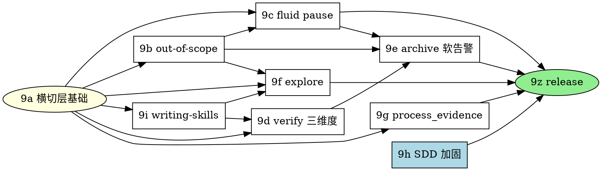

# Plan 9 — forge v1.0 fusion completion 实施 master plan

> **For agentic workers:** REQUIRED SUB-SKILL: superpowers:subagent-driven-development(推荐)或 superpowers:executing-plans。Steps 用 checkbox(`- [ ]`)语法跟踪。**本 master plan 仅做总览 + 依赖图 + sub-plan 索引;每个 sub-plan(9a..9z)在该 phase 实施前单独 invoke writing-plans 展开**(沿 forge v0.4 plan-8 模式)。

**Goal**:实施 forge v1.0 fusion completion 设计 — OpenSpec UX 哲学全恢复 + superpowers process discipline 反向覆盖修复;9 个子模块单议题深做,标志 forge fusion 真正达成产品定位。

**Architecture**:9 个子模块按依赖关系分 phase 实施。§2.3 横切层(三级分级 + critical_candidate + JCS + ack 两步协议)+ §2.7.6 CLI helper 框架是**基础**(其他子模块依赖)。§2.6 out-of-scope 协议提供 fence 数据形态(被 §2.1 / §2.4 / §2.5 引用)。§2.9 writing-skills 协议是新 skill 开发前提(被 §2.2 / §2.5 引用)。9h SDD / 9g process_evidence 相对独立(仅依赖 9a)。

**Tech Stack**:Node 20+ / TypeScript ESM / commander 12 / yaml / @anthropic-ai/sdk(若 §2.2 LLM-judge 路径)/ **canonicalize npm 包**(B-4 修订 JCS,RFC 8785 实现,新增依赖)/ **git worktree 操作**(BLOCKER #3 修订,通过 child_process 调 git CLI)/ **junit-xml-parser 或等价 reporter parser**(MAJOR #20 修订,新增依赖,具体包在 9g 选定)。

**Spec 引用**:[`2026-05-10-v1.0-fusion-completion-design.md`](../specs/2026-05-10-v1.0-fusion-completion-design.md) v3(1892 行;§1 动机 + 横切架构总览;§2 9 子模块详细设计;§3 非目标 + enforcement matrix + deprecation)

**前置**:
- v0.4.0 已发布(2026-05-10),`forge migrate` 已可用
- feature branch `feature/v1.0-fusion-completion-design` 已 commit design v3(`b823f6e`)
- superpowers v5.1.0 用户级安装(用于 §2.9 bootstrap exception)

---

## 0. 总览(9 phase + release phase)

| Phase | 子 plan 文件 | spec 引用 | 工日估算 | 关键依赖 |
|---|---|---|---|---|
| **9a** | [plan-9a-cross-cutting-base.md](2026-05-10-plan-9a-cross-cutting-base.md) | §2.3 全节 + §2.7.6 CLI helper 框架 | 4 | 无(基础) |
| **9b** | [plan-9b-out-of-scope.md](2026-05-10-plan-9b-out-of-scope.md) | §2.6 全节(scope-entries schema + anchor ID + 跨 change 兜底) | 2.5 | 9a |
| **9c** | [plan-9c-fluid-pause.md](2026-05-10-plan-9c-fluid-pause.md) | §2.1 全节(pause_decisions + Fluid Pause Decision Point) | 2 | 9a, 9b |
| **9d** | [plan-9d-verify-three-dimensions.md](2026-05-10-plan-9d-verify-three-dimensions.md) | §2.2 全节(`forge:verifying-three-dimensions` skill + verify_findings) | 3.5 | 9a, 9i |
| **9e** | [plan-9e-archive-soft-warning.md](2026-05-10-plan-9e-archive-soft-warning.md) | §2.4 全节(archive_summary + 三级 fence + handoff_to_backlog) | 2.5 | 9a, 9b, 9c, 9d |
| **9f** | [plan-9f-explore.md](2026-05-10-plan-9f-explore.md) | §2.5 全节(`/forge:explore` + `forge:exploring` skill + capture decisions) | 2.5 | 9a, 9b, 9i |
| **9g** | [plan-9g-process-evidence.md](2026-05-10-plan-9g-process-evidence.md) | §2.7 全节(process_evidence + 13 不变量 + worktree 重跑 + reporter parsing) | 5 | 9a |
| **9h** | [plan-9h-sdd-discipline.md](2026-05-10-plan-9h-sdd-discipline.md) | §2.8 全节(critical plan review + STOP + branch protection + `forge preflight branch-check`) | 1.5 | 无(独立) |
| **9i** | [plan-9i-writing-skills.md](2026-05-10-plan-9i-writing-skills.md) | §2.9 全节(`forge:writing-skills` + bootstrap exception + RED/GREEN scenario) | 2 | 9a |
| **9z** | [plan-9z-release.md](2026-05-10-plan-9z-release.md) | §3.4 deprecation + CHANGELOG + release-gate-checklist § v1.0 | 0.5 | 9a-9i 全部 |

**总计**:**~25.5 工日**(对照 v0.4 plan-8 的 ~14.5 工日,v1.0 工程量约 1.75x — 因为 9 子模块 + 横切层比 v0.4 单议题 forge migrate 大)。

**版本号叙事**(沿 v3 design §1.4):走 v1.0 而非 v0.5,标志 fusion 完成。

**版本拆分选项**:
- **选项 A — 一次性发 v1.0.0**(全 25.5 工日):9a-9z 串行 / 部分并行,~3-4 周完成。release notes 一次性
- **选项 B — 拆 rc1 / rc2**:
  - `v1.0.0-rc1`(~13 工日):9a + 9b + 9h + 9i + 9c + 9d — 基础 + 协议层 + apply/verify 协议
  - `v1.0.0-rc2`(~12.5 工日):9e + 9f + 9g + 9z — archive / explore / process_evidence + release
- **选项 C — 拆 v1.0 / v1.0.1 / v1.0.2 minor 版本**(更小 release):
  - `v1.0.0`(~9 工日):9a + 9b + 9c + 9h(横切层 + out-of-scope + apply pause + SDD 加固)
  - `v1.0.1`(~10 工日):9d + 9g + 9i(verify 三维度 + process_evidence + writing-skills)
  - `v1.0.2`(~5.5 工日):9e + 9f + 9z(archive 软告警 + explore + release)

**推荐**:实施时根据 phase 完成进度动态决定 — 若 9a-9c 完成顺利且测试 stable,可走 A;若中途发现新设计漏洞需 v3.1 minor revision,可拆 B/C 给中间发布机会。本 master plan 不锁定版本号拆分,实施时 9z phase 决定。

---

## 1. 实施依赖图



**可并行的 phase**:
- **9h SDD** 独立(无前置),可与 9a 并行启动
- **9g process_evidence** 仅依赖 9a,可与 9b-9d 并行
- **9i writing-skills** 仅依赖 9a,可与 9b-9c 并行
- **9b out-of-scope** 是 9c / 9e / 9f 的前置,需先于这三个完成

**关键路径**:9a → 9i → 9d → 9e(累计 ~12 工日;含 9d 的 LLM-judge skill eval 时间)

---

## 2. File Structure(全部 9 phase 完成时仓库改动汇总)

### 2.1 新增 src/ 文件

```
src/core/canonical-json.ts                      ← 9a:JCS / RFC 8785 序列化器
src/core/schemas/severity.ts                    ← 9a:三级 enum + candidate_type 6 类 enum
src/core/schemas/process-evidence.ts            ← 9g:`forge-process-evidence/v1`(13 不变量)
src/core/schemas/scope-entries.ts               ← 9b:`forge-scope-entries/v1`(8 字段)
src/core/schemas/archive-summary.ts             ← 9e:`forge-archive-summary/v1`
src/core/markers/content-hash.ts                ← 9b 修订:section 解析改 anchor ID 而非标题字面
src/core/worktree.ts                            ← 9g:git worktree 隔离重跑帮助函数
src/core/test-reporters/junit.ts                ← 9g:JUnit XML reporter parser
src/core/test-reporters/index.ts                ← 9g:reporter 注册 + factory(支持 junit / tap / vitest-json)
src/cli/commands/ack.ts                         ← 9a:propose / confirm / reject 三子命令
src/cli/commands/evidence.ts                    ← 9a:record-tdd / record-verify / record-review 三子命令
src/cli/commands/preflight.ts                   ← 9h:branch-check 子命令
src/cli/commands/scope.ts                       ← 9b:scan-archived-followups 子命令
```

### 2.2 新增 skills/ 文件

```
skills/verifying-three-dimensions/SKILL.md      ← 9d:三维度分析 skill(~250-400 LOC)
skills/exploring/SKILL.md                       ← 9f:explore skill(~300-500 LOC)
skills/writing-skills/SKILL.md                  ← 9i:forge writing-skills(~150-200 LOC,reference superpowers)
skills/writing-skills/forge-eval-integration.md ← 9i 配套
skills/writing-skills/frontmatter-conventions.md← 9i 配套
```

### 2.3 新增 commands/ 文件

```
commands/explore.md                             ← 9f:`/forge:explore` slash(~30 LOC)
commands/ack-confirm.md                         ← 9a:`/forge:ack-confirm` slash(~50 LOC)
```

### 2.4 修改的现有文件

```
src/cli/commands/archive.ts                     ← 9e + 9g:fence 13 不变量 + 三级分级 + worktree + ack-log + pending-acks 残留检测 + legacy 豁免 + version retrograde 拒签
src/cli/commands/validate.ts                    ← 9a + 9b + 9d + 9g:CRITICAL finding_hash + scope YAML 校验 + 三维度 LLM 调用 + process_evidence 子检
src/cli/commands/init.ts                        ← 9z:warning 文本 "v0.4 移除" → "v1.2 移除"(B-7 修订)
src/core/archive/transaction.ts                 ← 9e:Move 前 archive_summary `.tmp` 写入 + Move 后 rename + 失败回滚
src/core/schemas/types.ts                       ← 9a:统一 severity enum + candidate_type;9b:scope-entries 引用;9g:process_evidence 引用
src/core/parse/yaml.ts                          ← 9b:加 fenced YAML block 提取(scope-entries)
forge/config.yaml schema                        ← 9g:process_verification + test.reporter + ack.allow_ci_mode;9h:protected_branches

commands/apply.md                               ← 9c + 9h + 9g:Fluid Pause Decision Point + Critical Plan Review + STOP triggers + record-tdd helper 调用
commands/verify.md                              ← 9d + 9g:三维度分析协议 + record-verify helper 调用
commands/review.md                              ← 9a:severity 全名约束(沿 §2.3.5 简码迁移)
commands/archive.md                             ← 9e + 9g:三级分级行为 + archive_summary 生成 + 13 不变量校验
commands/propose.md                             ← 9b:扫 archived followups + 写 superseding_entries

skills/subagent-driven-development/SKILL.md     ← 9c + 9g + 9h:DESIGN_ISSUE_FOUND 第 5 档 + Main Agent STOP Triggers + record-tdd 报告字段
skills/test-driven-development/SKILL.md         ← 9g:RED commit 不可省略硬约束 + tdd_exemption 路径
skills/receiving-code-review/SKILL.md           ← 9a + 9b:severity 全名 + 区分指引(SUGGESTION vs out-of-scope)
skills/using-forge/SKILL.md                     ← 9f + 9i:explore 入口 + writing-skills 入口
```

### 2.5 新增 forge-eval/ 文件

```
forge-eval/scenarios/verifying-three-dimensions.yaml  ← 9d
forge-eval/scenarios/exploring.yaml                   ← 9f
forge-eval/scenarios/writing-skills.yaml              ← 9i(bootstrap_exception: true)
forge-eval/scenarios/process-evidence.yaml            ← 9g(7 攻击场景 RED + 1 GREEN)
forge-eval/scenarios/main-agent-stop.yaml             ← 9h
```

### 2.6 新增 tests/ 文件

```
tests/cli/ack-cli.test.ts                       ← 9a:CI 模式拒绝 / propose-confirm 流 / pending file 协议
tests/cli/evidence-helpers.test.ts              ← 9a:三 helper 语义 + ack-log append-only
tests/cli/severity-fence.test.ts                ← 9a:candidate 验证 / 篡改 finding_hash 拒签 / 降级 ack
tests/cli/process-evidence-fence.test.ts        ← 9g:13 不变量 × 7 攻击场景 + 三档 mode + worktree
tests/cli/archive-three-level-fence.test.ts     ← 9e:CRITICAL 拒签 / WARNING acked / SUGGESTION 持挂
tests/cli/archive-summary.test.ts               ← 9e:YAML schema + handoff_to_backlog
tests/cli/apply-preflight.test.ts               ← 9h:分支保护
tests/cli/verify-findings-fence.test.ts         ← 9d:三维度 fence
tests/core/canonical-json.test.ts               ← 9a:JCS 确定性
tests/core/scope-entries.test.ts                ← 9b:YAML 解析 + anchor + content_hash 排除
tests/core/worktree.test.ts                     ← 9g:worktree 隔离
tests/skills/critical-plan-review.test.ts       ← 9h
tests/eval/writing-skills-protocol.test.ts      ← 9i
```

### 2.7 修改 forge-repo 根级 / docs/

```
docs/release-gate-checklist.md                  ← 9z:加 § v1.0 段
CHANGELOG.md                                    ← 9z:v1.0.0 段
package.json                                    ← 9a:加 canonicalize 依赖;9g:加 reporter parser 依赖
```

---

## 3. 各 sub-plan 概览

每个 sub-plan 在该 phase 实施前**单独 invoke writing-plans skill 展开**(避免现在写好但实施时 codebase 已变,导致 plan 过期)。本节给出各 sub-plan 的目标 + 核心交付,作为 sub-plan 写作时的输入。

### 3.1 plan-9a 横切层基础(4 工日)

**Goal**:建立 critical_candidate 协议 + 三级分级 + JCS canonical-json + ack 两步协议 + CLI helper 框架。

**核心交付**:
- `src/core/canonical-json.ts` + tests
- `src/core/schemas/severity.ts`(三级 enum + candidate_type 6 类 enum)
- `src/cli/commands/ack.ts`(propose / confirm / reject)+ `commands/ack-confirm.md` slash
- `src/cli/commands/evidence.ts`(record-tdd / record-verify / record-review)
- `forge/changes/<id>/.evidence/{ack-log.jsonl, pending-acks/}` 目录协议
- 单元测试覆盖三组 fence(JCS / severity / ack-log)

**风险**:
- canonicalize 包跨平台 / Node 版本兼容性(需在 Linux + Windows runner 测)
- AskUserQuestion 在 OpenCode / Codex harness 的 fallback(沿 §2.3.3 B,可能需要终端 prompt)

### 3.2 plan-9b out-of-scope 协议(2.5 工日)

**Goal**:scope-entries schema + anchor ID + content_hash 排除三段 + propose 阶段扫 archived followups。

**核心交付**:
- `src/core/schemas/scope-entries.ts`(`forge-scope-entries/v1`)
- proposal.md / design.md 模板加 anchor ID(`{#forge-oos}` / `{#forge-non-goals}` / `{#forge-future-work}`)
- `src/core/markers/content-hash.ts` 修订(section 解析改 anchor ID)
- `src/cli/commands/scope.ts scan-archived-followups`
- `commands/propose.md` 加 §"Pending follow-ups 扫描"段
- 单元测试覆盖 anchor 识别 / content_hash 排除 / superseding_entries forward-reference

### 3.3 plan-9c apply fluid pause(2 工日)

**Goal**:pause_decisions schema + Fluid Pause Decision Point + AskUserQuestion 模板 + DESIGN_ISSUE_FOUND 第 5 档 status。

**核心交付**:
- pause_decisions schema(在 marker schema 内 superset additive)
- `commands/apply.md` 加 §"Fluid Pause Decision Point"段
- `skills/subagent-driven-development/SKILL.md` 加 DESIGN_ISSUE_FOUND status
- fence 五类校验(option 1-4 + non_blocking_rationale 必填)
- 单元测试覆盖五 chosen_option × CRITICAL 重定向 × marker 缺失老兼容

### 3.4 plan-9d verify 三维度(3.5 工日)

**Goal**:`forge:verifying-three-dimensions` skill + verify_findings schema + 三维度分析(Completeness / Correctness / Coherence)+ LLM-judge 集成。

**核心交付**:
- 走 §2.9 / 9i 协议开发新 skill(RED → GREEN scenario)
- `skills/verifying-three-dimensions/SKILL.md`(~250-400 LOC,4-6 标定 example)
- verify_findings schema(在 .verify-passed marker 内 superset)
- `src/cli/commands/validate.ts` 加 LLM 调用路径(用 `@anthropic-ai/sdk`,沿 v0.1 forge-eval 模式 + AbortController)
- finding_hash 自动产 + 篡改拒签
- forge-eval scenario `verifying-three-dimensions.yaml`(RED + GREEN)

**风险**:
- LLM-judge 调用成本(本地开发 vs CI 限流);可参考 v0.1 forge-eval 的 budget 实现
- 9i 必须先完成(用 `forge:writing-skills` 协议开发本 skill)

### 3.5 plan-9e archive 软告警放行(2.5 工日)

**Goal**:archive_summary.yaml + 三级 fence + handoff_to_backlog + `.tmp` 草稿生命周期。

**核心交付**:
- `src/core/schemas/archive-summary.ts`
- `src/core/archive/transaction.ts` 修订(Move 前 `.tmp` 写入 + Move 后 rename + 失败回滚)
- `src/cli/commands/archive.ts` 三级判定 + `--resume-summary` flag
- `commands/archive.md` 加 §"v1.0 三级分级行为"段 + §"archive_summary 输出"段
- `src/cli/commands/validate.ts` 加孤立 `.tmp` 扫描
- 单元测试 + fixture(模拟 acked-warning + pending-suggestion + pause-decision 的 change)

### 3.6 plan-9f explore 命令(2.5 工日)

**Goal**:`/forge:explore` 新命令 + `forge:exploring` skill + capture decisions 协议。

**核心交付**:
- 走 §2.9 / 9i 协议开发 skill
- `skills/exploring/SKILL.md`(~300-500 LOC,4-6 标定 example)
- `commands/explore.md` slash
- `skills/using-forge/SKILL.md` skill chain 加 explore + 红旗清单
- forge-eval scenario `exploring.yaml`(3 scenarios:vague idea / mid-implementation / option compare)
- 不引入 CLI fence(沿 §2.5.8)

### 3.7 plan-9g process_evidence(5 工日)

**Goal**:process_evidence schema + 13 fence 不变量 + worktree 隔离重跑 + 结构化 reporter parsing + 7 攻击场景 RED scenario。

**核心交付**:
- `src/core/schemas/process-evidence.ts`(13 不变量定义)
- `src/core/worktree.ts`(git worktree add / remove + cleanup)
- `src/core/test-reporters/{junit,tap,vitest-json}.ts`(reporter parser 三套)
- `src/cli/commands/archive.ts` fence 加 13 不变量校验(含 worktree 重跑 + reporter parse + ack-log 校验 + legacy 豁免)
- `forge/config.yaml` 加 `process_verification` + `test.reporter` 配置
- `commands/{apply,verify}.md` 加 record-tdd / record-verify helper 调用
- `skills/{subagent-driven-development,test-driven-development}/SKILL.md` 修订(report fields + RED 不可省略)
- forge-eval scenario `process-evidence.yaml`(7 攻击 RED + 1 GREEN)
- 单元测试 + 集成测试(fixture 项目跑 archive end-to-end)

**风险**(最高):
- worktree 隔离在 Windows + Linux 行为差异(磁盘空间 / 路径 / 权限)
- 实际重跑测试时长(用户项目可能很大,full mode 默认会让 archive 跑很久)
- 不同测试框架 reporter 格式差异(vitest / jest / mocha 各家 JUnit XML 格式略有不同)

### 3.8 plan-9h SDD 实施前置纪律加固(1.5 工日)

**Goal**:Critical Plan Review + Main Agent STOP triggers + 分支保护 CLI preflight。

**核心交付**:
- `src/cli/commands/preflight.ts` `branch-check` 子命令
- `forge/config.yaml` 加 `protected_branches`
- `commands/apply.md` 步骤 0 调 preflight + 步骤 3.5 加 Critical Plan Review + 禁止行为段
- `skills/subagent-driven-development/SKILL.md` 加 §"Main Agent STOP Triggers"
- forge-eval scenario `main-agent-stop.yaml`(RED:AI 在 main 直跑 / 重试失败 task ≥ 3 次绕过)

### 3.9 plan-9i forge 化 writing-skills(2 工日)

**Goal**:`forge:writing-skills` skill + bootstrap exception + RED-GREEN-REFACTOR 协议落地。

**核心交付**:
- `skills/writing-skills/SKILL.md`(~150-200 LOC,reference superpowers 上游)
- `skills/writing-skills/forge-eval-integration.md` + `frontmatter-conventions.md`
- `skills/using-forge/SKILL.md` 加 writing-skills 入口
- forge-eval scenario `writing-skills.yaml`(`bootstrap_exception: true` 标记)
- **bootstrap 实施**:用 superpowers `writing-skills` 开发 forge `writing-skills`(走完整 RED → SKILL → GREEN → REFACTOR)

**注**:9i 必须早于 9d / 9f(因为 9d / 9f 的新 skill 用 9i 协议开发);若 9i 延迟,9d / 9f 退回 ad-hoc 开发(作为 fallback,但不推荐)。

### 3.10 plan-9z release(0.5 工日)

**Goal**:release-gate-checklist § v1.0 + CHANGELOG + 全 verification。

**核心交付**:
- `docs/release-gate-checklist.md` 加 § v1.0 段(沿 v0.3 / v0.4 模式)
- `CHANGELOG.md` 加 v1.0.0 段(主题 + 9 子模块概要)
- `init.ts:38` warning 文本更新("v0.4" → "v1.2",B-7 修订)
- 全本地 verify(typecheck / lint / format:check / build / vitest)+ Linux + Windows CI 全绿
- 9z 决定版本号拆分(选项 A/B/C 沿本 master plan §0)
- npm publish v1.0.0(若选项 A)/ v1.0.0-rc1(若 B)/ v1.0.0(若 C 第一个)

---

## 4. 实施顺序与里程碑

### 4.1 推荐实施排程(单工程师顺序 / 部分并行)

```
Week 1: 9a(4d)+ 9h(1.5d 并行)
Week 2: 9b(2.5d)+ 9i(2d 并行,在 9a 完成后启动)
Week 3: 9c(2d)+ 9g(5d 并行,在 9a 完成后启动)
Week 4: 9d(3.5d,在 9i 完成后启动)+ 9f(2.5d 并行)
Week 5: 9e(2.5d)+ 9g 收尾 + 9z(0.5d)
```

并行实施依赖 §2.7 / §2.9 forge-eval scenario 可独立跑(LLM-judge 不互相阻塞)。

### 4.2 关键里程碑

| Milestone | 含义 | 触发 |
|---|---|---|
| **M1**:横切层就绪 | 9a 完成,其他 sub-plan 可启动 | `forge ack propose` / `forge evidence record-tdd` / `canonical-json.ts` 全部测试通过 |
| **M2**:数据形态层就绪 | 9b 完成,§2.1 / §2.4 / §2.5 fence 数据来源齐全 | scope-entries schema + anchor + content_hash 排除测试通过 |
| **M3**:行为塑造层就绪 | 9i 完成,§2.2 / §2.5 新 skill 可按协议开发 | bootstrap exception 完成 + forge-eval scenario PASS |
| **M4**:协议核心齐全 | 9c + 9d + 9e 完成,fluid pause + 三维度 + archive 软告警 端到端 | 集成测试覆盖 mid-implementation 全流程 |
| **M5**:反伪造层就绪 | 9g 完成,process_evidence 7 攻击 RED scenario 全 GREEN(被 fence 挡住)| forge-eval `process-evidence.yaml` PASS |
| **M6**:explore 与纪律加固完成 | 9f + 9h 完成 | 全部 9 个子模块就绪 |
| **M7**:release | 9z 完成,v1.0.0 / -rc1 publish | npm publish 成功 + CI 全绿 + tag 推送 |

---

## 5. 不在本 plan 范围(沿 v3 design §3.1 推迟项)

- Backlog registry 集中 derived view(v1.1 — 依赖本 plan 9b 产出的 archive_summary)
- specs-sync delete 支持(v1.1 — deletion marker 设计独立)
- OpenCode / Codex plugin 协议升级(v1.1 — `/forge:*` Tier 2/3 修复)
- skill eval baseline 重跑(v1.1 — Sonnet 4.6 / 4.7 校准)
- dogfood forge 自管理(v1.1 单独主题)
- 移除 deprecated `forge init`(v1.2)
- harness smoke 进 CI(v1.2)

---

## 6. 修订记录

- **v1**(2026-05-10):初稿 — 基于 v3 design(commit `b823f6e`)拆 9 sub-plan + release phase。Master plan 仅做总览,sub-plan 各 phase 实施前单独 invoke writing-plans 展开

---

## 7. Self-Review

### 7.1 Spec coverage

| v3 design § | sub-plan 覆盖 |
|---|---|
| §1 动机 + 横切架构 | 不需要直接实施(论证类) |
| §2.1 fluid pause | 9c |
| §2.2 verify 三维度 | 9d |
| §2.3 三级分级 + AI 反向加固(横切层) | 9a |
| §2.4 archive 软告警 | 9e |
| §2.5 `/forge:explore` | 9f |
| §2.6 Out-of-Scope 协议 | 9b |
| §2.7 行为证据 marker | 9g |
| §2.8 SDD 实施前置纪律 | 9h |
| §2.9 forge writing-skills 协议 | 9i |
| §3.1 v1.1+ 推迟项 | 不实施(本 plan §5 列出) |
| §3.2 v1.0 内不做 | 不实施 |
| §3.3 不变量 + enforcement matrix | 9a-9i 各 sub-plan 内部约束(每个 sub-plan 实施时校验本 phase 不破坏 §3.3 不变量) |
| §3.4 deprecation 时间窗口 | 9z(release 阶段固化 deprecation warning + 文档)+ 各 sub-plan 局部(如 9z init.ts 文本更新) |

**结论**:全部 v3 design 实施性条款都被 sub-plan 覆盖。

### 7.2 Placeholder scan

本 master plan 仅做总览,不含具体步骤代码。每个 sub-plan 实施前单独 invoke writing-plans 展开,届时按 writing-plans skill "No Placeholders" 严格要求(每步含真实代码 / 测试 / 命令 / 期望输出)。

### 7.3 Type consistency

本 master 不定义类型 / 函数签名。各 sub-plan 内部保证一致性(实施时 sub-plan A 引用 sub-plan B 的类型时,以 sub-plan B 实际产出的 .ts 文件为准)。

跨 sub-plan 共享类型(如 severity enum / candidate_type / canonical-json 接口)由 9a 锁死,后续 sub-plan reference 不重定义。
