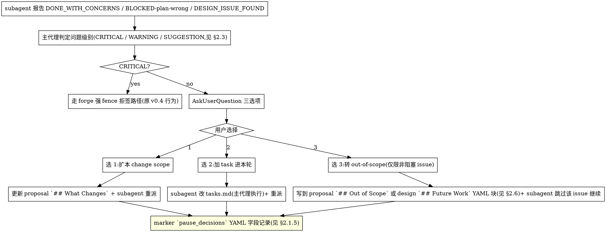
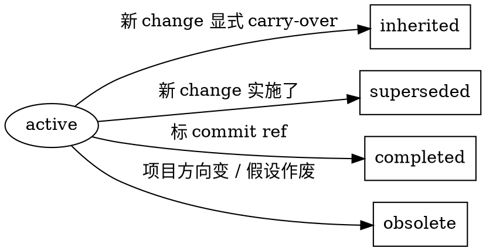

# forge v1.0 主题设计文档(fusion completion)

- **作者**:msc(由 Claude Opus 4.7 协助 brainstorming)
- **日期**:2026-05-10
- **状态**:草案,待用户审阅
- **范围**:**OpenSpec UX 哲学全恢复 + superpowers process discipline 反向覆盖修复**(9 子模块单议题深做)
- **前置版本**:v0.4.0(2026-05-10 发布,主题:forge migrate)
- **关键决策**:
  - 走 v1.0 而非 v0.5 — 标志 fusion 完成,从此 forge 才"配得上"它的产品定位(§1.4)
  - 保留双端缺陷对账表 — 公开承认 fusion-design 当年的论证漏洞(§1.1)
  - deprecation 时间窗口:warning v1.0 → 强制 v1.1(§3.4)

---

## 1. 动机 — 为什么这件事必须做且必须现在做

### 1.1 双端融合缺陷诊断

forge fusion 的产品定位是"融合 superpowers 行为纪律 + OpenSpec 文档管理体系优点"。v0.2 fusion 实施完成后,实际产物对账显示**两边的优点哲学都丢了,只取了文本和命令**。

#### 1.1.1 OpenSpec 端缺陷(用户视角:严格门拦着没出口)

对账分类:**已实现** / **形式不同**(协议存在但形式 / schema 不一致) / **缺 enforcement**(协议存在但 fence / marker 不强制) / **完全缺**。

| OpenSpec 能力 | forge 现状 | 分类 |
|---|---|---|
| 产物结构 + delta + archive 4 件套 | `forge/changes/<id>/{proposal,design,tasks,specs/}` 完整 | **已实现** |
| artifact-graph 依赖图 | `core/artifact-graph/` 实装 | **已实现** |
| schema 系统(可扩展) | `core/schema/types.ts` | **已实现** |
| specs-sync delta 合并 | 内部模块 + 原子事务化加强 | **已实现 + 工程化加强** |
| archive 原子化(Move→Sync→Rollback) | 超越 OpenSpec | **forge 自有强化** |
| YAML marker + hash 绑定 | forge 新增 | **forge 自有强化** |
| **`apply-change.ts` fluid pause-with-Options** | apply 命令直接 dispatch subagent,无 pause 出口 | **完全缺** |
| **`verify-change.ts` 三维度(Completeness/Correctness/Coherence)** | verify 退化为"测试 pass + log_hash" | **完全缺** |
| **CRITICAL/WARNING/SUGGESTION 三级分级** | review_outcomes 有 `severity: 'S'/'C'/'L'` 字段(`fusion-design:559` 定义),但**装饰用,不参与门禁** | **缺 enforcement** |
| **archive 软告警(`Don't block on warnings`)** | archive fence 行为相反 = 严格门拒签 | **形式相反** |
| **`/opsx:explore` mid-implementation 重新探索** | 命令不存在 | **完全缺** |
| **`## Out of Scope` / `## Future Work` 文档约定** | `commands/propose.md:22` 已要求 proposal 含 "Out of scope" 段(自由文本),但**缺结构化 schema + 跨 change 关联机制 + fence enforcement** | **形式不同 + 缺 enforcement** |

#### 1.1.2 superpowers 端缺陷(AI 视角:反正最后有 fence,中间可以放松)

| superpowers 哲学 | forge 现状 | 分类 |
|---|---|---|
| `verification-before-completion` 主动跑 verify 命令 | `verification-before-completion/SKILL.md:22` 已要求 fresh evidence;`/forge:verify` 已能 validate 并打 marker。**但 marker 校验的是结果(log_hash + pass=true)而非行为(主动跑过、跑了几次)** | **缺 enforcement**(行为追溯) |
| `receiving-code-review` "verify before implement" | `receiving-code-review/SKILL.md:12` 已要求 "Verify before implementing";`/forge:review` 已要求接受 / 拒绝判定。**但 marker 没记录 verify 行为是否真发生过,且"接受=必做"压过了"先质疑技术正确性"** | **缺 enforcement**(verify 行为追溯)+ **形式偏向**(强制接受) |
| `test-driven-development` 经历 RED→GREEN 顺序 | `commands/apply.md:22` 已要求 subagent 走 red→green→refactor;TDD skill 已要求 failing test first。**但 archive 阶段不验证顺序事件链(只验最终 log_hash + pass)** | **缺 enforcement**(顺序验证) |
| `executing-plans`(critical plan review / STOP / 分支保护) | `executing-plans` 上游是 `subagent-driven-development` 的 no-subagent fallback(沿 §2.8.1)。forge 三 harness 都有 subagent → 不需要 port 整 skill,但**SDD 缺 3 个子约束:critical plan review / 主代理 STOP / 分支保护** | **形式不同(整 skill 不需要)+ 部分缺**(3 子约束) |
| `writing-skills`(skill 自身的开发协议) | `forge-eval/` 已实施 testing-skills-with-subagents(LLM-judge / RED-GREEN baseline)。**但 RED-GREEN-REFACTOR 写新 skill 流程协议 / frontmatter 规范 / persuasion-principles 缺**(沿 §2.9.1) | **部分实现 + 部分缺**(协议层) |
| superpowers dogfood 自管理 | forge-repo 自己没用 forge 工具开发自己 | **完全缺**(文化) |

**结论**:forge 取的是 OpenSpec 的目录结构 + 命令名 + 工程基础设施 + superpowers 的 skill 文本。OpenSpec 之所以是 OpenSpec 的 UX 主轴(fluid + 用户决策点 + 软告警 + 三级分级)整套丢失;superpowers 之所以是 superpowers 的行为塑造(主动性 + verify before implement + 经历 RED→GREEN)被 forge 的强 fence 反向覆盖。

### 1.2 两个缺陷的同根恶性循环(假设链,待 forge-eval 实证)

**以下是设计假设,不是已实证的事实**。链条的合理性来自机制分析,但具体在 forge 实际使用中"AI 行为模式"是否如此,需要 v1.0 § 2.7 / § 2.9 forge-eval RED scenario 实测验证(沿 §2.7.5 四类 AI 伪造攻击 / §2.9 RED-GREEN baseline)。若实测发现 AI 实际行为与下面假设不符,需回头修订本节论证 + §2.7 反伪造机制。

**假设的恶性循环**:

```
强 fence(OpenSpec UX 哲学丢)
        ↓
让 AI 知道最后有终极拦截
        ↓
中间过程行为纪律松弛(superpowers process discipline 失效) ← 待实证
        ↓
快速冲到 review 阶段发现 issue
        ↓
没有 fluid 出口(OpenSpec 缺陷)
        ↓
主要走 YAGNI 反驳路径挡掉(`receiving-code-review/SKILL.md:88` 是合规出口之一,但用户原话"unused" YAGNI 在面对 scope 类问题时被滥用)← 待实证
        ↓
review 看似过关,实际是行为纪律和 UX 双方失效
```

**根因**(分析,非实证):fusion-design 把 forge 核心防线放在**机制门(YAML marker + hash + git diff)**,而不是**行为塑造**。机制门管**结果**(可伪造),行为纪律管**过程**(持续观察才能伪造)。两者不能互相取代,只能互相补充。

**与 §2.7 / §2.9 forge-eval 的关系**:v1.0 实施时,§2.7 / §2.9 RED scenario 的设计目标之一就是验证本节恶性循环假设是否真的发生。若 RED scenario 显示 AI 在无 process_evidence 强制时**确实**走 happy path、伪造 evidence、滥用 YAGNI,则本节假设链得到实证支持;若 RED 显示 AI 行为已经合规(可能 superpowers skill 文本足够强),则 v1.0 §2.7 反伪造机制属于**预防性加固**而非**修复**,本节论证需修订。

fusion-design 当年漏论证的 trade-off:把"工程化严格性"和"OpenSpec UX 哲学"理解成对立,没意识到 OpenSpec 的 fluid 出口本身就是工程化的一部分(它是"用户决策点"的工具化,不是"放水"的同义词)。

具体证据(`docs/specs/2026-05-04-forge-fusion-design.md` 决策表):

- #11 review 强制度 = "end-of-change 强制(archive 检查 .review-passed)"
- #13 failure 反馈回路 = "**自动追加失败项为 tasks.md 新条目 + archive 阻断**"
- #19 review-passed 时机 = "**仅当本轮接受意见已实现 + 测试通过 + 无新增 task 时才打**"

#19 等于显式拒绝 fluid 出口。但全文 0 处提及 fluid / pause / out-of-scope,说明 fusion 阶段连"OpenSpec 有这个特性,我们要不要要"都**没讨论过**。

### 1.3 为什么不能再推

- **协议性硬伤**:scope 扩张时无 graceful 出口
- **产品定位**:forge 标榜"融合两边优点",当前实际是"两边骨架 + 工程化 marker fence",不补齐就**不配 fusion 这个产品定位**
- **每补一版会更难**:v0.4 forge migrate 把外部项目搬过来后,用户搬过来直接撞强 fence 反向 UX,**migrate 用户基数累积,后续修复成本翻倍**
- **机制门 vs 行为塑造的边界一旦延期就成默认事实**:用户会逐步建立"forge 就是这样的"心智,后续重设计 = 破坏性变更

### 1.4 版本号叙事:走 v1.0

D 范围(双端补)从工程量到产品定位都达到**重设计级别**,而非小版本升级:

- 修复 fusion 的**根因哲学错误**(机制门覆盖行为塑造)
- 引入 9 个子模块,其中 6 个是新协议层,3 个是 skill 移植 / 协议加固
- 改变 review/verify/archive 三个核心命令的 UX 语义
- 工作量预估:议题 1 单独 ≈ v0.4 forge migrate 全部(LOC + 设计 + spec + plan + test)

**走 v1.0** 标志 fusion 完成,从此 forge 才"配得上"它的产品定位。后续小版本(v1.1/v1.2)再做 specs-sync delete / Plugin baseline / 发版整理(沿 §3.1)。

### 1.5 横切架构总览(fence 拓扑 + AI 反向加固原则)

v1.0 不引入新核心模块,9 子模块都是协议升级。两条横切原则贯穿全部子模块:

#### 1.5.1 fence 拓扑(三层防线)

| 级别 | 谁挡 | 触发 |
|---|---|---|
| **CRITICAL = 工具拒签** | forge CLI fence | 测试 fail / hash 不匹配 / evidence 丢 / 过程证据顺序错乱 / 等可自动验证的事实层不一致 |
| **WARNING / SUGGESTION = 用户 ack 放行** | 用户(YAML `acked_by` 字段) | 实施中发现的 design issue / scope 扩张 / 低优重构 / spec 偏移可解释 |
| **out-of-scope = 结构化字段兜底** | 协议(proposal/design 的 `## Out of Scope` / `## Future Work` YAML 块) | 修对了但不属于本 change 的项 |

详 §2.3 / §2.4.2。

#### 1.5.2 AI 不可信前提下的反向加固原则

OpenSpec verify-change.ts:152 "倾向降级"在 AI 手里是放水按钮。forge v1.0 反向:

- **CRITICAL 仅工具产**(`automated: true`)— AI 在 finding 中只能写 `severity_candidate: CRITICAL` + `candidate_type` 让工具独立验证;直接写 CRITICAL fence 拒签
- **WARNING / SUGGESTION 由 AI 判**(`automated: false`)— 必须可定位(file:line / artifact:section / change-level / command-output / tests:scenario 五类)
- **降级 CRITICAL→WARNING 不存在**(B-5 修订:CRITICAL 是工具客观事实,不存在"AI 觉得不够 critical"的语义空间;若需要协商走 candidate 路径)。**降级 WARNING→SUGGESTION** 需要用户 CLI ack(两步 propose / confirm 协议,沿 §2.3.3 B)
- **升级 AI 自决**(从严无害);WARNING→CRITICAL 不可跨界
- **WARNING 软告警放行**需要用户 CLI ack(两步 propose / confirm 协议)
- **SUGGESTION 持挂**无 ack 要求(交 v1.1 backlog registry 兜底)
- **过程证据反伪造**(§2.7)— TDD 顺序 / verify 命令 timestamps / 中间 commit 链都进 marker,关键事件由 CLI helper 写入(沿 §2.7.6),AI 无法事后伪造完整一致

详 §2.3.3 / §2.7.4 / §2.7.6。

---

## 2. v1.0 范围(单议题 9 子模块)

| # | 子模块 | 来源 | 主要交付 |
|---|---|---|---|
| 2.1 | apply 阶段 fluid pause-with-Options | OpenSpec | `commands/apply.md` 加 pause 协议 + AskUserQuestion 模板;SDD skill 加合规出口 |
| 2.2 | verify 阶段三维度分析 | OpenSpec | `commands/verify.md` 重构;新 skill `forge:verifying-three-dimensions` |
| 2.3 | 三级分级 + AI 反向加固 | OpenSpec + 强化 | 横切层统一定义 + automated 锁死 + 降级 ack |
| 2.4 | archive 软告警放行 | OpenSpec | `commands/archive.md` 三级 fence;archive_summary.yaml |
| 2.5 | `/forge:explore` 新命令 | OpenSpec | 非线性思考空间;新 skill `forge:exploring` |
| 2.6 | Out-of-Scope 协议 + 跨 change 兜底 | OpenSpec → 结构化升级 | YAML 块 + forward-reference 状态 + propose 阶段扫 archived |
| 2.7 | 行为证据加到 marker | superpowers + 强化 | process_evidence schema + 实际重跑测试 + 9 不变量 |
| 2.8 | SDD 实施前置纪律加固 | superpowers(从 executing-plans 提炼) | Critical Plan Review + STOP 协议 + 分支保护 |
| 2.9 | forge 化 writing-skills 协议 | superpowers + 复用 forge-eval | RED-GREEN-REFACTOR 五步骤 + frontmatter 规范 |

依赖关系:
- §2.3(横切层)被所有子模块引用 — 实施时**先实施 §2.3 schema 基础**
- §2.6 → §2.4(out-of-scope 字段是 archive_summary handoff 的 input)
- §2.9 → §2.2 + §2.5(writing-skills 协议是新 skill 开发的前提,dogfood 自身)
- §2.1 / §2.5 互相 cross-reference(开放探索 vs 阻塞 issue 边界)
- §2.7 / §2.8 独立可并行实施

### 2.1 apply 阶段 fluid pause-with-Options

#### 2.1.1 当前协议状态(基线)

`commands/apply.md` 现有协议:
- 主代理派 subagent 实施 → subagent 跑 TDD → 主代理 review commit/log → 改 `[ ]` 为 `[x]`
- 禁止行为 line 35-37:主代理不直写代码 / subagent 不改 tasks.md / TDD red 步骤不可跳

`skills/subagent-driven-development/SKILL.md` 已有四档 implementer status:
- DONE / DONE_WITH_CONCERNS / NEEDS_CONTEXT / BLOCKED

其中 DONE_WITH_CONCERNS(line 102)和 BLOCKED 第 4 项(line 111)已经是"发现 design issue / plan 本身错"的雏形信号。**v1.0 不发明新信号通道,只在这两档基础上加合规出口**。

#### 2.1.2 Fluid Pause 触发条件

| 触发源 | 现有处理(v0.4) | v1.0 处理 |
|---|---|---|
| subagent DONE_WITH_CONCERNS,concerns 类型 = "correctness or scope" | 主代理"address them before review"(必须本轮做掉) | 进 Fluid Pause Decision Point |
| subagent BLOCKED 第 4 项 = "plan itself is wrong" | escalate to human(无具体协议) | 进 Fluid Pause Decision Point |
| subagent 实施中发现属于本 change 但 spec 未覆盖的需求 | 没有此通道,只能 hard-code 写进去 | subagent 报新档 `DESIGN_ISSUE_FOUND`,进 Fluid Pause Decision Point |
| **CRITICAL 级问题**(测试 fail / hash 不匹配 / evidence 丢) | 强 fence 拒签 | **不变** — 不进 Fluid Pause(强 fence 是 forge 工程化优势,保留) |

#### 2.1.3 Pause 协议流程



#### 2.1.4 AskUserQuestion 模板(主代理触发)

主代理调 AskUserQuestion(harness 不支持时降级为终端 [1]/[2]/[3] prompt):

```
## Implementation Paused

**Change:** <change-id>
**Task:** <task-id>(<task-summary>)
**Progress:** N/M tasks complete

### Issue Encountered
<subagent 报告的 issue 描述,从 DONE_WITH_CONCERNS / BLOCKED concerns 字段或 DESIGN_ISSUE_FOUND payload 提取>

**Severity:** WARNING | SUGGESTION(主代理初判,详见 §2.3 分级)

**Options:**
1. **扩本 change scope** — 把这个 issue 纳入本 change。会更新 proposal `## What Changes` 段,重新派 subagent 实施。代价:本 change scope 增大,需要重 review
2. **加 task 进本轮 tasks.md** — 当成新发现的本 change 必做项。主代理 append 新 task 到 tasks.md,subagent 重派实施。等同 v0.4 行为
3. **转 out-of-scope**(仅限 issue 不阻断本 task 时可用) — 不在本 change 做,写到 proposal `## Out of Scope` 或 design `## Future Work` 段(YAML 结构化字段,详 §2.6)。subagent 跳过该 issue 继续当前 task。**v1.1 backlog registry 会从这里读**

What would you like to do?(若选 4. Other approach,请提供具体描述)
```

#### 2.1.5 marker `pause_decisions` 字段(实现反向加固 §1.5.2)

`.review-passed` / `.verify-passed` schema 加新字段(superset additive,沿 §3.4 deprecation):

```yaml
pause_decisions:
  - paused_at: 2026-05-12T14:30:00Z
    task_ref: tasks.md#task-3
    issue_summary: "subagent 发现 specs/auth/spec.md 没覆盖 OAuth refresh token 过期处理"
    severity: WARNING                # 主代理初判
    severity_acked_by: msc           # 用户 ack 该 severity 判定(若主代理判 SUGGESTION,fence 不要求此字段;判 WARNING/CRITICAL 必须)
    severity_acked_at: 2026-05-12T14:32:00Z
    chosen_option: 3                 # 1=扩 scope / 2=加 task / 3=转 out-of-scope / 4=Other
    target_artifact: proposal.md     # 选 1=proposal.md;选 2=tasks.md;选 3=proposal.md `## Out of Scope` 或 design.md `## Future Work`
    target_anchor: "## Out of Scope" # marker 记录写到哪个段
    non_blocking_rationale: "subagent 可以跳过该 issue 完成本 task 主体功能,不影响本 task 验收"  # 选 3 必填
    other_rationale: null            # 选 4 时用户提供的描述
    other_acked_by: null             # 选 4 时用户在 marker 之外的某处确认
```

**Fence 校验**(`forge archive` 阶段):
- 每条 `pause_decisions` 项必须 `severity_acked_by` 非空(SUGGESTION 例外,fence 仅校验存在性)
- `chosen_option = 1`:proposal.md 必须有对应修改(diff 内含 `## What Changes` 段变更)
- `chosen_option = 2`:tasks.md 必须有新增 task,且该 task 已勾选(`[x]`)
- `chosen_option = 3`:proposal `## Out of Scope` 或 design `## Future Work` YAML 块必须有对应 entry(详 §2.6 schema);**且 `non_blocking_rationale` 必填**
- `chosen_option = 4`:`other_rationale` 必须非空 + `other_acked_by` 非空

#### 2.1.6 与 v0.4 行为的兼容性

- v0.4 `commands/apply.md` 的"禁止主代理直写代码"和"subagent 不改 tasks.md"约束**不变**。Fluid Pause 的"主代理 append task"是 §2.1.5 选项 2 的协议,本来就是主代理职责
- v0.4 `commands/apply.md:35-37` 的"verify 阶段会发现并 append 修复 task"行为**不变**(那是 verify 端的反馈回路,不和 apply pause 重叠)
- v0.4 marker schema 兼容:`pause_decisions` 缺失等价于"本 change 没触发 pause",老 marker 仍合法但 v1.1 强制非空(沿 §3.4 deprecation 时间窗口)

#### 2.1.7 实施清单

- 改 `commands/apply.md`:加 §"Fluid Pause Decision Point"段,引用 §2.1.3 流程
- 改 `skills/subagent-driven-development/SKILL.md`:加新 status `DESIGN_ISSUE_FOUND` 到四档之外作为第五档;DONE_WITH_CONCERNS 的"address them before review"改为"if CRITICAL → 同 v0.4;else → invoke Fluid Pause"
- 改 `src/core/schemas/`(YAML schema):marker schema 加 `pause_decisions` 字段
- 改 `src/cli/commands/archive.ts`:fence 加 `pause_decisions` 校验逻辑(§2.1.5 五类校验)
- 加测试:`tests/cli/archive-pause-fence.test.ts` 覆盖五 chosen_option × CRITICAL 重定向 × marker 缺失老兼容 × non_blocking_rationale 缺失拒签

### 2.2 verify 阶段三维度分析

#### 2.2.1 当前协议状态(基线)

`commands/verify.md` 现有协议(沿 v0.4):
- 调 `forge:verification-before-completion` skill
- 跑 `forge validate <change-id>` CLI(产物完整性 + GWT 格式 + tasks 不变量 hash)
- 跑用户配置的测试命令(读 `forge/config.yaml` 的 `context.test_command`,缺省 `pnpm test`),产 evidence log
- 写 `.verify-passed` YAML(`schema: forge-verify/v1` + tasks_hash + content_hash + evidence log_hash)
- archive 阶段 hash 重算校验

**问题**:verify **退化为"测试 pass + 文件 hash 校验"**,完全没回答 OpenSpec verify-change.ts 三个根本问题:
- Completeness:实施有没有覆盖 spec 里所有 requirement?
- Correctness:实施跟 spec 描述的行为是否一致?
- Coherence:实施是否遵循 design.md 决策 + 项目代码风格?

测试 pass 不等于这三个问题的答案 — 测试只能覆盖被写出来的测试,spec 里没被测试覆盖的 requirement 完全不会被发现。

#### 2.2.2 三维度协议(从 OpenSpec verify-change.ts 移植)

| 维度 | 检查项 | 自动 / LLM | forge v1.0 处理 |
|---|---|---|---|
| **Completeness** | task 完成度(checkbox 计数) | 自动 | `forge validate` 已做 |
| | spec 覆盖度(每个 requirement 在 codebase 有实现证据) | LLM | 新 skill 做 |
| **Correctness** | requirement 实施映射(file:line) | LLM | 新 skill 做 |
| | scenario 覆盖(WHEN/THEN/AND 条件在 code 或 test 中体现) | LLM | 新 skill 做 |
| **Coherence** | design 决策追溯(design.md `## Decision:` / `## Approach:` 段落是否被实施) | LLM | 新 skill 做 |
| | 代码 pattern 一致性(命名 / 目录 / 风格 vs 项目惯例) | LLM | 新 skill 做 |

#### 2.2.3 verify_findings YAML schema(`.verify-passed` / `.verify-failed` 新增字段)

```yaml
verify_findings:
  - id: 1
    dimension: completeness
    check_type: task-completion
    severity: CRITICAL
    automated: true                  # 自动产生,AI 不可降级(沿 §1.5.2)
    finding_hash: <sha256>           # forge validate 产生时的 payload SHA256(JCS,沿 §2.3.6);AI 改 severity 重算 hash 即不一致 → fence 拒签
    evidence: "tasks.md#task-7 未勾选"
    recommendation: "完成 task-7 或标记 [x] 若已实施"
    resolved: false

  - id: 2
    dimension: correctness
    check_type: requirement-mapping
    severity: WARNING
    automated: false                 # LLM 产生,可被用户 ack 降级
    evidence: "specs/auth/spec.md:15 'Requirement: token refresh' 在 src/auth/ 找不到实现"
    recommendation: "在 src/auth/refresh.ts 加实现,或 review spec 是否需要"
    resolved: false
    severity_acked_by: null          # WARNING 必须非空才能 archive(沿 §1.5.2)
    severity_acked_at: null

  - id: 3
    dimension: coherence
    check_type: pattern-consistency
    severity: SUGGESTION
    automated: false
    evidence: "src/auth/login.ts:23 命名 'doLogin' 与项目惯例 'handleX' 不一致"
    recommendation: "考虑 rename 'handleLogin'"
    resolved: false                  # SUGGESTION 不要求 resolved,允许带 finding archive
```

#### 2.2.4 Fence 校验(forge archive 阶段,沿 §1.5.1 fence 拓扑)

| Severity | resolved=true 路径 | resolved=false 路径 |
|---|---|---|
| CRITICAL | 通过 | **拒签**(forge 强 fence,无例外) |
| WARNING | 通过 | 通过 if `severity_acked_by + severity_acked_at` 非空,否则**拒签** |
| SUGGESTION | 通过 | **通过**(允许带 finding archive,记录到 marker summary) |

**关键差异化**(forge 比 OpenSpec 走更远):

OpenSpec verify-change.ts:152 "When uncertain, prefer SUGGESTION over WARNING" 在 AI 手里是放水按钮。forge v1.0 反向:

- **CRITICAL 由工具自动判**(`automated: true`):测试 fail / tasks_hash 不匹配 / requirement 0 实施证据(spec 写了但 codebase 完全无对应代码)→ AI **无法降级**,fence 严格校验 `automated=true` 项的 `finding_hash` 不可变(JCS SHA256(沿 §2.3.6) 重算比对)
- **WARNING / SUGGESTION 由 AI 判**(`automated: false`):AI 倾向偷懒 → 全推 SUGGESTION → 但 SUGGESTION 进 marker 后,**v1.1 backlog registry 会全表索引**(沿 §3.1)→ AI 偷懒会留下持续可见的 SUGGESTION 堆积,反向暴露给用户
- **降级必须用户 ack**(沿 §1.5.2 `downgrade_acked_by`):AI 把 LLM 判的 WARNING 降为 SUGGESTION,marker 写 `downgrade_acked_by + downgrade_rationale`,fence 校验该字段。**升级 AI 自决**(从严无害)

#### 2.2.5 verify-passed schema 升级(superset additive)

```yaml
# changes/<id>/.verify-passed
schema: forge-verify/v1               # v1.0 不动 schema 版本(additive,沿 §3.4)
verified_at: 2026-05-12T16:00:00Z
verified_by: ai-agent
tasks_hash: <sha256>
content_hash: <sha256>
evidence:
  - log_path: .evidence/test-run.log
    log_hash: <sha256>
    pass: true
verify_findings: [...]                # v1.0 新增,沿 §2.2.3 schema
pause_decisions: [...]                # §2.1.5 新增(verify 阶段也可触发 pause,共享 schema)
process_evidence: {...}               # §2.7.2 新增(行为证据)
```

`.verify-failed` schema 类似,加 `unresolved_findings` 列表(等价于 `verify_findings` 中 resolved=false 且 severity ∈ {CRITICAL, 未 ack 的 WARNING})。

注:`.verify-failed` v0.4 已有 `fake_completions` / `appended_tasks` 字段(沿 `commands/verify.md:21-26`),v1.0 与之并存:
- `fake_completions` / `appended_tasks` 处理"已勾但 verify 失败"的 v0.4 路径(继续保留)
- `verify_findings` / `process_evidence` 处理 v1.0 新增三维度 + 行为证据路径

两套字段并存不冲突 — 处理不同类型问题。

#### 2.2.6 新 skill `forge:verifying-three-dimensions`

新建 `skills/verifying-three-dimensions/SKILL.md`,内容:
- **来源**:OpenSpec `src/core/templates/workflows/verify-change.ts` 第 4-7 步(Completeness/Correctness/Coherence 三维度分析逻辑)
- **forge 化改动**:
  - 加 §"AI 反向加固指令":显式声明"你不能把 automated=true 的 CRITICAL 项降级 — fence 会拒签;你判定的 WARNING 项要诚实给证据(file:line)+ 具体 recommendation,不要避麻烦推 SUGGESTION;每个 finding 必须可定位,vague 'consider reviewing' 类话不允许"
  - 加 §"评分标定锚点":给 4-6 个具体 example,每例标 dimension + check_type + severity + 为什么这么判,**配合 forge-eval/ 框架的 LLM-judge 校准**(沿 v0.1 eval 体系)
- **不照抄 OpenSpec 倾向降级指令**(verify-change.ts:152) — 那条在 forge 反向加固语境下是 anti-pattern

#### 2.2.7 实施清单

- 新 skill `skills/verifying-three-dimensions/SKILL.md`(~250-400 LOC,含 4-6 个标定 example)
- 改 `commands/verify.md`:加 §"三维度分析"段调新 skill;原"测试 pass + log_hash"步骤保留作为 Completeness 的 task-completion 子项
- 改 `src/core/schemas/`(YAML schema):marker schema 加 `verify_findings` 数组(必填 superset,老 marker 缺等价 `[]`)
- 改 `src/cli/commands/archive.ts`:fence 加 verify_findings 校验逻辑(§2.2.4 三类)
- 改 `src/cli/commands/validate.ts`(forge validate):自动产 CRITICAL findings(测试 fail / tasks_hash mismatch / spec 完全无 codebase 证据);输出含 `finding_hash`(JCS SHA256(沿 §2.3.6))
- 加测试:`tests/cli/verify-findings-fence.test.ts`(三 severity × resolved 组合 × downgrade ack × automated 不可降级 × finding_hash 篡改拒签)
- 加 eval scenario:`forge-eval/scenarios/verifying-three-dimensions/`(2-3 scenario 覆盖 GREEN baseline + RED 反向加固验证)

### 2.3 三级分级 + AI 反向加固(横切层)

#### 2.3.1 为什么需要横切层

§2.1(pause_decisions)/ §2.2(verify_findings)/ §2.5(explore captures)/ §2.4(archive 软告警放行)都需要回答**同一个问题**:这个项目是 CRITICAL 还是 WARNING 还是 SUGGESTION?谁判?能不能改判?fence 怎么挡?

如果每个子模块各定义一套语义和加固机制,会出现:
- 同一类问题在不同阶段判不同 severity(用户混乱)
- AI 找薄弱阶段绕(比如 verify 严但 explore 松,AI 把所有 finding 都从 verify 推到 explore 表达)
- 维护时改一处忘改另一处(协议碎片化)

§2.3 把分级语义和反向加固机制**抽成统一规范**,§2.1 / §2.2 / §2.4 / §2.5 全部 reference 此处,不重复定义。

#### 2.3.2 三级语义(forge v1.0 统一定义)

| 级别 | 语义 | 判定来源 | 典型例 |
|---|---|---|---|
| **CRITICAL** | 工具拒签级别。**事实层面客观可验证的不一致** — 不需要人类判断 | **仅工具自动产生**(`automated: true`)。AI 不能直接产生 CRITICAL finding(沿 §2.3.3 candidate 协议) | 测试 fail / tasks_hash mismatch / evidence log 缺 / git diff_hash 不一致 / process_evidence 不变量违反(沿 §2.7.3) |
| **WARNING** | **要做但需要决策** — 事实层面可能有问题但需人类判断;或者 scope/优先级需要确认 | **AI 主判,用户 ack 放行**(`automated: false` + `severity_acked_by` 由 CLI 强制写入,沿 §2.3.3) | spec 描述与实施有语义偏差但行为可解释 / scope 扩张但本 change 可吸收 / design 决策被绕过但有合理理由 / scenario 覆盖不足 / **`spec requirement 在 codebase 找不到完整实现`**(grep 不到不等于 0 实施 — 可能 AST 走不到的代码路径或测试覆盖,降为 WARNING 让用户判,**MAJOR #13 修订**) |
| **SUGGESTION** | **可改进但不阻塞** — 风格 / 命名 / 微优化 / 未来扩展点 | **AI 主判,无需 ack**(`automated: false`) | 命名风格不一致 / 函数长度建议拆 / 错误信息可读性 / 未来扩展提示 |

**判定来源的硬约束**(forge 比 OpenSpec 走更远的差异化):

- CRITICAL **永远不能由 AI 直接产生**。AI 在 finding 中只能写 `severity_candidate: CRITICAL`(候选标记),由工具 fence 阶段独立验证 — 验证通过 → 升级为 `severity: CRITICAL`(`automated: true`);验证失败 → fallback 为 `severity: WARNING`(`automated: false`,沿 §2.3.3 candidate 协议)
- WARNING / SUGGESTION 由 AI 直接判定,但 **evidence 必须可定位**(支持多种格式,详 §2.3.3 D)。无定位的 finding fence 拒签
- AI 想偷懒只能忽略问题或推 SUGGESTION,推 SUGGESTION 要求定位证据,**最低偷懒成本不为 0**;且 SUGGESTION 进 archive_summary `handoff_to_backlog`,v1.1 backlog registry 索引后**持续可见**,长期偷懒会积累暴露

#### 2.3.3 AI 反向加固机制(critical_candidate 协议 + CLI 强制 ack)

OpenSpec verify-change.ts:152 "When uncertain, prefer SUGGESTION over WARNING, WARNING over CRITICAL"(倾向降级)在 AI 手里是放水按钮。forge v1.0 反向规则,分四块:

##### A. critical_candidate 协议(BLOCKER #1 修订;v3:加 candidate_type enum 应对 codex 二轮 B-1)

AI 在 finding 中**不直接写 `severity: CRITICAL`**,只能写 `severity_candidate: CRITICAL` + `candidate_type: <enum>`(声明候选 + 验证类型)。工具 fence(`forge validate` / `forge archive`)阶段按 candidate_type **分别独立验证**:

| candidate_type | 工具验证算法 | 验证通过 → CRITICAL 条件 |
|---|---|---|
| `test_failure` | 在 worktree 重跑 evidence 中指定的 test_file + test_name(沿 §2.7.4 worktree 协议),取 exit_code | exit_code != 0 且 reporter 显示该 test 真失败 |
| `hash_mismatch` | 重算 marker 中声称 mismatch 的 hash(tasks_hash / content_hash / log_hash / git.diff_hash 任一)| 重算结果与 marker 写入值不一致 |
| `evidence_missing` | 检查 evidence.log_path 文件是否存在 | 文件不存在 |
| `coverage_gap`(原 spec 0 evidence,B-1 新加) | 用 grep + AST 双重扫描 codebase 找 spec requirement 关键词 + identifier | **完全找不到**(grep + AST 都 0 匹配)→ CRITICAL;部分匹配 → fallback WARNING(沿 §2.3.2 "grep 不到 ≠ 0 实施"原则);完全匹配 → fallback SUGGESTION |
| `api_contract` | 解析 spec 中 API 签名 + AST 抽取 codebase 中实现签名 + 比对 | 签名不匹配(参数名 / 类型 / 返回类型)→ CRITICAL |
| `manual_claim`(B-1 新加) | **工具不能自动验证**(AI 主张但不属于上面任何类型) | **必须经 `forge ack` user CLI 确认**才能升 CRITICAL(沿 §2.3.3 B ack 协议);未 ack → fallback WARNING |

| AI 写入 | 工具 fence 行为 | 最终 finding state |
|---|---|---|
| `severity_candidate: CRITICAL` + `candidate_type: <enum>` + 给具体 evidence | 按 candidate_type 走对应验证算法 | 验证通过 → `severity: CRITICAL` + `automated: true` + `finding_hash` 锁死;**验证失败** → `severity: WARNING` + `automated: false` + `severity_candidate_rejected: true` + `candidate_rejected_reason: <text>`(给用户提示) |
| `severity: WARNING` 或 `SUGGESTION`(直接写,无 candidate) | 不验证(AI 自决) | `automated: false` |
| `severity: CRITICAL` + `automated: false`(AI 跨过 candidate 直接写) | **fence 拒签** | — |
| `severity_candidate: CRITICAL` + 缺 `candidate_type` | **fence 拒签**(候选必须标类型) | — |

工具自动产 CRITICAL(无 AI 候选):forge validate 跑测试 fail / 算 hash mismatch / process_evidence 不变量违反等,直接产 `severity: CRITICAL` + `automated: true`,不走 candidate 路径(因为是工具客观事实,不需要 AI 提议)。

**降级 CRITICAL→WARNING 路径不存在**(MAJOR #16 修订):CRITICAL 由工具自动产 = 客观事实,不存在"AI 觉得不够 critical"的语义空间;若需要协商,走 candidate 路径(AI 一开始就只写 candidate,工具不通过自动 fallback 到 WARNING)。

##### B. ack 必须 CLI 触发 — 两步 propose / confirm 协议(MAJOR #17 + codex 二轮 BLOCKER B-2 修订)

`severity_acked_by` / `downgrade_acked_by` 等 ack 字段**不能直接由 AI 写入 marker**(AI 可填假名)。

**B-2 修订关键**:`forge ack` 是独立 Node CLI 进程,不能直接调用 AskUserQuestion(MCP 工具仅 LLM 对话回合内可用)— 因此采用 **pending file 两步协议**:

###### B.1 第一步:AI propose(`forge ack propose`)

```
forge ack propose <change-id> --finding <finding-id> --action <ack-warning|downgrade|ack-mode|ack-tdd-exemption> [--rationale <text>] [--target-severity <SEVERITY>]
```

CLI 行为:
1. **不直接 prompt user**(独立进程没有 prompt 通道)
2. 写一个 pending file:`forge/changes/<id>/.evidence/pending-acks/<finding-id>-<timestamp>.yaml`,内容含 finding 引用 + action + AI rationale + AI 提议时间 + git.head
3. **CLI exit code = 1**(表示"待用户确认",而非完成)+ stderr 提示:
   ```
   AI proposed ack written to: forge/changes/<id>/.evidence/pending-acks/<finding-id>-<ts>.yaml
   User must confirm via /forge:ack-confirm <change-id> <finding-id>
   This pending file blocks archive until confirmed or rejected.
   ```
4. CI 模式(`forge/config.yaml#ack.allow_ci_mode: false` 默认):**拒绝执行 propose**,exit code = 2

###### B.2 第二步:用户 confirm(`/forge:ack-confirm` slash 触发,主代理 AskUserQuestion 让用户看)

主代理在自己对话回合内:
1. 读 pending file 内容
2. 调 AskUserQuestion 让用户看 finding + AI rationale + 提议 ack action,问 confirm / reject / modify-rationale
3. 用户选择:
   - **confirm**:主代理调 `forge ack confirm <change-id> <finding-id>`(CLI 真正写 marker 字段 + ack-log.jsonl + 删 pending file)
   - **reject**:主代理调 `forge ack reject <change-id> <finding-id> --rationale <text>`(CLI 写 reject record 到 ack-log + 删 pending file)
   - **modify-rationale**:用户改 rationale 后再 confirm(CLI 用新 rationale 写)

###### B.3 fence 校验

`forge archive` fence 阶段:
- 校验 marker ack 字段非空 + ack-log.jsonl 含对应 confirm 条目
- 校验 pending-acks/ 目录无残留(若有未 confirm/reject 的 pending 文件 → archive 拒签 + 列出所有 pending file 路径)
- 校验 ack-log 条目的 finding_hash 与 marker finding_hash 一致(JCS 重算)
- AI 直接写 marker 的 ack 字段但没对应 ack-log 条目 → fence 拒签

###### B.4 协议保证

**两步分离**确保:
- AI 不能跨过 user 直接 ack(因为 propose 不写 marker,只写 pending file;真正写 marker 的是 confirm,confirm 必须经 user)
- user 看到的不是 AI 编辑的 marker,而是 AI 写的 pending file(pending file 内容由 CLI 验证 schema,但语义由 AI 写)
- `/forge:ack-confirm` slash 是 v1.0 新加 slash 命令(详 §X 实施清单)
- pending file 残留即 archive 阻塞,确保不会"AI propose 了 user 没看到就 archive"

##### C. 横切操作矩阵

| 操作 | 谁能做 | 约束 |
|---|---|---|
| **判 CRITICAL** | 仅工具(`forge validate` 等) | AI 只能 `severity_candidate`,经工具验证后升级 |
| **判 WARNING / SUGGESTION** | AI | evidence 必须可定位(详 D) |
| **降级 WARNING→SUGGESTION** | AI 提议 + 用户 CLI ack | `forge ack --action downgrade` 触发,marker 写 `downgraded_from / downgraded_to / downgrade_acked_by / downgrade_rationale`,jsonl 记录 |
| **降级 CRITICAL→WARNING** | **不存在**(沿 A 段) | CRITICAL 是工具客观事实,无降级语义。若 AI 不同意 CRITICAL,只能在写入时用 candidate 路径让工具自己验证 |
| **升级 SUGGESTION→WARNING** | AI 自决 | 无 ack 要求(从严无害) |
| **升级 WARNING→CRITICAL** | 不可跨界 | AI 只能升到 WARNING,CRITICAL 只能工具产(沿 A) |
| **软告警放行**(WARNING resolved=false) | 用户 CLI ack | `forge ack --action ack-warning` 触发(沿 B) |
| **SUGGESTION 持挂** | 无需 ack | 允许 archive,v1.1 backlog registry 自动索引 |

##### D. evidence 定位类型(SUGGESTION / WARNING 必填,MAJOR #18 修订)

evidence 字段不强制 `file:line` 单一格式,支持 5 种类型:

| evidence 类型 | 例 | 适用场景 |
|---|---|---|
| `file:line` | `src/auth/login.ts:23` | 具体代码位置 |
| `artifact:section` | `proposal.md:## What Changes` | 文档级问题(scope / design 决策类) |
| `change-level` | `change:add-oauth-refresh` | 跨文件 coherence 问题(整个 change 设计层) |
| `command-output` | `forge validate:tasks-incomplete:7/12` | 工具输出引用 |
| `tests:scenario:<name>` | `tests:integration:oauth-refresh-edge-case` | 测试覆盖类问题 |

无 evidence 或 evidence 格式不符 5 类 → fence 拒签(沿 §2.3.2 "最低偷懒成本不为 0")。

#### 2.3.4 横切应用清单(各子模块 reference 此处)

| 子模块 | 引用 §2.3 处 |
|---|---|
| §2.1 pause_decisions | `severity` 字段沿 §2.3.2 三级;`severity_acked_by` 校验沿 §2.3.3 软告警放行行 |
| §2.2 verify_findings | `severity` + `automated` + `finding_hash` 全部沿 §2.3.2 + §2.3.3;`forge validate` 自动产 CRITICAL 时按 §2.3.3 第 1 行输出 `finding_hash` |
| §2.4 archive 软告警放行 | archive fence 三级行为表沿 §1.5.1 fence 拓扑;ack 字段校验沿 §2.3.3 |
| §2.5 explore captures | mid-implementation 探索发现的 issue 进 verify_findings 或 pause_decisions(根据 explore 时机),severity 沿 §2.3.2 |
| review_outcomes(v0.4 已有,v1.0 升级) | `severity` 字段从装饰升级为参与门禁;沿 §2.3.2 + §2.3.3。**v0.4 marker 中 severity 是 'S'/'C' 简码,v1.0 强制为 'CRITICAL'/'WARNING'/'SUGGESTION' 全名**(deprecation:v0.4 marker 老格式 archive 时给 warning,v1.1 强制) |

#### 2.3.5 与 v0.4 schema 兼容(简码迁移)

`.review-passed` v0.4 已有 `review_outcomes[i].severity` 字段。**v0.4 简码语义来自 fusion-design:559 明确定义**:

> `review_outcomes[].severity` | string,枚举 `{S, C, L}`(**S=critical / C=clarification / L=low**)

v1.0 三级体系是 `CRITICAL / WARNING / SUGGESTION`,简码与三级**不是 1:1 映射**(`C` 是"需要澄清"语义,不直接对应任何一级)。迁移规则:

| v0.4 简码 | v0.4 语义 | v1.0 映射 | 备注 |
|---|---|---|---|
| `S` | critical | `CRITICAL` | 直接映射(语义一致) |
| `L` | low | `SUGGESTION` | 直接映射 |
| `C` | clarification | **人工迁移**(`WARNING` 或 `SUGGESTION` 由用户判断) | clarification 在 v1.0 不直接存在 — 若是阻塞性"必须澄清才能通过" → WARNING + ack;若是"建议澄清但不阻塞" → SUGGESTION。**自动映射会丢失语义信息,必须由 `forge upgrade --resign-markers` 交互式询问用户每条 `C` 的目标 severity** |

v1.0 行为:
- v1.0 **写入** marker:严格用 `'CRITICAL' | 'WARNING' | 'SUGGESTION'` 全名(不再写简码)
- v1.0 **读入** v0.4 marker:`S` / `L` 自动映射 + deprecation warning;**`C` 不自动映射**,archive 阶段给 CRITICAL finding "v0.4 简码 'C'(clarification)需人工迁移",拒签直到用户走 `forge upgrade --resign-markers` 处理
- v1.1 强制全名,简码 fence 拒签(沿 §3.4 deprecation 时间窗口)

#### 2.3.6 hash 体系基础设施(JSON Canonicalization Scheme,MAJOR #14 修订)

`finding_hash` / `process_evidence` hash / 各 marker hash 字段需要**确定性序列化**(同一逻辑 payload 产生同一字节序列,跨平台 / 跨版本一致)。

**v1.0 决策**:用 **JSON Canonicalization Scheme(JCS,RFC 8785)** 做 hash payload 序列化,**不用 canonical YAML**。理由:

- YAML 有 anchor / merge key / date 多种格式 / null 写法多样(`null` / `~` / 空)/ string quoting 二义性等,canonicalization 实现复杂且易遗漏 corner case(codex review MAJOR #14 指出)
- JCS 是 IETF 标准(RFC 8785),已有 reference implementation(npm `canonicalize` 包),字段按 lexicographic / 数值用 IEEE 754 双精度 / 字符串只接受 UTF-8 / 无 trailing comma 等,确定性强
- marker 文件本身**仍是 YAML**(可读 + 注释 + fenced YAML 块嵌入 markdown),只是 hash 计算前**先把 payload 转为 JCS**(YAML → JS object → JCS string → SHA256)

##### finding_hash payload 字段定义(MAJOR #15 修订)

`finding_hash` 锁死的是 finding 的**事实层面**字段,ack / 状态变化字段**不进 hash**(否则 ack 操作会改 hash,hash 失去锁死意义):

```
# finding_hash payload(JCS 序列化前的 JS object 字段集)
{
  "validate_run_id": "<UUID,每次 forge validate run 一个>",
  "content_hash": "<sha256(proposal+design+specs+tasks)>",  // 沿 v0.4
  "git_head": "<commit sha at validate run time>",
  "dimension": "completeness|correctness|coherence",
  "check_type": "task-completion|spec-coverage|...",
  "severity": "CRITICAL|WARNING|SUGGESTION",  // candidate 阶段是 candidate 值,工具升级后是 final
  "automated": true|false,
  "evidence": "<file:line 或 artifact:section 等,沿 §2.3.3 D>",
  "recommendation": "<具体 action 文本>"
}
```

**不进 hash 的字段**(可变,操作过程中修改):
- `resolved` / `severity_acked_by` / `severity_acked_at` / `downgraded_from` / `downgraded_to` / `downgrade_acked_by` / `downgrade_rationale` / `severity_candidate_rejected` / `id`(local sequence id,跨 marker 不一致)

这样 ack 操作只 append marker 字段,不破坏 hash 锁死语义。fence 重算 hash 时只取上面 immutable 字段做 JCS 序列化 + SHA256。

##### 实现位置

新加 `src/core/canonical-json.ts`(引入 npm `canonicalize` 包,wrap 给 hash 路径用)。`src/core/parse/yaml.ts` 不变,但所有 hash 计算路径(`forge validate` / `forge archive` fence)调 `canonical-json.ts` 而非 YAML serializer。

JCS 同时用于 `process_evidence.<...>` 各子字段的 hash 计算(沿 §2.7.3 不变量 9)— 整个 v1.0 hash 体系统一基础设施。

#### 2.3.7 实施清单

- 改 `src/core/schemas/`(YAML schema):统一 `severity` enum 定义(`'CRITICAL' | 'WARNING' | 'SUGGESTION'`),被 marker schema / pause_decisions / verify_findings / review_outcomes / explore captures 各处 reference
- 加 `candidate_type` enum 定义(B-1 修订):`'test_failure' | 'hash_mismatch' | 'evidence_missing' | 'coverage_gap' | 'api_contract' | 'manual_claim'`,被 verify_findings / pause_decisions 各处 reference;每类型对应独立验证算法(沿 §2.3.3 A 表)
- 新加 `src/core/canonical-json.ts`:JCS(JSON Canonicalization Scheme,RFC 8785)序列化器,沿 §2.3.6 — wrap npm `canonicalize` 包
- 改 `src/cli/commands/validate.ts`(forge validate):自动产 CRITICAL finding 时输出 `finding_hash`(JCS SHA256(沿 §2.3.6));输出 schema 加 `findings` 数组
- 改 `src/cli/commands/archive.ts`:fence 加横切校验逻辑(§2.3.3 表全部行为)
- 改 `skills/verifying-three-dimensions/SKILL.md`(§2.2 新建):严格按 §2.3.2 + §2.3.3 写"判定指引"段,**不抄 OpenSpec 倾向降级指令**
- 改 `skills/receiving-code-review/SKILL.md`:`severity` 字段从装饰升级,加"判定指引"段
- 加 `forge upgrade --resign-markers` 子命令(沿 v0.3 已有 `forge upgrade` 命令扩展):重新签 v0.4 marker 把简码升级到全名,保留原 hash 绑定
- 加测试:`tests/cli/severity-fence.test.ts` 覆盖:AI 篡改 finding_hash 拒签 / WARNING 缺 ack 拒签 / 降级缺 ack 拒签 / 升级无 ack 通过 / SUGGESTION 持挂通过 / v0.4 简码读入兼容 + warning
- 加测试:`tests/core/canonical-json.test.ts` 覆盖确定性序列化(同 payload 不同输入顺序 → 同字节)

### 2.4 archive 软告警放行

#### 2.4.1 当前协议状态(基线)

`commands/archive.md:31-33` 当前 forge archive 是严格门,任一不一致拒签:
- tasks_hash / content_hash mismatch → 拒签
- evidence log 缺 / log_hash mismatch / pass ≠ true → 拒签
- review_outcomes 中 accepted=true 但 resolved=false → 拒签

`--force` 仅接受两类降级:human-override 标记 + 非 git 项目跳过 git 字段。

#### 2.4.2 v1.0 archive 三级分级行为(§2.3.3 横切机制的 archive 阶段执行)

| 状态 | archive 行为 | 沿 §2.3 |
|---|---|---|
| 全 resolved=true | 通过 | 不变 |
| CRITICAL resolved=false | **拒签**(无 ack 出口) | §2.3.2 第 1 行 |
| WARNING resolved=false + `severity_acked_by` 非空 | 通过(标 acked-warning archive) | §2.3.3 软告警放行行 |
| WARNING resolved=false + `severity_acked_by` 空 | **拒签** | §2.3.3 |
| SUGGESTION resolved=false(无论 ack 与否) | **通过**(标 pending-suggestion archive,handoff to backlog) | §2.3.2 第 3 行 |

**保留 forge 强 fence 优势**:CRITICAL 永远拒签,无 `--force` 出口(`--force` 仍只覆盖 v0.4 那两类降级,不扩展到 CRITICAL)。这是 forge 比 OpenSpec 更严的不变量 — OpenSpec archive-change.ts:111 "Don't block on warnings" 把所有都软化,forge 反向保留 CRITICAL 硬墙。

#### 2.4.3 archive_summary.yaml(给 v1.1 backlog registry 入参)

archive 成功后,除了 move + specs-sync,**新增产物**:
`forge/changes/archive/YYYY-MM-DD-<id>/archive_summary.yaml`

```yaml
schema: forge-archive-summary/v1
archived_at: 2026-05-12T16:45:00Z
change_id: add-oauth-refresh
schema_used: spec-driven
final_marker_state:
  verify_findings_count:
    critical: 0
    warning: 2                       # 全 acked
    suggestion: 5                    # 持挂
  review_outcomes_count:
    critical: 0
    warning: 1                       # acked
    suggestion: 0
  pause_decisions_count: 1
acked_warnings:               # v5 选项 C 修订:统一字段名(原 design 字面 acknowledged_warnings,master §3.12.1bis 后修为 acked_warnings;以 master 为准) — 给用户回顾用
  - source: verify_findings
    id: 2
    dimension: correctness
    check_type: requirement-mapping
    acked_by: msc
    acked_at: 2026-05-12T16:30:00Z
    rationale: "spec 描述模糊,实施按更严解释,标后续 review"
handoff_to_backlog:                  # 给 v1.1 forge backlog index 用
  - source: verify_findings
    id: 3
    severity: SUGGESTION
    dimension: coherence
    check_type: pattern-consistency
    evidence: "src/auth/login.ts:23"
    recommendation: "考虑 rename 'handleLogin'"
  - source: pause_decisions
    id: 1
    chosen_option: 3
    target_artifact: proposal.md
    target_anchor: "## Out of Scope"
    issue_summary: "OAuth refresh token 过期处理"
    severity: WARNING
    severity_acked_by: msc
```

`handoff_to_backlog` 收三类入参:
1. SUGGESTION 持挂项(`verify_findings` / `review_outcomes` 中 severity=SUGGESTION 且 resolved=false)
2. pause_decisions 中 `chosen_option = 3`(转 out-of-scope)
3. proposal `## Out of Scope` / design `## Future Work` YAML 块的 entry(沿 §2.6,这次 archive 时新加的)

v1.1 `forge backlog index --scan-archive` 扫所有 archive_summary.yaml 聚合即可,不需要 v1.0 引入 registry 文件本身。

#### 2.4.4 archive 输出格式(用户视角)

参考 OpenSpec archive-change.ts:236-252 "Output On Success With Warnings",改为 forge 风格 + 三级分级:

```
## Archive Complete

**Change:** add-oauth-refresh
**Schema:** spec-driven
**Archived to:** forge/changes/archive/2026-05-12-add-oauth-refresh/
**Specs:** ✓ Synced
**Security:** [process_verification=full]   ← §2.7.4 mode 显式标注

### Acknowledged Warnings (2)
- [WARNING] verify_findings#2 (correctness/requirement-mapping)
  Evidence: specs/auth/spec.md:15 'Requirement: token refresh' 在 src/auth/ 找不到完整实现
  Acked by: msc at 2026-05-12T16:30:00Z
  Rationale: spec 描述模糊,实施按更严解释,标后续 review

### Pending Suggestions (5) — handed off to backlog
- [SUGGESTION] verify_findings#3 (coherence/pattern-consistency)
  Source: src/auth/login.ts:23
  Recommendation: 考虑 rename 'handleLogin'
- [SUGGESTION] pause_decisions#1 (transferred-to-out-of-scope)
  Issue: OAuth refresh token 过期处理
  Captured at: proposal.md `## Out of Scope`
- ... (3 more)

Review handoff details: cat forge/changes/archive/2026-05-12-add-oauth-refresh/archive_summary.yaml
v1.1+: run `forge backlog list` to query across changes
```

#### 2.4.5 与 forge archive 原子化的集成(沿 spec §3.5,MAJOR #29 修订)

archive 原子化阶段当前是:**Lock → Verify markers → Move → Sync specs → Commit / Rollback**(`src/core/archive/transaction.ts`)。

v1.0 升级序列(关键:**先写 source `.tmp` 再 rename 到 archive 目标,避免直接写 archive 目录的 race condition**):

1. **Lock**:`forge/.cache/archive.lock` 防并发(沿 v0.4)
2. **Verify markers**:三级 fence(§2.4.2)+ ack-log 一致性 + JCS hash 重算 + worktree 重跑(§2.7.4)
3. **Generate `archive_summary.tmp.yaml` to source**:写到 `forge/changes/<id>/archive_summary.tmp.yaml`(尚未 archive,与 change 文件同目录)
4. **Move**:`mv forge/changes/<id>/ → forge/changes/archive/YYYY-MM-DD-<id>/`(rename 单原子,`archive_summary.tmp.yaml` 跟着移动)
5. **Rename .tmp → 正式名**:`mv .../archive_summary.tmp.yaml → .../archive_summary.yaml`(rename 单原子)
6. **Sync specs**:沿 v0.4 specs-sync 内部模块
7. **Commit / Rollback**:任何阶段失败,回滚链反向操作

失败回滚:
- 第 3 步失败(写 archive_summary.tmp 失败):整个 archive 失败,markers 留原位(未 move),source 目录残留 `.tmp` → unlink
- 第 4 步失败(rename 失败,典型:archive 目录已存在 / 跨设备):整个 archive 失败,`.tmp` 由 source 目录持有,unlink + 释放 Lock
- 第 5 步失败(`.tmp` → 正式名 rename 失败,极罕见):archive 目录已 move,但 summary 是 `.tmp` 名;**不强制回滚 Move**(数据已在 archive),fail with error,提示用户走 `forge archive --resume-summary <id>` 子命令(沿 v0.4 `--recover` 模式)手动重 rename
- 第 6 步失败(specs-sync):沿 v0.4 spec §3.5 specs-sync 失败回滚链(unmove + 删除已 sync 的 spec changes)

沿 forge migrate v0.4 的三步 cp 防孤儿模式(沿 v0.4 决策 M14)+ source `.tmp` 写入避免直接写 archive 目标的 race condition。

##### archive_summary `.tmp` 草稿生命周期(codex 二轮 B-9 修订)

`.tmp` 文件触发 / 冲突 / 清理协议:

| 场景 | 触发 / 处理 |
|---|---|
| **正常生成 + rename**(沿第 3-5 步) | 由 `forge archive` 自动完成 |
| **半完成的 `.tmp`(archive_summary 写了但 Move 失败)** | source 目录残留 `.tmp` → archive 失败时 rollback unlink(沿原回滚链) |
| **rename `.tmp` → 正式名失败**(极罕见,第 5 步) | archive 目录已存在 `.tmp` 但无正式 archive_summary.yaml。**触发命令**:`forge archive --resume-summary <YYYY-MM-DD-id>`(沿 v0.4 `--recover` 模式扩展)— CLI 检测 archive 目录有 `.tmp` 无正式名 → rename → 完成 |
| **`.tmp` 与已存在 archive_summary.yaml 冲突**(理论上不应该出现,因为 rename 是覆盖 atomic;但若文件系统异常可能出现两份) | `forge archive --resume-summary` 默认**拒签**(error:"两个 archive_summary 都存在,无法判断哪个是 ground truth")— 用户需手动检查后删一个再重跑 |
| **孤立 `.tmp`(active change 目录残留 `.tmp`,但 change 已 archive 过)** | `forge validate` 检测到孤立 `.tmp` 时给 WARNING + 提示用户决定:`forge archive --resume-summary` resume,或手动 `rm` 清理 |

`.tmp` 文件名格式锁定:`archive_summary.tmp.yaml`(`.tmp` 是不可变后缀,避免和其他 `.tmp` 文件混淆)。

实施清单加:
- `forge archive --resume-summary <id>` flag(在 §2.4.7 实施清单)
- `forge validate` 加孤立 `.tmp` 扫描(在 §2.4.7)

#### 2.4.6 `--force` 行为不扩展

v0.4 `--force` 仅覆盖两类降级(human-override / 非 git):**v1.0 不扩展**。具体:

| 降级类型 | `--force` 接受? | 沿何处 |
|---|---|---|
| human-override | ✓ 沿 v0.4 | `commands/archive.md:25-28` |
| 非 git 项目跳过 git 字段 | ✓ 沿 v0.4 | 同上 |
| **CRITICAL 拒签**(本节新增) | **✗ 不接受** — 需要 fix CRITICAL,无 escape hatch | §2.4.2 强不变量 |
| WARNING 缺 ack | ✗ 不接受 — 用户必须显式 ack `severity_acked_by` 字段 | 鼓励 user explicit decision |

理由:`--force` 在 forge 哲学里是"在 fence 不可达的情况下手动确认事实"的出口,**CRITICAL / WARNING 都有合规出口**(fix / ack),不需要 `--force` 介入。`--force` 滥用会让 fence 失效。

#### 2.4.7 实施清单

- 改 `commands/archive.md`:加 §"v1.0 三级分级行为"段(§2.4.2 表)和 §"archive_summary 输出"段(§2.4.4 模板)
- 改 `src/cli/commands/archive.ts`:fence 加三级判定 + archive_summary 生成
- 加 `src/core/schemas/archive-summary.ts`:`forge-archive-summary/v1` schema 定义
- 改 `src/core/archive/transaction.ts`:Move 之前加 archive_summary `.tmp` 写入步骤(沿 §2.4.5),Move 后 rename `.tmp` → 正式名;失败回滚链覆盖
- 加 `forge archive --resume-summary <YYYY-MM-DD-id>` flag(B-9 修订):resume 半完成的 `.tmp` rename;`.tmp` 与正式 archive_summary 冲突 → 拒签 + 错误提示
- 改 `src/cli/commands/validate.ts`:加孤立 `.tmp` 扫描(B-9 修订),给 WARNING + 提示
- 加测试:`tests/cli/archive-three-level-fence.test.ts`(CRITICAL 拒签 / WARNING acked 通过 / WARNING 缺 ack 拒签 / SUGGESTION 持挂通过 / mixed 状态)
- 加测试:`tests/cli/archive-summary.test.ts`(YAML schema 校验 + handoff_to_backlog 三类入参聚合)
- 加 fixture:`tests/fixtures/archive-warnings/`(模拟有 acked-warning + pending-suggestion + pause-decision 的 change,end-to-end 跑 archive)

### 2.5 `/forge:explore` 新命令(mid-implementation 重新探索)

#### 2.5.1 当前协议状态(基线)

forge 当前命令链是**线性 6 步管道**:`brainstorm → propose → apply → review → verify → archive`。每一步产物驱动,前一步未完不能跳。

**问题**:实施途中需要回头思考时,没有合规的非产物驱动空间。OpenSpec `/opsx:explore`(`explore.ts:204-218` 例)恰好填补这个缺口 — "User is stuck mid-implementation: OAuth integration is more complex than expected" → 读 change artifacts → ASCII diagram 探索 → offer to capture decisions。

forge 当前做法:用户只能用 `/forge:brainstorm` 起新 draft(但 brainstorm 是 early-stage 工作流,语义不对),或者跳出 forge 工具用普通对话探索(失去工具感知和 capture 落地)。

#### 2.5.2 与现有命令的语义边界

| 命令 | 触发时机 | 产物驱动? | 与 explore 的差异 |
|---|---|---|---|
| `/forge:brainstorm` | early-stage idea | 是(写 draft) | brainstorm = idea→draft;explore = 任何阶段思考,可不产物 |
| `/forge:propose` | draft → 4 件套 | 是(产 4 件套) | propose 是产物生成,explore 是探索 |
| `/forge:apply` 中 Fluid Pause(§2.1) | apply 阶段被动触发 | pause_decisions schema 强制 | Fluid Pause 是被动,explore 是用户主动 |
| **`/forge:explore`(本节新增)** | 任何阶段,主动触发 | 不强制 | 鼓励 ASCII diagram / 选项对比;capture 是 offer 不是要求 |

#### 2.5.3 命令形态

`/forge:explore [<topic> | --change <id>]`

- 无参数:开放探索,不绑定具体 change
- `<topic>`:用户给的探索主题(自由文本)
- `--change <id>`:绑定本 change,explore 时读该 change 的 4 件套作为上下文(典型 mid-implementation 用法)

如果当前在 `/forge:apply` subagent 实施中、检测到唯一未归档 change,允许省略 `--change`(主代理自动推断,沿 v0.4 推断模式)。

#### 2.5.4 协议步骤

1. **读上下文**(若 `--change <id>`):`forge/changes/<id>/{proposal,design,tasks,specs/*}.md`
2. **必须调用 `forge:exploring` skill**(本节新增)
3. **探索阶段**(skill 引导):
   - AI 鼓励 ASCII diagram / 选项对比 / 反思 assumption
   - 不限定输出格式,不强制 reach a conclusion(沿 OpenSpec explore.ts 第 252 行)
   - 用户随时叫停 / 转向
4. **Capture offer 阶段**(沿 OpenSpec capture decisions 表 + forge 化):

   | 探索结论类型 | 落地位置 | 后续动作 |
   |---|---|---|
   | New requirement / Requirement changed | `forge/changes/<id>/specs/<capability>/spec.md` | marker 失效(content_hash 变),提示用户重 verify |
   | Design decision made | `forge/changes/<id>/design.md` | marker 失效,提示重 verify |
   | Scope changed(扩本 change) | `forge/changes/<id>/proposal.md` `## What Changes` | marker 失效,提示重 propose review |
   | **Out-of-scope 识别(转 follow-up)** | `forge/changes/<id>/proposal.md` `## Out of Scope` 或 `design.md` `## Future Work`(YAML 块,沿 §2.6) | 不影响 marker(out-of-scope 不是 change 内容) |
   | New work identified(本 change 必做) | `forge/changes/<id>/tasks.md` | marker 失效,需重 apply |
   | Assumption invalidated | 相关 artifact | 看具体 |

5. **Capture 是 offer 不是命令**(沿 OpenSpec explore.ts:132 "The user decides — Offer and move on"):AI 给 offer 后用户可拒绝 / 修改 / 推迟。**v1.0 不在 explore 阶段强制 fence** — fence 在后续 verify/archive 阶段自然拦截

#### 2.5.5 与 §2.1 / §2.6 的桥接

- **explore → out-of-scope**:第 4 类 capture(out-of-scope 识别)直接写 `## Out of Scope` / `## Future Work` YAML 块,sharing schema with §2.6,沿 §2.4.3 `handoff_to_backlog` 第 3 类 input
- **explore → Fluid Pause**:explore 在 mid-implementation 触发,如果发现 issue 阻塞当前 task → 不直接走 explore capture,而是引导主代理走 §2.1 Fluid Pause(因为这种是被 issue 推动的,语义匹配 pause-with-Options 而不是开放探索)
- **explore 不能绕过 archive 不变量**:archived change 是冻结的,explore 触发对 archived change artifacts 的修改 → 拒绝(沿 v0.4 archive 不变量)

#### 2.5.6 forge 化反向加固

OpenSpec explore.ts 的"What You Don't Have To Do"列表(line 136-143)在 AI 手里会被滥用:

> "Don't have to: Follow a script / Reach a conclusion / Stay on topic / Be brief"

AI 看到这个会用作偷懒理由(无限发散、不收敛、最后没 capture)。forge 反向加固:

- **必须有显式收尾**:exploring skill 末尾强制 AI 输出 "Exploration Summary":列 N 个 tentative decision + capture offer。**禁止"探索完成无结论"**
- **Capture offer 必须可执行**:每个 offer 必须给具体 file:section,不允许 vague"也许更新一下 design"
- **AI 不能在 explore 阶段直接写 artifacts**:写入必须经过 capture offer + 用户确认两步,沿 OpenSpec "Don't auto-capture"(explore.ts:132)

#### 2.5.7 新 skill `forge:exploring`

新建 `skills/exploring/SKILL.md`,内容:
- **来源**:OpenSpec `src/core/templates/workflows/explore.ts`(255 行)
- **forge 化改动**:
  - capture decisions 表替换为 forge 路径(`forge/changes/<id>/...`)
  - 加 §"Forge 反向加固"段(§2.5.6 三条)
  - 加 §"与 §2.1 Fluid Pause 的边界":mid-implementation 阻塞型 issue → 走 Fluid Pause;开放思考 → 走 explore
  - 删 OpenSpec 的"continue exploring later"鼓励(forge 协议要求收尾)
- **保留**(直接抄):ASCII diagram 鼓励、选项对比模式(`Options: 1/2/3` + tradeoff 表)、四种 entry point 例(vague idea / specific problem / mid-implementation stuck / compare options)

#### 2.5.8 实施清单

- 新 skill `skills/exploring/SKILL.md`(~300-500 LOC,含 4-6 个标定 example 配 forge-eval)
- 新 command `commands/explore.md` slash command(~30 行薄包装,调 skill)
- 改 `skills/using-forge/SKILL.md`(bootstrap):skill chain 表加 explore 入口;红旗清单加"实施中模糊 → 走 explore 不要直接改 artifacts"
- 改 `commands/apply.md`:§"Fluid Pause Decision Point"段加 cross-ref:"如果是开放探索而非阻塞型 issue,转 `/forge:explore --change <id>`"
- 不改 `src/cli/`(explore 是 skill 驱动,无 CLI fence)— 这是 explore 与其他 forge 命令的关键差异
- 加测试:仅 skill auto-trigger 行为测试(forge-eval scenario,无 CLI 测试)
- 加 forge-eval scenario:`forge-eval/scenarios/exploring/`(3 scenario:vague idea / mid-implementation stuck / option compare;含反向加固 RED/GREEN — RED 验证无 forge 反向加固时 AI 会无限发散)

### 2.6 Out-of-Scope 协议 + 跨 change 兜底

#### 2.6.1 OpenSpec 现状的弱点

OpenSpec archived changes 高频出现 `## Out of Scope` / `## Non-Goals` / `## Future Work` 三种段落(grep 命中样本沿 §1.1):
- `add-multi-agent-init/proposal.md:27` "## Out of Scope"
- `add-slash-command-support/proposal.md:71` "## Future Work"
- archived change `archive/2025-09-29-improve-deterministic-tests/proposal.md:21` "## Non-Goals"(MINOR #40 修订:精确路径;active changes 也有同模式,如 `changes/add-artifact-regeneration-support/proposal.md:120`)

但 OpenSpec 全部用**自由文本 bullet 段**写,**工具不解析、不索引、不跨 change 关联**。AI 写完即忘,后续 change 启动时没有任何机制提示"上一个 archived change 的 Future Work 段还有 N 项"。

这就是 forge v1.0 §2.4 archive_summary `handoff_to_backlog` 想兜底的对象,但需要 §2.6 先把数据形态做好 — 自由文本不可机器读,**v1.0 把这三段做成结构化 YAML 块**。

#### 2.6.2 三段语义区分(forge v1.0 强制定义)

| 段名 | 位置 | 语义 | 状态语义 |
|---|---|---|---|
| `## Out of Scope` | proposal.md | **本 change 明确不做**(原则上不期待后续做) | 永久;新 change 想做需要显式 supersede |
| `## Non-Goals` | proposal.md | **反目标**(明确反对做,比 out-of-scope 更强) | 永久反对;新 change 做需要论证为什么从反目标变正目标 |
| `## Future Work` | design.md | **未来可能做**(扩展点 / 长期 backlog) | 期待消化;新 change 启动时**优先**扫这段 |

OpenSpec 三段并行使用(混着用),forge v1.0 不强制三选一,**但要求结构化字段一致** — 三段共用同一个 YAML schema,只是 `category` 字段不同。

#### 2.6.3 结构化 YAML 块 schema

每段下嵌入 fenced YAML block,人类读 markdown,工具解析 YAML:

````markdown
## Out of Scope

(本 change 明确不做的项,沿 forge v1.0 §2.6 协议)

```yaml
schema: forge-scope-entries/v1
entries:
  - id: oauth-refresh-token-grace-period
    category: out-of-scope          # out-of-scope | non-goal | future-work
    description: "OAuth refresh token 在过期边界的 grace period 处理"
    reason: "本 change 只做基础 refresh,grace period 涉及时钟漂移容忍度,需独立 spec"
    triggered_by:                    # 可选:从 §2.1 pause_decisions 转来时引用
      source: pause_decisions
      id: 1
    priority: medium                 # critical | high | medium | low | null
    status: active                   # active | inherited | superseded | completed | obsolete
    related_change: null             # 可选:相关其他 change id
```

(自由文本说明可放 YAML 块前后,工具仅解析 YAML)
````

YAML 块字段语义(详):

- **id**:kebab-case 稳定 ID,跨 change 唯一(类似 git ref)
- **category**:三段对应 enum
- **description**:1-2 句概括
- **reason**:**必填** — 为什么不做 / 为什么反目标 / 为什么是未来工作。这是 forge 比 OpenSpec 走更远的差异化:**强制论证**,不允许 vague 列项
- **triggered_by**:可选,记录这个 entry 怎么来的(从 §2.1 pause_decisions chosen_option=3 转入 / explore capture / review_outcomes 推到 out-of-scope 等)
- **priority**:可选,空值表示"暂未排序"
- **status**:核心字段,见 §2.6.4 状态转移
- **related_change**:可选,关联其他 change

##### content_hash 覆盖范围 + anchor ID 机制(MAJOR #28 + codex 二轮 B-6 修订)

forge v0.4 `content_hash` 覆盖整个 `proposal.md + design.md + tasks.md + specs/*` 字节序列(沿 fusion-design 不变量)。v1.0 §2.6 在 proposal/design 引入 `## Out of Scope` / `## Non-Goals` / `## Future Work` 三段的 YAML 块后,**content_hash 计算时必须排除这三段**。

**B-6 修订关键**:用 **anchor ID** 而非 H2 标题字面量识别这三段(避免重命名标题绕过):

- proposal / design 模板的 H2 标题加 forge 专用 anchor ID:
  - `## Out of Scope {#forge-oos}`
  - `## Non-Goals {#forge-non-goals}`
  - `## Future Work {#forge-future-work}`
- content_hash 算法识别 anchor ID(`{#forge-oos}` 等),**不靠标题字面**
- 用户可改标题文字(如本地化为 `## 不做项 {#forge-oos}`),fence 仍正确识别该段为排除
- 用户改 anchor ID(如 `{#forge-oos}` → `{#oos}`)→ fence 不识别 → 该段重新被纳入 content_hash → marker 失效(等同标题改变)— 这是预期行为,anchor ID 是契约

具体算法:
- 解析 markdown,识别带 `{#forge-oos}` / `{#forge-non-goals}` / `{#forge-future-work}` anchor 的段落(无论 H 级别)
- 把这些段落(含其下所有内容,含 fenced YAML 块,直到下一 H2 同级或更高 / 文件末尾)从 hash payload 中**剔除**
- 用剔除后的内容算 content_hash

`forge validate` 检查模板符合性:proposal / design 缺 anchor ID 时给 WARNING(老模板沿 §3.4 deprecation 路径处理)。

**理由**:
- out-of-scope / future-work 是"明确不做"的元信息,不是 change 实施内容
- 修改这三段(如 explore 阶段 capture decisions / pause_decisions chosen_option=3)**不应让 marker 失效** — 否则用户每次写 follow-up 都要重 verify(违反 §2.5 / §2.1.5 设计意图)
- 用户实际改了 What Changes / specs / tasks 等"实施内容"段,content_hash 仍然反应这些变化

**实施位置**:`src/core/markers/content-hash.ts` 加段过滤逻辑。section 解析已有(沿 v0.4 markdown parser)。

**反例与权衡**:有人可能想"反正不影响 marker 就没人重 verify out-of-scope 项" — 但 fence 在 archive 阶段会把 out-of-scope YAML 块进 `archive_summary.handoff_to_backlog`(沿 §2.4.3),所以这些项会被 v1.1 backlog registry 索引,不会丢失。content_hash 排除是**正确的解耦**(不让"补 follow-up 文档"重 verify 整个 change)。

#### 2.6.4 状态转移协议(append-only,不改 archived 历史)



**关键不变量**:archived change 的 markdown 文件**冻结不改**(沿 v0.4 archive 不变量)。状态转移通过 forward-reference 表达 — 新 change 在自己的 proposal.md 里写 `superseding_entries` 字段:

```yaml
# forge/changes/<new-change-id>/proposal.md 的 YAML 块
superseding_entries:
  - source_change: 2026-05-12-add-oauth-refresh
    entry_id: oauth-refresh-token-grace-period
    new_status: superseded
    rationale: "本 change(add-oauth-grace-period)实施该项"
```

archive 时 archive_summary.yaml 把 `superseding_entries` 引用的历史 entries 标 status=superseded(在 archive_summary 视图,不改原 archived markdown)。**v1.1 backlog registry 聚合所有 archive_summary 形成跨 change 状态视图**。

这是 git 风格 — 历史 append-only,运行时状态在 derived view 计算。

#### 2.6.5 跨 change 兜底:`/forge:propose` 启动时扫 archived

新 change `/forge:propose <new-id>` 启动时,CLI 行为升级:

1. **扫所有 `forge/changes/archive/*/proposal.md` + `design.md`** 的 YAML 块
2. **聚合所有 status=active 的 entries**(扣除已被其他 archived change `superseding_entries` 标走的)
3. **按 `## Future Work` 优先 + `## Out of Scope` 次之 + `## Non-Goals` 最低优先级排序**(因为 Future Work 期待消化,Non-Goals 反对消化)
4. **AskUserQuestion 提示**:

   ```
   ## Pending follow-ups from archived changes (8 active)

   ### Future Work (3) — typically expected to be picked up
   1. [add-oauth-refresh] oauth-refresh-token-grace-period — OAuth refresh token 过期边界 grace period
   2. ...

   ### Out of Scope (4) — typically not expected, but available
   5. [add-auth] sso-saml-support — SSO SAML 支持
   ...

   ### Non-Goals (1) — explicitly rejected previously
   8. [add-auth] biometric-only-mode — 生物识别独占模式(原决策反对,本 change 重启需论证)

   For this new change "<new-id>", which entries to address?
   - inherit (这个 entry 在新 change 做)
   - acknowledge but defer (本 change 不做,留 active)
   - mark obsolete (项目方向变了,关掉)
   - mark superseded by some other change (引用具体)
   ```

5. **用户决策结果**写到新 change 的 `proposal.md` `superseding_entries` YAML 块

**不强制**(沿 OpenSpec 用户决策点哲学)— 用户可全跳过 / 部分处理。但**显式提示让链不断**,这是相比 OpenSpec 静默自由文本的关键升级。

#### 2.6.6 forge 化反向加固(关键)

AI 倾向把所有"不做"的项都塞 SUGGESTION 持挂,而不写到 out-of-scope。区分指引必须显式写到 `forge:exploring` / `forge:receiving-code-review` / `forge:verifying-three-dimensions` 三 skill:

| 状态 | 写到 | 语义 | AI 判定指引 |
|---|---|---|---|
| **应在本 change 做但低优先级** | `verify_findings` / `review_outcomes` 中 SUGGESTION | 本 change 内的 nice-to-have,可不做 | "可定位 + 可修复 + 不做也不影响本 change 核心目标" |
| **本 change 不做,未来可能做** | `design.md` `## Future Work` YAML 块 | 跨 change 长期 backlog | "实施会扩 scope,但目标方向一致" |
| **本 change 不做,原则反对做** | `proposal.md` `## Non-Goals` YAML 块 | 反目标 | "实施会偏离项目方向 / 违反核心约束" |
| **本 change 不做,无强烈意见** | `proposal.md` `## Out of Scope` YAML 块 | 中性 out-of-scope | "明显不属于本 change 但未来可能做也可能不做" |

**Fence 反向加固**:`/forge:archive` 阶段如果发现 SUGGESTION 数量 > 5(可配)或 SUGGESTION 中有"明显应该转 out-of-scope"语义关键词,**给 deprecation warning**:"考虑把以下 SUGGESTION 推到 `## Future Work` / `## Out of Scope`"。**仅 warning,不阻断**(沿 §2.3 SUGGESTION 不要求 ack 不变量)。

关键词列表实施时 finalize,需覆盖中英文(英文如 `"future"` / `"later"` / `"outside scope"`,中文如 `"未来"` / `"后续"` / `"超出"` / `"另外"`),且配置可扩展。

#### 2.6.7 与 §2.1 / §2.4 / §2.5 的桥接(再次明确)

- **§2.1 pause_decisions chosen_option=3**:`target_artifact = proposal.md` 或 `design.md`,`target_anchor = "## Out of Scope"` 或 `"## Future Work"`。pause_decisions schema 已包含相关字段(沿 §2.1.5)
- **§2.4 archive_summary `handoff_to_backlog`**:第 3 类 input 收 `## Out of Scope` / `## Future Work` YAML 块的 status=active entries(沿 §2.4.3)
- **§2.5 explore capture decisions**:第 4 类 capture(out-of-scope 识别)写本节 YAML 块(沿 §2.5.4 表)

#### 2.6.8 实施清单

- 新 schema `src/core/schemas/scope-entries.ts`:`forge-scope-entries/v1` 定义(8 字段)
- 改 proposal.md / design.md template(`src/core/templates/`):
  - proposal.md 加 `## Out of Scope {#forge-oos}` + `## Non-Goals {#forge-non-goals}` 两段(B-6 修订:加 anchor ID,可选 YAML 块占位)
  - design.md 加 `## Future Work {#forge-future-work}` 段(B-6 修订:加 anchor ID,可选 YAML 块占位)
- 改 `src/core/markers/content-hash.ts`(沿 §2.6.3 修订):section 解析改为识别 anchor ID(`{#forge-oos}` 等)而非 H2 标题字面;对应段从 hash payload 剔除
- 改 `src/cli/commands/validate.ts`(forge validate):fence 解析 YAML 块 + schema 校验(语法错产 CRITICAL finding)
- 新加 CLI 子命令 `forge scope scan-archived-followups <change-id>`(MAJOR #27 修订:propose 是 slash 模板不是 CLI,扫 archived YAML 块逻辑放在新 CLI helper 中,由 slash 调用):扫 archived YAML 块 + 输出 active entries(JSON);**slash 模板不直接做 fs 扫描**
- 改 `commands/propose.md`(slash):加 §"Pending follow-ups 扫描"段,调 `forge scope scan-archived-followups` + 用 AskUserQuestion 提示 + 把用户决策 append 到 proposal.md `superseding_entries` YAML 块
- 改 `src/cli/commands/archive.ts`:archive_summary `handoff_to_backlog` 收 §2.6.5 第 2 步聚合结果
- 改 `skills/exploring/SKILL.md`:加 §2.6.6 区分指引表
- 改 `skills/receiving-code-review/SKILL.md`:加同表
- 改 `skills/verifying-three-dimensions/SKILL.md`:加同表
- 加测试:scope-entries YAML parse / superseding_entries forward-reference / propose 阶段扫 archived / category 区分 / forge-eval AI 区分四种状态

### 2.7 行为证据加到 marker(superpowers 端反向覆盖修复)

#### 2.7.1 当前协议状态(基线)

forge v0.4 marker 已绑定:
- `tasks_hash`(产物状态快照)
- `content_hash`(产物状态快照)
- `evidence` 数组:每条 `log_path` + `log_hash` + `pass`(测试结果快照)
- `git.head` + `git.diff_hash`(代码状态快照)

**全是状态快照,零过程信息**。AI 可以:
- 先写实现再补测试,伪造 TDD RED→GREEN 顺序(`test-driven-development` skill 失效)
- 不主动跑 verify 命令,等最后统一跑一遍填 evidence log(`verification-before-completion` skill 失效)
- 在主代理 review subagent commit 时直接 rubber-stamp,无中间反馈痕迹(`subagent-driven-development` 二段 review 失效)

§1.1 superpowers 端缺陷表"marker 校验结果不校验行为"指的就是这个空白。

#### 2.7.2 v1.0 新增 `process_evidence` 字段(superset additive,codex 二轮多 MAJOR 修订)

`.verify-passed` / `.review-passed` schema 加 `process_evidence` 字段:

```yaml
process_evidence:
  schema: forge-process-evidence/v1

  process_verification_mode: full                # full | sample | hash-only(沿 §2.7.4 BLOCKER #4)
  process_verification_mode_acked_by: null       # mode != full 时必填(用户 CLI ack 写入)
  process_verification_mode_acked_at: null

  env_hash:                                      # MAJOR #23 修订:环境一致性
    lockfile_hash: <sha256(pnpm-lock.yaml 或 package-lock.json)>
    node_version: "20.10.0"
    os_platform: "win32"                         # win32 | darwin | linux

  tdd_event_chain:                               # TDD RED→GREEN 事件序列(每 task 一条)
    - task_ref: tasks.md#task-1
      red_commit:
        sha: abc123
        timestamp: 2026-05-12T14:00:00Z
        red_log_path: .evidence/task-1-red.log
        red_log_hash: <sha256>
        exit_code: 1                             # 必须 != 0(MAJOR #19 修订:exit code 替代 grep 关键词)
        expected_failures:                       # MAJOR #24 修订:必填,RED 绑定具体失败
          - test_file: src/auth/refresh.test.ts
            test_name: "refreshToken returns new access token on valid refresh"
            failure_type: assertion              # assertion | timeout | error | not-implemented
        runner_report_path: .evidence/task-1-red-junit.xml   # MAJOR #20 修订:结构化 reporter
        runner_report_hash: <sha256>
      green_commit:
        sha: def456
        timestamp: 2026-05-12T14:30:00Z
        green_log_path: .evidence/task-1-green.log
        green_log_hash: <sha256>
        exit_code: 0                             # 必须 == 0
        runner_report_path: .evidence/task-1-green-junit.xml
        runner_report_hash: <sha256>
      tdd_exemption: null                        # MAJOR #37 修订:trivial change(light mode)允许免 RED,需 user CLI ack
      tdd_exemption_acked_by: null

  verify_invocations:                            # verify 命令每次跑都 append 一条(CLI helper append-only,沿 §2.7.6 MAJOR #21)
    - invoked_at: 2026-05-12T14:30:05Z
      task_refs: [tasks.md#task-1]               # MAJOR #22 修订:list,支持 per-task / change-level
      verify_scope: per-task                     # per-task | change-level
      result: pass
      exit_code: 0
      log_path: .evidence/task-1-verify.log
      log_hash: <sha256>
      runner_report_path: .evidence/task-1-verify-junit.xml
      runner_report_hash: <sha256>

  subagent_review_chain:                         # subagent → spec review → quality review 二段 review 痕迹
    - task_ref: tasks.md#task-1
      implementer_commit: abc123
      spec_reviewer_iterations:
        - reviewer_commit: abc124
          outcome: needs-fix                     # needs-fix | approved
          notes_log_path: .evidence/task-1-spec-review-1.log
        - reviewer_commit: abc125
          outcome: approved
          notes_log_path: .evidence/task-1-spec-review-2.log
      quality_reviewer_iterations:
        - reviewer_commit: abc125
          outcome: approved
          notes_log_path: .evidence/task-1-quality-review.log
      main_agent_check_off_at: 2026-05-12T14:35:00Z
```

新增 / 修订字段说明:

- `process_verification_mode`(BLOCKER #4):标识本 marker 产生时的模式。`hash-only` 模式 fence 校验弱(等同 v0.4),需 `process_verification_mode_acked_by` CLI ack(用户必须显式确认接受降级安全等级)。CI release gate 拒签 mode != full(沿 §2.7.4)
- `env_hash`(MAJOR #23):lockfile + node version + os 三因子。fence 重跑前校验环境一致;不一致 → fence 产 WARNING(env 漂移可能导致重跑结果不等同),不自动 CRITICAL(环境差异客观存在)
- `exit_code`(MAJOR #19):替代 grep 关键词作为成败的 ground truth。RED 必 != 0,GREEN 必 == 0
- `expected_failures`(MAJOR #24):RED 阶段必填,列出具体失败的 test file + test name + failure type。fence 校验**这些指定测试**确实失败 — 避免 RED 因不相关代码错误(依赖装失败 / 配置坏)产生 fail 但被认为合规
- `runner_report_*`(MAJOR #20):JUnit XML / TAP / JSON reporter 结构化输出。fence 解析 reporter 比 plain log 易精确(test 名 / fail 数 / 错误类型 / 时长)
- `task_refs` + `verify_scope`(MAJOR #22):v0.4 verify 是 change-level;v1.0 加 per-task 选项,允许 subagent 实施完单 task 立即跑该 task 测试 + append 一条 verify_invocations,fence 验 verify_invocations 总数 ≥ task 数(沿 §2.7.3 不变量 7)
- `tdd_exemption`(MAJOR #37):writing-plans light mode(`forge/config.yaml#writing_plans.light_threshold`,默认 200 行)的 trivial change 允许跳过 RED commit。但必须用户 CLI ack 写入 `tdd_exemption_acked_by`,fence 校验 ack-log 含对应条目;无 exemption 时 RED commit 不可省略

#### 2.7.3 Fence 不变量校验(archive 阶段,沿 §1.5.1 fence 拓扑)

| # | 不变量 | 校验方式 | 失败 → severity |
|---|---|---|---|
| 1 | `red_commit.timestamp < green_commit.timestamp` | timestamp 比对 | CRITICAL(automated) |
| 2 | `red_commit.sha` 是 `green_commit.sha` 祖先 | `git merge-base --is-ancestor` | CRITICAL(automated) |
| 3 | RED commit `exit_code != 0`(MAJOR #19 修订:exit code 替代 grep 关键词) | 字段值 != 0 | CRITICAL(automated) |
| 4 | GREEN commit `exit_code == 0` | 字段值 == 0 | CRITICAL(automated) |
| 5 | RED commit 在临时 worktree 重跑实际 fail + `expected_failures` 中至少一个失败(MAJOR #24) | 沿 §2.7.4 worktree 重跑;parse runner_report 校验 expected_failures 命中 | CRITICAL(automated) |
| 6 | GREEN commit 重跑实际 pass | 沿 §2.7.4 worktree 重跑 | CRITICAL(automated) |
| 7 | `verify_invocations` 总数 ≥ task 数 | 计数 | WARNING |
| 8 | `subagent_review_chain` 各 reviewer commit 顺序合理 | timestamp + ancestor 链 | CRITICAL(automated) |
| 9 | `process_evidence` 各 hash 字段(JCS 序列化,沿 §2.3.6) | 重算 | CRITICAL(automated) |
| 10 | `env_hash` 一致性(MAJOR #23 修订) | lockfile_hash + node_version + os_platform 与重跑环境比对 | WARNING(环境差异客观存在,提示用户 hermetic CI) |
| 11 | `tdd_exemption` 字段非空时(light mode 跳 RED,MAJOR #37 修订) | ack-log 含对应条目 | CRITICAL(automated;无 ack 则 fence 拒签) |
| 12 | `process_verification_mode != full` 时 `process_verification_mode_acked_by` 非空(BLOCKER #4) | ack-log 含对应条目 | CRITICAL(automated);CI release gate 额外拒签 mode != full(沿 §2.7.4 B) |
| 13 | 重跑 timeout(`test_timeout_per_task` 配置,MAJOR #25 修订) | full 模式 → CRITICAL;sample / hash-only → WARNING + 需要 ack | CRITICAL(full)/ WARNING(其他) |

#### 2.7.4 实际重跑测试机制(BLOCKER #3 + #4 + MAJOR #19 / #20 修订)

不变量 5/6 的"实际重跑测试"是反向加固关键 — **AI 可以伪造 log 内容,但不能让重跑结果对得上**。

##### A. git worktree 隔离(BLOCKER #3 修订)

**不在主工作区 checkout**(避免破坏用户未保存修改 + race condition)。改用临时 git worktree:

```
forge archive 阶段(per task in tdd_event_chain):
1. 解析 process_evidence.tdd_event_chain[i]
2. 创建临时 worktree:
   git worktree add /tmp/forge-rerun-<change-id>-<task-id>-<random> <red_commit.sha>
3. 在 worktree 跑测试(用 forge/config.yaml 的 context.test_command,沿 commands/verify.md:29):
   a. 先校验 env_hash 一致(若不一致 → WARNING,不阻断,提示用户)
   b. 跑测试 + 结构化 reporter(JUnit / TAP / Vitest JSON,timeout 沿 test_timeout_per_task)
   c. 校验 exit_code != 0
   d. 解析 reporter 校验 expected_failures 中指定的 test 都失败
4. git worktree add ... <green_commit.sha>
5. 跑测试 → 校验 exit_code == 0 + reporter 显示全部 pass
6. 清理:git worktree remove <path>(失败时强制 --force + log 警告)
```

worktree 隔离的优点:
- 主工作区不动(用户未保存修改不被 stash / lose)
- 多个 task 重跑可并行(每个 worktree 独立目录,沿 `process_verification.max_parallel_reruns` 限并发)
- 失败回滚简单(remove worktree)

风险与缓解:
- 跨平台路径(Windows 用 `%TEMP%`,Unix 用 `/tmp`,沿 forge 现有 path 处理)
- 磁盘空间(并发 worktree × 多 task)→ 配置限并发 + cleanup hook
- 长事务持锁(沿 v0.4 `archive.lock`)— archive 进程独占,无第二个 archive 同时跑

##### B. hash-only / sample 模式必须用户 CLI ack(BLOCKER #4 修订)

`process_verification.mode` 三档:

| mode | 行为 | ack 要求 | CI release gate |
|---|---|---|---|
| `full`(默认) | 每个 task 都重跑(完整) | 不要求 ack | **通过** |
| `sample` | 抽样重跑(`process_verification.sample_ratio`,默认 0.3) | **必须** `process_verification_mode_acked_by` 非空(用户 CLI ack 写入) | **拒签** |
| `hash-only` | 仅 log_hash + JCS hash 不变性校验(等同 v0.4 弱 fence) | **必须** ack | **拒签** |

`forge ack <change-id> --action ack-mode --mode <sample|hash-only>` 触发 user prompt + 写入 marker + ack-log.jsonl(沿 §2.3.3 B)。

archive 输出强制显式标:
- `[security: process_verification=full]` ✓ 推荐
- `[security: process_verification=sample, acked_by=msc, ack_at=...]` ⚠ 降级
- `[security: process_verification=hash-only, acked_by=msc, ack_at=...]` ⚠⚠ 强降级

CI 模式(`forge/config.yaml#ack.allow_ci_mode: false` 默认)— `forge ack` 在 CI(检测 `CI=true` 环境变量)拒绝触发,确保 CI 无法静默降级。本地开发可显式 `allow_ci_mode: true`(不推荐)。

##### C. 测试结果用结构化 reporter 而非 grep(MAJOR #19 / #20 修订)

- 校验 ground truth 用 `exit_code`(进程退出码),不再用 grep 关键词(避免不同测试框架日志格式差异导致误判)
- 测试 fail 数 / 错误类型 / 测试名等校验 → 解析 JUnit XML / TAP / Vitest JSON reporter(`forge/config.yaml#test.reporter` 配置,默认 `junit`)
- `expected_failures` 校验:解析 reporter 找出实际失败的 test → 校验是否覆盖 `expected_failures` 中指定的 test_file + test_name + failure_type
- 若 reporter 不可用(legacy 测试框架不支持结构化输出),回退到 plain log + 显式标 `process_verification_mode: hash-only`(降级,需 ack)

##### D. timeout 行为(MAJOR #25 修订)

| mode | timeout 触发 | 行为 |
|---|---|---|
| `full` | 单 task 重跑 > `test_timeout_per_task` | **CRITICAL**(automated) — 重跑挡伪造的核心机制不能在 full 模式下被超时绕过 |
| `sample` / `hash-only` | 抽样到的 task 超时 | WARNING + 需要 ack(用户决定接受不完整重跑) |

测试 timeout 不应该正常发生(单元测试一般几秒到一分钟)。300 秒(默认)的 timeout 已经是大宽容,full 模式下到这个值都没出结果说明测试本身或测试环境有问题,不能放行。

#### 2.7.5 反向加固覆盖 — AI 伪造攻击

AI 难以伪造的几类攻击,fence 必须挡住(forge-eval RED scenario 必跑):

| 攻击 | fence 拦截点 |
|---|---|
| AI 改 commit timestamp 让 RED 在 GREEN 之后 | 不变量 2(ancestor 校验)— rebase 改 hash 后链断 |
| AI 在 RED commit 里 stage 实际通过的代码,commit message 标 "RED" | 不变量 5(worktree 实际重跑)— RED 应该 fail 但实际 pass;且 expected_failures 中指定的 test 实际未失败 |
| AI 同 commit 写测试 + 实现(skip RED 阶段) | 不变量 1(同 commit timestamp 相等)+ 不变量 5(无前置 RED commit)+ 不变量 11(tdd_exemption 缺 ack 拒签) |
| AI 用不相关代码错误产生 fail 当 RED(实际期望测试没跑) | 不变量 5 子项 d(parse runner_report 校验 expected_failures 中指定的 test 真正失败) |
| AI 伪造 verify_invocations 时间序列(不存在的 log) | log_hash 校验(沿 v0.4 evidence log_hash 机制)+ 关键事件 CLI helper append-only 写入(沿 §2.7.6 MAJOR #21) |
| AI 直接写 marker `tdd_event_chain` 跳过 helper(伪造 process_evidence) | 不变量 9(JCS hash 校验)+ ack-log.jsonl 缺对应 helper 调用条目 → fence 拒签 |
| AI 利用 hash-only 模式绕重跑 | 不变量 12(mode != full 必须 ack 且 CI 拒签) |
| AI 写"假失败"测试(`expect(true).toBe(false)`)作 RED,GREEN 注释掉 → exit_code 满足但测试无意义(codex 二轮 B-8 修订) | **§2.7 单层 fence 不能完全挡此攻击** — 不变量 5(`expected_failures` 中的 test_name)只验该 test 真失败,不验该 test 是否真覆盖 spec requirement。**完整防御需 §2.2 verify 三维度的 spec coverage 校验组合**:§2.2 三维度的 Correctness / `requirement-mapping` check_type 会检查每个 spec requirement 在 codebase + tests 是否有真实证据,空测试无法通过这层校验。**§2.7 + §2.2 组合才挡得住此攻击**;单独依赖 §2.7 process_evidence 会留漏洞 |

#### 2.7.6 collection 协议 — 关键事件 CLI helper append-only 写入(MAJOR #21 修订)

主代理职责扩展(沿 v0.4 `commands/apply.md:36` "tasks.md 写入是主代理单点串行职责"),**v1.0 process_evidence 关键事件改为 CLI helper 写入,主代理只调 helper**:

| 子字段 | 谁产 | 写入方式 |
|---|---|---|
| `tdd_event_chain[i]` | 主代理基于 subagent 报告 | **CLI helper**:`forge evidence record-tdd <change-id> --task <task-ref> --red-commit <sha> --red-timestamp <iso> --red-log <path> --red-log-hash <sha256> --red-report <path> --red-report-hash <sha256> --red-exit <int> --green-commit <sha> --green-timestamp <iso> --green-log <path> --green-log-hash <sha256> --green-report <path> --green-report-hash <sha256> --green-exit <int> --expected-failures <json>`。**v1.0 修订**(plan-9g brainstorm v6/v8 Codex 一轮 + 四轮 MAJOR-3 + MAJOR-3):helper 接收完整字段(主代理预先跑测试 + 算 hash 后传入),**不自跑测试**;worktree 重跑统一放 archive `crossCuttingFenceCheck()` 内 `runRerunFence`(沿 §2.7.4 A)。helper 内部:append staging.yaml(走文件锁 `.evidence/.staging.lock`)+ append ack-log.jsonl(带 prev_entry_hash 链);marker 写入由 freeze CLI 子命令 `forge evidence freeze <changeId> --kind <verify\|review>` 统一完成,不在 helper 内 |
| `verify_invocations[i]` | 主代理 | **CLI helper**:`forge evidence record-verify <change-id> --task-refs <list> --scope <per-task\|change-level> --report <path> --report-hash <sha256> --log <path> --log-hash <sha256> --exit-code <int> --invoked-at <iso>`。**v1.0 修订**(同上):接收字段不自跑 |
| `subagent_review_chain[i]` | 主代理 | **CLI helper**:`forge evidence record-review <change-id> --task <task-ref> --implementer-commit <sha> --spec-iterations <json> --quality-iterations <json> --main-check-off-at <iso>`。**v1.0 修订**(同上):接收字段不自跑 |

**为什么 CLI helper(关键设计)**(v1.0 修订,plan-9g brainstorm v6/v9):

- helper 是 **ground truth 写入路径**:主代理在 task 实施时跑测试 + 算 hash,把完整字段(commit sha + timestamp + log path + log hash + reporter path + reporter hash + exit code + expected_failures)传给 helper;helper 不自跑测试,**接收字段后 append staging.yaml + ack-log.jsonl(双源 + JCS hash 链)**。AI 仍可伪造字段值,但 archive 阶段 `crossCuttingFenceCheck()` 的 `runRerunFence` 在临时 worktree 重跑 RED/GREEN commit 验证 exit_code + reporter parse,**改不动测试运行结果**(沿 §2.7.4 A)
- helper append-only(不能改已 record 的字段),AI 无法回头篡改历史记录
- 每次 helper 调用产 ack-log.jsonl 一行(含 prev_entry_hash 链),fence 校验链完整性 + marker.ack_log_tail_hash + entry_count 固化(plan-9g brainstorm §9.11 — 挡"改最后一行"和"重写整链 + 链内自洽"两种攻击)
- marker 写入由独立 freeze CLI 子命令 `forge evidence freeze <changeId> --kind <verify|review>` 统一完成(plan-9g brainstorm v6/v7):staging → marker 凝固走 transaction(tmp + rename atomic + crash 回滚保护)

这是 forge 比 superpowers 真正走更远的核心 — **关键事件的写入路径上工具是 ground truth**。主代理"读 subagent 报告"是 AI 行为(不可避免),但"把报告变成 marker 字段"是工具行为(由 helper 强制)。

**subagent 不直接写 marker 也不直接调 helper**(沿 v0.4 不变量)— subagent 报告时把 RED/GREEN commit hash + log path + expected_failures 等给主代理,主代理调 helper。

#### 2.7.7 与现有 evidence 字段兼容

v0.4 marker 的 `evidence` 数组(log_path + log_hash + pass)**不删**,与 `process_evidence` 并存:

- `evidence`:整个 verify run 的最终聚合证据(沿 v0.4)
- `process_evidence.verify_invocations`:每次 verify 调用的过程序列(v1.0 新增)

部分字段重叠是有意的:`evidence` 是 final state,`process_evidence` 是 history。两者校验维度不同(state vs process)。

注:`.verify-failed` 已有 `fake_completions` / `appended_tasks`(沿 `commands/verify.md:21-26`),v1.0 与 process_evidence 并存:
- `fake_completions` / `appended_tasks` 处理 verify 失败路径(已勾但 verify 失败,继续保留)
- `process_evidence` 处理成功路径行为追溯

迁移:
- v0.4 marker 缺 `process_evidence` → archive 时给 deprecation warning(沿 §3.4 v1.1 强制时间窗口)
- v1.0 不强制旧 archive 重 sign,只对**新 archive** 强制 process_evidence

#### 2.7.8 实施清单

- 新 schema `src/core/schemas/process-evidence.ts`:`forge-process-evidence/v1` 定义(三大字段 + env_hash + verification_mode + **14 不变量**;v1.0 plan-9g brainstorm v6 加不变量 14 green↞HEAD)
- 改 marker schemas:`.verify-passed` / `.review-passed` 加 `process_evidence` superset 字段
- 新 helper CLI:`src/cli/commands/evidence.ts`(沿 §2.7.6 MAJOR #21;v1.0 修订 plan-9g brainstorm v6/v9 — helper 接收完整字段不自跑测试)
  - `forge evidence record-tdd <change-id> --task --red-commit --red-timestamp --red-log --red-log-hash --red-report --red-report-hash --red-exit --green-commit --green-timestamp --green-log --green-log-hash --green-report --green-report-hash --green-exit --expected-failures`
  - `forge evidence record-verify <change-id> --task-refs --scope --report --report-hash --log --log-hash --exit-code --invoked-at`
  - `forge evidence record-review <change-id> --task --implementer-commit --spec-iterations --quality-iterations --main-check-off-at`
  - `forge evidence freeze <change-id> --kind <verify|review>`(plan-9g brainstorm v6 新增子命令)
  - 每个 helper 内部:append staging.yaml(`.evidence/process-evidence.staging.yaml`,走 `.evidence/.staging.lock` 文件锁) + append ack-log.jsonl(带 `prev_entry_hash` 链);marker 写入由 `forge evidence freeze` 统一完成(staging → marker 凝固走 transaction);worktree 重跑统一放 archive `crossCuttingFenceCheck()` 内 `runRerunFence`(不在 helper)
- 新 CLI:`src/cli/commands/ack.ts`(沿 §2.3.3 B 两步 propose/confirm 协议,v3 codex 二轮 B-2 修订)
  - `forge ack propose <change-id> --finding --action <ack-warning|downgrade|ack-mode|ack-tdd-exemption> [--rationale --target-severity]`:写 pending file + exit code 1
  - `forge ack confirm <change-id> <finding-id>`:用户已 confirm,真正写 marker + ack-log.jsonl + 删 pending file
  - `forge ack reject <change-id> <finding-id> --rationale <text>`:写 reject record + 删 pending file
  - CI 模式拒绝 propose(`forge/config.yaml#ack.allow_ci_mode: false` 默认)
- 新 slash 命令 `/forge:ack-confirm <change-id> <finding-id>`(commands/ack-confirm.md):主代理读 pending file → AskUserQuestion 让用户 confirm/reject/modify-rationale → 调 `forge ack confirm` / `reject`
- 新 `src/core/canonical-json.ts`(JCS / RFC 8785,沿 §2.3.6 MAJOR #14):wrap npm `canonicalize` 包,所有 hash 计算路径调
- 改 `src/cli/commands/archive.ts`:fence 加 **14** 类不变量校验,含 git worktree 隔离重跑(BLOCKER #3)+ JCS hash 重算 + ack-log 一致性校验 + pending-acks/ 残留检测拒签(沿 §2.3.3 B.3)+ legacy=true 精确豁免表(沿 §3.4.4.1)+ marker version retrograde 拒签(沿 §3.4.4.3 B-10)+ green↞HEAD ancestor 校验(v1.0 plan-9g brainstorm v6 新增不变量 14,挡旁支造链攻击)
- 改 `src/cli/commands/init.ts:38`(B-7 修订):warning 文本 "will be removed in v0.4" → "will be removed in v1.2"
- 改 `src/cli/commands/validate.ts`:支持 `--verify-process` flag 单独跑过程证据校验;CRITICAL finding 输出 `finding_hash`(JCS,沿 §2.3.6)
- 改 `forge/config.yaml` schema:
  - 加 `process_verification: { mode, sample_ratio, test_timeout_per_task, max_parallel_reruns }`
  - 加 `test.reporter`(`junit | tap | vitest-json`,默认 `junit`)
  - 加 `ack.allow_ci_mode`(默认 `false`)
- 改 `commands/apply.md`(slash 模板,沿 MAJOR #26 — apply 是 slash 不是 CLI):主代理改为调 `forge evidence record-tdd` helper(不再直接写 marker);加禁止行为"不允许绕过 helper 直接写 process_evidence"
- 改 `commands/verify.md`:每次跑都调 `forge evidence record-verify` helper
- 改 `skills/subagent-driven-development/SKILL.md`:subagent 报告 DONE 时必须含 RED commit / GREEN commit / log paths / expected_failures(供主代理调 helper 用)
- 改 `skills/test-driven-development/SKILL.md`:加"RED commit 不可省略"硬约束;light mode 走 `tdd_exemption` ack 路径(沿 §2.7.2 MAJOR #37)
- 加测试:`tests/cli/process-evidence-fence.test.ts`(**14** 不变量 × **8** 攻击场景 + 三档 mode + worktree 隔离;v1.0 plan-9g brainstorm v6 加 A8 旁支造链 + 主分支换实现)
- 加测试:`tests/cli/evidence-helpers.test.ts`(三 helper 各自语义 + ack-log append-only)
- 加测试:`tests/cli/ack-cli.test.ts`(CI 模式拒绝 / user prompt 集成 / 三类 action)
- 加 forge-eval:`forge-eval/scenarios/process-evidence.yaml`(v9 修订:单 yaml per skill,沿 §5.5 RED/GREEN 双跑;3 scenario 测 AI 在压力下是否走 helper / 不跳 RED commit / 不静默切 mode);**8 attack** 的 fence 拦截由 `tests/cli/process-evidence-fence.test.ts` fixture 单元测试覆盖(零成本,沿 §5.3)

### 2.8 SDD 实施前置纪律加固(从 executing-plans 提炼)

#### 2.8.1 §1.1 诊断更正

§1.1 superpowers 端缺陷表"`executing-plans` 整个 skill 没移植"这条**诊断需要细化**。重读 superpowers 上游 `executing-plans/SKILL.md`(71 行)发现关键定位说明:

> "Tell your human partner that Superpowers works much better with access to subagents... If subagents are available, use superpowers:subagent-driven-development instead of this skill." (line 14)

**`executing-plans` 是 `subagent-driven-development` 的 no-subagent fallback,不是独立 skill**。forge 三个目标 harness(Claude Code / Codex / OpenCode)都支持 subagent,所以 forge **不需要 port 整个 executing-plans skill**。

但 executing-plans 里有三条 SDD 完全没覆盖的**实施前置纪律约束**:

1. **Critical plan review**(line 18-23)— 执行前必须批判性 review plan
2. **STOP when blocked**(line 39-47, 55)— 不强行通过
3. **Never start on main/master without consent**(line 63)— 分支保护不变量

修正后的 §2.8 范围:**从 executing-plans 提炼三条约束加到 SDD + apply,不 port 整个 skill**。

#### 2.8.2 当前 SDD / apply 协议的缺口

| 约束 | superpowers 来源 | forge 当前覆盖 |
|---|---|---|
| Critical plan review | `executing-plans:18-23` | **缺** — `commands/apply.md` 步骤 4 直接读 tasks.md → dispatch subagent,无前置 review |
| STOP when blocked(主代理层) | `executing-plans:39-47` | **部分缺**(MINOR #39 修订)— SDD skill 有 BLOCKED status 第 4 项 "plan wrong → escalate human"(`SKILL.md:111` 覆盖 plan 错路径),但**缺独立的综合 STOP gate**:同 task 多次 BLOCKED / verify 反复失败 / 用户主动 interrupt 等触发条件没有统一处理协议 |
| 分支保护(main/master) | `executing-plans:63` | **完全缺** — forge 任何阶段无分支检查 |

#### 2.8.3 三条约束的 v1.0 实施

##### A. Critical Plan Review(实施前置步骤)

`commands/apply.md` 步骤 3.5 新增(在原步骤 4 之前):

主代理在 dispatch subagent 前必须完成:

1. 读 `forge/changes/<id>/{proposal, design, tasks, specs/*}.md` 全套
2. 批判性 review,检查 4 类问题:
   - **完整性**:tasks 是否覆盖 specs 所有 requirement?(对照 specs requirement 计数)
   - **顺序**:tasks 依赖关系是否合理?(标 dependency 的 task 是否先于被依赖)
   - **清晰度**:是否有 tasks 描述 vague(如"处理边界情况"/"加测试")?
   - **scope**:是否有 tasks 应该是 §2.6 out-of-scope 而非本 change?
3. **若有 concerns** → AskUserQuestion 列 concerns,等用户决策:
   - 改 plan(回 propose 修)
   - 接受当前 plan(继续 dispatch)
   - 走 §2.5 explore 重新评估
4. **无 concerns** → 直接进 dispatch 阶段

forge 化反向加固:Critical Plan Review **不允许 vague pass-through** — AI 必须显式输出 4 类检查结果(可以是"无问题"但必须按维度逐条说),不允许跳过整段 review。

##### B. 主代理 STOP 协议(显式触发条件)

`skills/subagent-driven-development/SKILL.md` 新增 §"Main Agent STOP Triggers":

主代理必须停下问用户,**禁止自动绕过或重试**:

| 触发条件 | 主代理行为 |
|---|---|
| Critical Plan Review 发现 critical gap | 暂停 dispatch,走 A 步骤 3 |
| subagent 报告 BLOCKED status 第 4 项("plan itself is wrong") | 转 §2.1 Fluid Pause Decision Point |
| **同一 task 被 subagent BLOCKED ≥ 2 次** | STOP 问用户(可能任务过大需拆分,或 plan 本身错) |
| **verify 命令重试 ≥ 3 次仍失败** | STOP 问用户(可能 spec 错 / 测试本身错) |
| 用户主动 interrupt | STOP,等下一步指令 |

**禁止行为**(写到 `commands/apply.md` 禁止行为段):
- 不允许"绕过失败 task 跑下一个"
- 不允许"修改 task 描述让它能过"(改 task 描述需经 §2.1 Fluid Pause 走选项 1/2)
- 不允许"重试同一 task ≥ 3 次不停下"

##### C. main/master 分支保护(B-14 / #26 修订:用 CLI helper 而非 forge CLI 子命令)

`/forge:apply` slash 模板在步骤 0(Critical Plan Review 之前)调 `forge preflight branch-check` CLI helper(沿 §2.8.5 实施清单),helper 内部:

```typescript
// src/cli/commands/preflight.ts(branch-check 子命令)
const protected = config.protected_branches ?? ['main', 'master', 'develop', 'trunk'];
const currentBranch = await getCurrentBranch();
if (protected.includes(currentBranch) && !flags.allowProtectedBranch) {
  // exit code = 2,stderr 写
  console.error(
    `forge preflight: current branch '${currentBranch}' is protected. ` +
    `建议: git checkout -b feature/${changeId}, 或加 --allow-protected-branch`
  );
  process.exit(2);
}
```

`forge/config.yaml` 加配置:
```yaml
protected_branches:
  - main
  - master
  - develop
  - trunk
# 空数组等价于禁用分支保护(不推荐)
```

`--allow-protected-branch` flag(传给 `forge preflight branch-check`):显式覆盖,helper 加 stderr warning"在保护分支直接实施,build/CI 风险自负"。

非 git 项目(`is_git_repo: false`)跳过保护检查(沿 v0.4 非 git 项目降级模式)。

非 git 项目(`is_git_repo: false`)跳过保护检查(沿 v0.4 非 git 项目降级模式)。

#### 2.8.4 与 §2.1 / §2.5 的桥接

- **Critical Plan Review concerns** → 走 §2.5 `/forge:explore --change <id>` 重新评估;若是 scope 问题可在 explore capture 阶段写到 §2.6 out-of-scope
- **subagent BLOCKED 第 4 项** → 走 §2.1 Fluid Pause(用户决策扩 scope / 加 task / 转 out-of-scope)
- **主代理 STOP after N 次失败** → 通常用户介入会走 §2.5 explore 重新评估 plan,极端情况回滚到 `/forge:propose` 重写(罕见,会丢 partial commits — 沿 v0.4 行为)

#### 2.8.5 实施清单

- 改 `commands/apply.md`:加步骤 3.5 Critical Plan Review + 禁止行为段三条新增
- 改 `skills/subagent-driven-development/SKILL.md`:加 §"Main Agent STOP Triggers"段(5 触发条件)
- 新加 CLI 子命令 `forge preflight branch-check <change-id> [--allow-protected-branch]`(MAJOR #26 修订:apply 是 slash 模板不是 CLI,分支保护逻辑放在新 CLI helper 中,由 slash 调用):检查当前分支 vs `protected_branches` 配置,违反则 exit 非零 + stderr 错误信息
- 改 `commands/apply.md`(slash):步骤 0(在 Critical Plan Review 之前)调 `forge preflight branch-check`;若失败则退出
- 改 `forge/config.yaml` schema(`src/core/schema/types.ts`):加 `protected_branches: string[]` 字段(默认 `[main, master, develop, trunk]`)
- 加 `--allow-protected-branch` flag(传给 `forge preflight branch-check`)
- 加测试:`tests/cli/apply-preflight.test.ts`(分支保护 / `--allow-protected-branch` flag / 非 git 项目跳过)
- 加测试:`tests/skills/critical-plan-review.test.ts`(4 类 concerns 检测 / 用户决策 flow)
- 加 forge-eval:`forge-eval/scenarios/main-agent-stop/`(RED scenario:AI 在 main 上直跑 / AI 重试失败 task ≥ 3 次绕过 / GREEN:正常前置 review 通过)

### 2.9 forge 化 writing-skills 协议

#### 2.9.1 §1.1 诊断细化

§1.1 superpowers 端缺陷表"`writing-skills`(skill 自身的开发协议)没移植"这条**部分准确**。重读 superpowers `writing-skills/SKILL.md`(655 行 + 4 个支持文件)发现:

`writing-skills` 核心论点(line 10-18):

> "**Writing skills IS Test-Driven Development applied to process documentation.**"
> "REQUIRED BACKGROUND: You MUST understand superpowers:test-driven-development before using this skill."

也就是 RED-GREEN-REFACTOR 适配到文档:
- Test case = pressure scenario with subagent
- Production code = SKILL.md
- RED = agent violates rule without skill
- GREEN = agent complies with skill present
- REFACTOR = close loopholes

forge 现状对账:

| writing-skills 组件 | forge 现状 |
|---|---|
| pressure scenario eval 框架(testing-skills-with-subagents) | ✓ **forge-eval/ 已实施**(29 scenario,LLM-judge,RED/GREEN 双跑) |
| RED-GREEN-REFACTOR 写新 skill 流程协议 | ❌ 缺 |
| anthropic-best-practices 引用(Anthropic 官方 skill authoring) | ❌ 缺 |
| persuasion-principles(让 AI 真的遵循的写作原则) | ❌ 缺 |
| SKILL.md frontmatter 规范(`Use when...` / 第三人称 / 500 字内) | ❌ 缺(forge skill frontmatter 实际 ad-hoc) |

**修正后的 §2.9 范围**:forge 已经实施了 writing-skills 的 eval 部分(forge-eval),v1.0 补**写新 skill 的协议层** — 不照搬 655 行,只 port forge 真正缺的方法论部分。

#### 2.9.2 写 skill 的 ad-hoc 现状暴露的风险

forge v0.2-v0.4 实际加 skill 的过程:

- v0.2 fusion:**直接复制 superpowers 文本** + 改路径,**没跑 pressure scenario 验证 forge 路径下 skill 真起作用**(forge-eval 是后加的)
- v0.3 加 `using-forge` bootstrap skill:手写,**没 RED scenario 验证 baseline**
- v0.4 不加新 skill

v1.0 设计要新增:
- §2.2 `forge:verifying-three-dimensions`
- §2.5 `forge:exploring`

v1.1+ 预期还会加(`forge:backlog-managing` 等)。**没协议 → 每个新 skill 质量参差,且容易陷入"写了 skill 但 AI 实际不遵循"的失败**。

#### 2.9.3 forge 化协议设计

**不照搬 superpowers `writing-skills/SKILL.md` 655 行**,而是引用 + forge 化:

```markdown
# forge:writing-skills

## 方法论基础(reference superpowers)

writing-skills 核心论点和 RED-GREEN-REFACTOR 映射沿 superpowers `writing-skills/SKILL.md` line 10-45。**REQUIRED BACKGROUND**:必须先懂 `forge:test-driven-development`。

## forge 化适配

### 步骤 1: 写 RED scenario(在写 SKILL.md 之前)

新建 `forge-eval/scenarios/<new-skill-name>/red.yaml`:
- 模拟一个 baseline 场景:**没有这个 skill bootstrap 时**,AI 应该犯什么错?
- 用 forge-eval 的 must_match / must_not_match 模式精确定位犯错信号
- 跑一次确认 baseline 真的失败(LLM-judge 评分 < 6,或 must_match 命中 violation 关键词)
- **如果 RED 不失败 → skill 没必要**(沿 superpowers writing-skills line 16 不变量:"If you didn't watch an agent fail without the skill, you don't know if the skill teaches the right thing")

### 步骤 2: 写 SKILL.md(production code)

frontmatter 严格约束(沿 superpowers writing-skills line 95-103):
- `name`:小写 + 连字符,无前缀(`forge:` namespace 由 plugin manifest 隐含,不写在 frontmatter)
- `description`:第三人称 + "Use when..." 开头 + 描述触发条件(不描述 skill 做什么)+ 500 字内
- 不允许 frontmatter 含 process 描述(描述 process 是 SKILL.md body 的事)

content 必须包含:
- Overview(1-2 句核心论点)
- When to Use / When NOT to Use(对称写)
- 主流程(numbered steps 或 dot graph)
- forge-specific 反向加固段(若 skill 涉及 AI 不可信前提)

### 步骤 3: 写 GREEN scenario + 跑

新建 `forge-eval/scenarios/<new-skill-name>/green.yaml`:
- 同样 baseline 输入,但 **bootstrap 加 skill**
- 验证 LLM-judge 评分 ≥ 6 + must_match 命中 compliance 关键词
- **delta 阈值**:GREEN - RED ≥ 1.5(沿 forge-eval v0.1 默认)

### 步骤 4: REFACTOR(close loopholes)

跑 GREEN 时观察 AI 仍有的 rationalization:
- 找 AI 用的具体说辞(如"this is just a quick prototype")
- 在 SKILL.md 加红旗清单显式 plug
- 重跑 GREEN scenario 验证 plug 起作用

### 步骤 5: 集成到 using-forge bootstrap(可选)

如果 skill 是 process discipline 类(必须主动 invoke),加到 `using-forge/SKILL.md` 的 skill chain 表 + 红旗清单。
如果是 reference/utility 类(用户主动 invoke),不加 bootstrap。
```

#### 2.9.4 与现有 forge-eval 框架的对齐(MAJOR #32 修订)

**当前 forge-eval/ 实际状态**(基于 `forge-repo/forge-eval/scenarios/` 实测):
- 12 个 skill yaml 文件(每 skill 一个 yaml,含若干 scenario cases)
- RED/GREEN 双跑机制(yaml 内分 scenarios for baseline + scenarios for skill-applied)
- LLM-as-judge(0-10 分,≥ 6 及格)
- must_match / must_not_match 模式
- delta 阈值 1.5
- CI 三 trigger(PR `--changed-only` / weekly / 手动)

**注**:fusion-design 决策 #17 "12 skill 全做 + multi-turn 进 v1" 目标是 ~29 case 总数(12 skill × 2-3 case)。当前实际 case 数需要扫各 yaml `scenarios:` 数组聚合得出,不是固定 29。**v1.0 描述时按"每 yaml 含 N case"而非固定数字**。

§2.9 协议**复用现有框架**,加:
- v1.0 新 skill 必须配 **RED + GREEN 两类 scenarios**(在同一 yaml 内 `scenarios:` 数组里分类标 `phase: red | green`)
- v0.2-v0.4 老 yaml 不强制补 RED phase(deprecation 沿 §3.4,v1.1 强制)
- 每个 RED scenario 必须含 **baseline failure rubric**(MAJOR #31 修订):
  - `expected_violations: [list]`(具体 violation 关键词或行为模式)
  - `expected_judge_score_max: <数值>`(LLM-judge 分数上限,通常 < 6)
  - 沿 forge-eval runner 既有合约(must_match / must_not_match / score 三类断言)

#### 2.9.5 与 §2.2 / §2.5 的关系(dogfood + bootstrap exception)

§2.2 `verifying-three-dimensions` 和 §2.5 `exploring` 是 v1.0 的两个新 skill — **它们的开发本身就是 §2.9 协议的第一个 dogfood 用例**。

##### Bootstrap exception(MAJOR #33 修订)

**第一个 forge writing-skills 实现本身的 bootstrap 悖论**:用还未实现的 `forge:writing-skills` 来实现 `forge:writing-skills` 自己,逻辑上不可能。

解决:**v1.0 实施 §2.9 时,把 superpowers 上游 `superpowers:writing-skills` 作为 bootstrap exception**。具体:

- v1.0 实施第 1 步:开发 `forge:writing-skills` SKILL.md 时,**调用 `superpowers:writing-skills`**(superpowers v5.1.0 已用户级安装),走完整 RED-GREEN-REFACTOR
- `forge:writing-skills` SKILL.md 在 §"方法论基础"段显式声明:"本 skill 自身的初次开发使用 `superpowers:writing-skills` 完成(bootstrap exception),后续修订使用 `forge:writing-skills` 自身"
- 标记到 forge-eval scenario 元数据:`bootstrap_exception: true`(forge-eval runner 知道此 yaml 不强制按 forge:writing-skills 协议开发)

##### 实施顺序

1. 先用 superpowers writing-skills 协议开发 `forge:writing-skills` SKILL.md(标 bootstrap exception)
2. 再用 `forge:writing-skills` 协议开发 §2.2 `verifying-three-dimensions`(完整 RED → SKILL → GREEN → REFACTOR)
3. 同协议开发 §2.5 `exploring`
4. 这是 v1.0 自身的 dogfood test — 如果 §2.9 协议本身有缺陷,§2.2 / §2.5 开发时会暴露

#### 2.9.6 长期目标:外部贡献者加 skill

forge 框架公开后,外部 contributor 加新 skill 的入门门槛:

- 必须先读 `forge:writing-skills` skill
- PR 必须配 RED + GREEN scenario,不达标 reject
- review 阶段(`/forge:review`)主代理跑对应 skill 的 forge-eval 验证

这把 superpowers "skill = test-driven documentation" 哲学延伸到 forge 开源社区流程。

#### 2.9.7 实施清单

- 新 skill `skills/writing-skills/SKILL.md`(forge 版,~150-200 行,reference superpowers 上游而非复制)
- 配套文件:
  - `skills/writing-skills/forge-eval-integration.md`(如何把新 skill 接入 forge-eval,~80 行)
  - `skills/writing-skills/frontmatter-conventions.md`(name / description 规范 + 反例,~60 行)
- 改 `skills/using-forge/SKILL.md`(bootstrap):skill chain 加 `writing-skills` 作为元开发入口
- 不引入新 CLI 命令(元开发活动)
- 加 forge-eval `forge-eval/scenarios/writing-skills.yaml`(沿 v0.4 yaml 命名,含 scenarios 数组):
  - RED phase scenarios(`phase: red` 标记)— **必含 baseline failure rubric**(MAJOR #31 修订):
    - `expected_violations: ["缺 RED scenario 描述", "frontmatter 含 process 描述", "无反向加固段", ...]`
    - `expected_judge_score_max: 5`(LLM-judge 应给低分)
    - `must_not_match: [...]`(用 forge-eval 既有合约)
  - GREEN phase scenarios(`phase: green` 标记):AI 写 skill 完整覆盖五步骤
  - meta 字段 `bootstrap_exception: true`(沿 §2.9.5 bootstrap)
- 加测试:`tests/eval/writing-skills-protocol.test.ts`(协议步骤 1-5 的 fixture-based 验证)

---

## 3. 非目标 + 兼容性承诺

### 3.1 推迟到 v1.1+

| 项 | 推迟到 | 与 v1.0 的边界 |
|---|---|---|
| **Backlog registry(集中 derived view)** | v1.1 | v1.0 §2.6 已做结构化字段 + forward-reference + archive_summary `handoff_to_backlog`(每 archive 一个 summary)。v1.1 = 加 `forge backlog list / index / query` CLI + 跨 change 聚合视图,**不引入新数据,只 aggregate v1.0 已生产的 archive_summary** |
| **specs-sync delete 支持** | v1.1 | deletion marker 设计独立,与 UX 哲学 / process discipline 无关 |
| **OpenCode / Codex plugin 协议升级** | v1.1 | `/forge:*` slash command 在 Tier 2/3 harness 不可用是 v0.3 留下的 known issue,与 v1.0 fusion 缺陷修复无关 |
| **skill eval baseline 重跑** | v1.1 | Sonnet 4.6/4.7 baseline 校准是周期性维护任务,但 v1.0 加了 §2.9 writing-skills 协议会改变新 skill 的 eval 形态 — v1.1 baseline 重跑应在 §2.9 协议落地后再做 |
| **dogfood forge 自管理**(forge-repo 自己用 forge 工具开发) | v1.1 单独主题 | 风险:与 superpowers 5.1.0 用户级安装 namespace 双轨。v1.0 §2.9 已做"writing-skills 协议",但具体 dogfood 还要解决 namespace 冲突 |
| **移除 deprecated `forge init`** | v1.2 | v0.3 标 deprecated,v0.4 未移除。v1.0 不动,因为 v1.0 已经引入大量协议变更,再叠破坏性 CLI 移除会让 release notes 过载 |
| **harness smoke 进 CI** | v1.2 | headless / fixture 路径探索独立,与 v1.0 协议层无关 |

### 3.2 v1.0 内明确不做

| 项 | 理由 |
|---|---|
| 不重构核心模块**结构**(archive transaction / lock / recover 模块边界不动) | v1.0 在这些模块**扩展行为**(§2.4 archive_summary 嵌入原子链 + §2.7 process_evidence 重跑测试嵌入 fence),但**不重画模块边界**。重构留给独立 refactor 主题 |
| 不破坏 v0.4 marker schema(superset additive) | `.verify-passed` / `.review-passed` v1.0 新增字段都是可选 superset。老 marker 缺新字段时给 deprecation warning,v1.1 强制(沿各子模块 deprecation) |
| 不破坏 v0.4 命令名 / CLI 接口 | `/forge:apply` / `/forge:verify` / `/forge:review` / `/forge:archive` 命令名不变,行为扩展。新增 `/forge:explore`(§2.5) |
| 不强制 `process_verification: full`(§2.7) | 用户可配 `sample` / `hash-only` 降级安全等级。但 archive 输出会显式标 `[security: process_verification=<mode>]` 让用户看见(§2.7.4)— 降级不能静默 |
| 不强制旧 archive 重 sign markers | v0.4 archived changes 不强制升级到 v1.0 schema(冻结历史)。新 archive 强制 v1.0 |
| 不强制 v0.2-v0.4 老 skill 补 RED scenario(§2.9) | 老 skill 现状 GREEN-only 仍合法,deprecation 沿 §3.4 时间窗口 |
| 不引入新分支命名规范(§2.8 分支保护扩展) | 仅检查保护分支(`main` / `master` / `develop` / `trunk`),不要求新分支命名格式 |
| 不引入 web UI / telemetry / i18n | 沿 v0.1 §2.3 长期边界 |
| 不 port `continue-change` / `bulk-archive` / `ff-change` | 沿 fusion-design line 193,这三个工作流跟 forge 强 fence 模型有 conceptual 冲突,需独立设计主题。**v1.0 的 fluid pause(§2.1)/ explore(§2.5)/ out-of-scope(§2.6)已部分覆盖 OpenSpec 这三个工作流的部分用例**(continue 用 explore 替代;bulk-archive 用 §2.4 archive_summary 单 change 内聚合替代)— v1.0 不需要 port 整个 |

### 3.3 不变量 + 9 子模块 enforcement matrix

#### 3.3.1 核心不变量(v1.0 必须保留的承诺)

v1.0 协议大改,但有些 forge 核心承诺**绝对不破坏**:

| 不变量 | 出处 |
|---|---|
| **archived changes 冻结**(不改 markdown / 不改 marker) | v0.4 spec §3.5 archive 不变量。v1.0 §2.6 forward-reference 设计就是为了保留这个不变量 |
| **CRITICAL 拒签无 escape hatch** | v0.4 forge 强 fence 哲学。v1.0 §2.4.6 `--force` 仍只覆盖 v0.4 那两类降级,不扩展 |
| **关键事件由 CLI helper 写入 marker**(v1.0 修订,沿 MAJOR #21) | v0.4 `commands/apply.md:36` 主代理是 marker 单点 writer。v1.0 process_evidence 关键事件改为 CLI helper append-only 写入(沿 §2.7.6),主代理调 helper 但 helper 才是 ground truth |
| **specs/ 仅由 archive 内部 sync 写入** | v0.4 spec §3.4 internal-only。v1.0 §2.6 out-of-scope YAML 块写在 proposal/design 不在 specs,沿用此不变量 |
| **tasks.md 已勾段不可改** | v0.4 spec §3.3 不变量 2。v1.0 §2.1 Fluid Pause 选项 2 加 task 是 append,不动已勾段 |
| **强 fence + 行为塑造同时生效**(v1.0 新加) | v1.0 §1.2 根因恶性循环修复:机制门(§2.7 process_evidence)+ 行为纪律(§2.8 SDD 加固 + §2.9 writing-skills)同时生效,不再"机制门覆盖行为塑造" |
| **archived changes 不可改但状态可在新 change 表达**(v1.0 新加) | §2.6.4 forward-reference 协议:历史 archived 文件冻结,状态变化通过新 change 的 `superseding_entries` 字段表达,v1.1 backlog registry 在 derived view 计算 |

#### 3.3.2 9 子模块 enforcement matrix(BLOCKER #6 修订)

每个子模块的 enforcement 类型:

| 子模块 | hard fence(CLI 拒签) | soft warning(用户 ack 放行) | skill-only(行为指引,无 fence) |
|---|---|---|---|
| §2.1 fluid pause-with-Options | pause_decisions 五类 fence(option 1-4 + non_blocking_rationale 必填) | severity 字段 ack(WARNING) | DONE_WITH_CONCERNS / DESIGN_ISSUE_FOUND status 协议 |
| §2.2 verify 三维度 | finding_hash automated CRITICAL 不变 / verify_findings schema 强制 | WARNING 缺 ack 拒签 | 三维度分析行为(Completeness / Correctness / Coherence) |
| §2.3 三级分级 + candidate | candidate 验证 fence / ack-log 一致性 / 直接写 `severity: CRITICAL` + `automated: false` 拒签 | downgrade ack | severity 判定指引 |
| §2.4 archive 软告警放行 | CRITICAL resolved=false 拒签 / WARNING 缺 ack 拒签 / archive_summary schema 校验 | WARNING acked 通过 / SUGGESTION 持挂(无 ack) | — |
| §2.5 `/forge:explore` | **indirect**(B-11 修订:capture decisions 修改 proposal / design / specs / tasks → content_hash 失效 → 后续 verify/archive 拒签 — 这是间接 hard fence,沿 §2.5.4 / §2.6.3) | — | **skill-only**(直接 fence 路径无;explore 本身是非线性思考空间) |
| §2.6 Out-of-Scope 协议 | scope-entries YAML schema 校验(`forge validate`)/ superseding_entries forward-reference 校验 | archive 阶段 SUGGESTION 数量阈值 / 关键词 deprecation warning(soft) | category 区分指引(out-of-scope vs non-goal vs future-work) |
| §2.7 process_evidence | **14** 不变量 fence(含 worktree 重跑 / mode ack / tdd_exemption ack / green↞HEAD ancestor v6 brainstorm 新增)/ ack-log 一致性 + prev_entry_hash 链 + tail_hash + entry_count 固化(v9 brainstorm) | env_hash 不一致 → WARNING(freeze-time → marker.verify_findings)/ sample 或 hash-only timeout → WARNING(rerun-time stderr;ack-mode 隐含覆盖,v9 简化) | TDD RED→GREEN 行为约束(写 SKILL.md)— archive 阶段 fence 兜底 |
| §2.8 SDD 实施前置纪律 | 分支保护 CLI preflight(`forge apply` 入口) | — | Critical Plan Review(主代理行为)/ Main Agent STOP(主代理行为)— forge-eval RED scenario 验证 |
| §2.9 writing-skills 协议 | new skill 无 RED+GREEN scenario(`forge validate --skill-eval`,v1.1 强制) | — | RED-GREEN-REFACTOR 五步骤 + frontmatter 规范(skill 行为)— forge-eval 验证 |

**enforcement 类型说明**:

- **hard fence**:`forge validate` / `forge archive` 阶段 CLI 直接拒签,无 ack 出口(CRITICAL 级,沿 §1.5.1)
- **soft warning**:`forge validate` / `forge archive` 阶段提示用户 + 走 `forge ack` 出口(WARNING 级)
- **skill-only**:仅 SKILL.md 行为指引,fence 不直接验证;依赖 forge-eval scenario 间接验证(skill bootstrap 是否真改变 AI 行为)

**这套 matrix 实现 §3.3.1 "强 fence + 行为塑造同时生效"承诺**:
- §2.1 / §2.2 / §2.3 / §2.4 / §2.6 / §2.7 子模块都有 hard fence 和 soft warning 多层挡(机制门)
- §2.5 / §2.8 / §2.9 子模块以 skill-only 为主(行为塑造),配合现有 fence + forge-eval 兜底
- 9 子模块加起来覆盖 fluid 出口(§2.1 / §2.5)+ 强 fence(§2.2 / §2.4 / §2.7)+ 行为塑造(§2.8 / §2.9)三个维度

#### 3.3.3 review_outcomes 三套 schema 历史迁移(MAJOR #38 修订)

forge 历史上 review_outcomes 出现过三套 schema:

| 来源 | severity 字段值 | 说明 |
|---|---|---|
| `commands/review.md:38`(早期示例) | `blocking` | 字面 string,装饰用 |
| fusion-design v0.2:559(正式 schema) | `S/C/L`(S=critical / C=clarification / L=low) | 简码,装饰用 |
| v1.0(本次) | `CRITICAL/WARNING/SUGGESTION` | 全名,参与 fence 门禁 |

迁移路径:
- 早期 `blocking` 字符串(若存在):**人工迁移**(走 `forge upgrade --resign-markers`),建议映射 `blocking → CRITICAL`
- v0.2-v0.4 简码 `S/L`:沿 §2.3.5,自动映射 + warning
- v0.2-v0.4 简码 `C`(clarification):**人工**(交互式询问)
- v1.0:严格全名

`forge upgrade --resign-markers` 子命令对三种格式的处理详 §3.4 deprecation 表 + §2.3.5 简码迁移段。

### 3.4 deprecation 时间窗口 + 多版本兼容(BLOCKER #5 + MAJOR #34 / #35 / #36 修订)

#### 3.4.1 marker 加 `created_by_tool_version` 字段(BLOCKER #5 修订)

每个 marker 加版本字段:

```yaml
schema: forge-verify/v1
created_by_tool_version: "1.0.0"        # forge CLI 版本(semver)写 marker 时的版本号
created_at: 2026-05-12T16:00:00Z
...
```

**resigned_by_tool_version 字段**(v2 BLOCKER 2 新增):

```yaml
schema: forge-verify/v1
created_by_tool_version: "0.4.0"        # marker 写入时的 forge CLI 版本(原始)
resigned_by_tool_version: "1.0.0"       # 若 marker 经过 forge upgrade --resign-markers,记录 resign 时的 CLI 版本
created_at: 2026-05-12T16:00:00Z
...
```

`resigned_by_tool_version` 字段语义:
- 仅在 marker 经过 `forge upgrade --resign-markers` 后存在
- 与 `created_by_tool_version` 配对使用 — 原始版本 + resign 版本
- archive fence 用此字段区分:**原生** v1.0 marker(无 resigned 字段)vs **resigned** legacy marker(有 resigned 字段)

archive 阶段 fence 按版本字段判断 marker 行为:
- `< 1.0.0`(v0.4 及以下):走 v0.4 兼容路径(沿 §3.4.2)
- `>= 1.0.0`:走 v1.0 严格路径

active change(尚未 archive)的 marker 一旦写入版本号就锁死 — 跨版本归档时按写入时的版本判断,**不会因为升级 forge CLI 导致 active change 数据失效**。这给用户跨版本归档窗口(避免 v1.0 升 v1.1 时 active change 必须紧急完成或回滚)。

#### 3.4.2 三类 marker 情景的 deprecation 路径(MAJOR #34 修订)

§2.7 等子模块的 deprecation warning 与 §3.4 总表的版本路径**优先级清晰**:

| 情景 | created_by_tool_version | v1.0 行为 | v1.1 行为 | v1.2 行为 |
|---|---|---|---|---|
| **old marker on archived change**(冻结) | `< 1.0.0` | **不动**(archived 不变量,沿 §3.3.1) | 不动 | 不动 |
| **old marker on active change**(尚未 archive) | `< 1.0.0` | warning + 提示走 `forge upgrade --resign-markers` | warning(继续兼容,允许 active change 跨大版本归档) | 强制 resign 才能 archive |
| **new marker on new change**(v1.0 写入) | `1.0.0` | 严格路径(全字段必填) | 严格(沿 v1.1 新约束) | 严格 |

active change 跨版本(如 v1.0 创建 + v1.1 archive):**优先走该 marker 的版本路径**,不强制升级到当前 CLI 版本。这是 forge 给用户的兼容承诺。

#### 3.4.3 字段 / 行为 deprecation 表

| 字段 / 行为 | v1.0 | v1.1 | v1.2 |
|---|---|---|---|
| `severity: 'S' / 'L'` 简码(v0.4)→ 全名(v1.0) | warning + 自动映射(沿 §2.3.5) | 强制全名,简码拒签 | — |
| `severity: 'C'` 简码(clarification)| warning + fence 拒签直到走 `forge upgrade --resign-markers` 交互式处理(沿 §2.3.5) | 强制全名 | — |
| `process_evidence` 字段(v1.0 新增) | warning(`< 1.0.0` marker 缺字段) | 强制(`>= 1.1.0` 创建的新 marker 必填;`< 1.1.0` 老 marker 不强制) | — |
| `verify_findings` 字段(v1.0 §2.2) | warning(`< 1.0.0` 缺) | 强制(`>= 1.1.0` 新 marker) | — |
| `pause_decisions` 字段(v1.0 §2.1) | warning(`< 1.0.0` 缺) | 强制(`>= 1.1.0` 新 marker) | — |
| `process_verification: full` 默认 | 默认 + 可降级(需 ack,沿 §2.7.4 B) | 默认 + 可降级 | 评估是否强制 full(根据 v1.0 / v1.1 用户反馈) |
| 老 skill(v0.2-v0.4)缺 RED scenario(§2.9) | warning | 强制全补 | — |
| `forge init` 命令 deprecation | **必须更新 init.ts warning 文本**(B-7 修订:`init.ts:38` 当前写 "will be removed in **v0.4**" — v0.4 已发布但 init 仍在,文本已过期;v1.0 实施时把 init.ts:38 文本改为 "will be removed in **v1.2**";其他保持 stderr warning 行为) | warning(继续) | **移除** |

#### 3.4.4 `forge upgrade --resign-markers` 行为(MAJOR #35 + codex 二轮 BLOCKER B-3 / MINOR B-12 修订)

一次性升级 `< 1.0.0` markers 到 `1.0.0` schema:

- **保留**原 hash 绑定(tasks_hash / content_hash 不变,沿 v0.4)
- **保留**原 `created_by_tool_version`(若已有);若缺则**沿用** `<1.0.0` 语义不写
- **加** `resigned_by_tool_version: "1.0.0"`(v2 BLOCKER 2 修订:不改原 version,加 resign 字段)
- **简码 severity 处理**(沿 §2.3.5):`S → CRITICAL`(自动)/ `L → SUGGESTION`(自动)/ `C` **交互式询问**用户每条目标 severity(走 §2.3.3 B 两步 propose/confirm 协议)/ `blocking` 字符串(早期示例,若存在)同上交互式询问,建议 CRITICAL
- **`process_evidence` / `verify_findings` / `pause_decisions` 字段处理**(MAJOR #35 修订):
  - **不自动填空数组**(填空 = 工具帮 AI 伪造"没触发过 pause / verify_findings"的历史 — 等同伪造证据)
  - 改标 `process_evidence_unavailable_legacy: true`(meta 标记)
  - fence 行为:**精确豁免表**(B-3 修订 — 不是"全部跳过")
- **写 ack-log.jsonl 一行**(timestamp + action=resign + change-id + 用户 confirm + 原版本号 + 目标版本号)

resign 不创建新 commit(直接修改 active change 的 marker 文件),是本地操作。用户运行后建议 git commit 同步到远端。

##### 3.4.4.1 `process_evidence_unavailable_legacy` 精确豁免表(B-3 修订)

§2.7.3 13 类不变量在 `legacy=true` 时的行为:

| # | 不变量 | legacy=true 行为 | 理由 |
|---|---|---|---|
| 1 | `red_commit.timestamp < green_commit.timestamp` | **跳过** | 直接读 process_evidence 子字段 |
| 2 | `red_commit.sha` 是 `green_commit.sha` 祖先 | **跳过** | 同上 |
| 3 | RED commit `exit_code != 0` | **跳过** | 同上 |
| 4 | GREEN commit `exit_code == 0` | **跳过** | 同上 |
| 5 | RED 重跑 expected_failures 命中 | **跳过** | 同上 |
| 6 | GREEN 重跑 pass | **跳过** | 同上 |
| 7 | `verify_invocations` 总数 ≥ task 数 | **跳过** | 同上 |
| 8 | subagent_review_chain 顺序 | **跳过** | 同上 |
| 9 | process_evidence JCS hash 不变 | **保留**(校验 marker 整体完整性) | 与 process_evidence 内容无关,校验 marker 没被篡改 |
| 10 | env_hash 一致性 | **跳过** | 直接读 process_evidence 子字段 |
| 11 | `tdd_exemption` 字段非空时需 ack | **保留 + 反向**:legacy marker **不应该**有 `tdd_exemption` 字段(legacy 没走 v1.0 协议),若有则 fence **拒签**(疑似 tamper) | 防止 AI 给 legacy marker 加 tdd_exemption 试图绕开 fence |
| 12 | `process_verification_mode != full` 时需 ack | **保留 + 反向**:legacy marker 不应有 `process_verification_mode` 字段,若有则 fence **拒签** | 同上 |
| 13 | timeout 行为 | **跳过**(legacy 无重跑) | — |

**关键不变量保留**:#9 / #11 / #12 — 即使是 legacy marker,这三类校验仍然生效,确保 legacy flag 不能被 AI 滥用为完全放水的逃生口。

加固 fence(v2 BLOCKER 2 修订):
- 原 互斥规则:`legacy=true ⊥ created_by_tool_version >= 1.0.0`
- **新规则**:`legacy=true ⊥ (created_by_tool_version >= 1.0.0 且 resigned_by_tool_version 缺失)`
- 即:**原生 v1.0 创建**的 marker 不允许 legacy 标记;**resign 后**的 marker(有 resigned_by_tool_version 字段)允许 legacy=true + version 字段共存

##### 3.4.4.2 sunset policy(MINOR B-12 修订)

`process_evidence_unavailable_legacy: true` 不是永久豁免:

| 版本 | legacy=true 行为 |
|---|---|
| v1.0 | 合法(沿 §3.4.4.1) |
| v1.1 | 合法 + warning("此 legacy marker 将于 v2.0 sunset,建议早升级") |
| v1.2 | warning 加强 |
| **v2.0** | **拒签** legacy=true。`forge migrate <change-id>` 自动触发 process_evidence 补录流程(具体协议在 v2.0 设计;可能要求用户重跑该 change 的 verify / review 阶段重新生成 process_evidence) |

随时间推移,legacy marker 占比降低,fence 实际覆盖率不下降到危险阈值。

##### 3.4.4.3 marker version 与 hash 关系(codex 二轮 B-10 修订)

`created_by_tool_version` 字段**不在任何 hash payload 内**:

- `finding_hash` payload(沿 §2.3.6)字段定义:`validate_run_id` / `content_hash` / `git_head` / `dimension` / `check_type` / `severity` / `automated` / `evidence` / `recommendation` — **无 version 字段**
- `tasks_hash` / `content_hash` / `log_hash` / `git.diff_hash`(v0.4 已有)— 都是基于内容算的,与 marker 元字段无关

**含义**:version bump 不会让任何 hash 失效,因此 **`forge upgrade --resign-markers` 不需要重算这些 hash**(沿 §3.4.4 "保留原 hash 绑定")。

**version 字段 tamper 风险与缓解**:

- AI 把 marker 的 `created_by_tool_version` 字段从 `1.0.0` 改为 `0.4.0`,试图走 v0.4 兼容路径绕开 v1.0 严格 fence
- **缓解 1**:fence 校验 version 字段是合法 semver,且**不接受 retrograde**(`forge validate` / `archive` 校验 version 字段不能从高版本回降低版本 — git history 中此字段曾经是 `1.0.0` → 当前是 `0.4.0` 视为篡改,fence 拒签)
- **缓解 2**:git history 检查通过 `git log -p <marker-file>` 扫描 — 若 version 字段历史值高于当前,fence 拒签
- **缓解 3**:`legacy=true` 与 `created_by_tool_version >= 1.0.0` 互斥(沿 §3.4.4.1 加固)— v1.0 创建的 marker 不允许有 legacy 标记;若 version 被改为 `0.4.0` + legacy=true 同时存在,fence 拒签

**审计可见**:即使 AI 改了 version 字段,git diff 显示这个变化,人类审计 / CI gate 可以发现。version 字段是**审计层不变量**,不是 hash 层不变量,但有明确的 fence 校验路径。

---

## 修订记录

- **v1**(2026-05-10):初稿,Claude Opus 4.7 协助 brainstorming
  - §1.1 双端融合缺陷诊断
  - §1.2-1.5 动机 + 横切架构总览
  - §2.1-2.9 九子模块详细设计
  - §3 非目标 + 不变量 + deprecation 时间窗口

- **v2**(2026-05-10):codex 一轮对抗性审查 40 条全采纳(6 BLOCKER + 32 MAJOR + 2 MINOR)
  - §1.1 表格三档化(已实现 / 形式不同 / 缺 enforcement)— MAJOR #7 / #8 / #9 / #10 / #30
  - §1.2 加假设链待实证 caveat — MAJOR #11 / #12
  - §2.3.2 加 critical_candidate 协议 + requirement 0 evidence 改为 WARNING — BLOCKER #1, MAJOR #13
  - §2.3.3 重写反向加固机制(candidate 验证 + ack 必须 CLI 触发 + 删降级 CRITICAL→WARNING + evidence 5 类定位)— BLOCKER #1, MAJOR #16 / #17 / #18
  - §2.3.5 v0.4 简码映射反向修正(`S→CRITICAL` 不是 SUGGESTION,`L→SUGGESTION`,`C` 人工迁移)— **BLOCKER #2(原 v1 字母完全反了)**
  - §2.3.6 canonical 改 JCS(JSON Canonicalization Scheme,RFC 8785)+ finding_hash payload 字段定义 — MAJOR #14 / #15
  - §2.4.5 archive_summary 写 source `.tmp` + rename 防 race(MAJOR #29)
  - §2.6.3 content_hash 排除 `## Out of Scope` / `## Future Work` / `## Non-Goals` 三段 — MAJOR #28
  - §2.6.8 / §2.8.5 实施清单清理:propose / apply 是 slash 模板,引入 `forge scope scan-archived-followups` / `forge preflight branch-check` 子命令 — MAJOR #26 / #27
  - §2.7.2 schema 大改:加 process_verification_mode + env_hash + exit_code + expected_failures + runner_report + tdd_exemption + per-task verify_scope — MAJOR #19 / #20 / #22 / #23 / #24 / #37
  - §2.7.3 fence 9 不变量扩到 13(加 env / tdd_exemption ack / mode ack / timeout)
  - §2.7.4 重跑用 git worktree 隔离(不在主工作区 checkout)+ hash-only / sample 必须 user CLI ack + CI release gate 拒签 + 结构化 reporter 替代 grep — **BLOCKER #3 / #4**, MAJOR #25
  - §2.7.5 攻击场景从 4 类扩到 7 类
  - §2.7.6 process_evidence 关键事件改 CLI helper append-only 写入(`forge evidence record-tdd / record-verify / record-review`),AI 不直接写 marker — MAJOR #21
  - §2.7.8 实施清单加 `src/cli/commands/evidence.ts` / `ack.ts` / `canonical-json.ts` 三新模块
  - §2.9.4 forge-eval scenario 数描述精确化(yaml 内 case 数,非固定 29)— MAJOR #32
  - §2.9.5 加 bootstrap exception(第一个 forge writing-skills 用 superpowers:writing-skills 实现)— MAJOR #33
  - §2.9.7 RED scenario 必含 baseline failure rubric — MAJOR #31
  - §3.3 补 9 子模块 enforcement matrix(hard fence / soft warning / skill-only 三类)+ review_outcomes 三套 schema 迁移 — **BLOCKER #6**, MAJOR #38
  - §3.4 marker 加 `created_by_tool_version` + 三类 marker 情景 deprecation 路径 + upgrade `--resign-markers` 不伪造空值(改标 `process_evidence_unavailable_legacy: true`)+ `forge init` deprecation 时间表统一 — **BLOCKER #5**, MAJOR #34 / #35 / #36
  - MINOR #39 § 2.8.2 STOP 描述精确化("缺独立的综合 STOP gate"而非"主代理无 STOP")
  - MINOR #40 §2.6.1 OpenSpec 引用路径精确化(`archive/...` 前缀 + active changes 同模式举例)

- **v3**(2026-05-10):codex 二轮对抗性审查 15 条新问题 + 13 PARTIAL 全采纳(反驳 B-13 / B-15 codex 误读)
  - **3 BLOCKER**:
    - B-1(§2.3.3 A):加 `candidate_type` enum 6 类(test_failure / hash_mismatch / evidence_missing / coverage_gap / api_contract / manual_claim),每类对应独立验证算法 — 解决"非 test-fail 类 candidate 验证算法空洞"
    - B-2(§2.3.3 B):`forge ack` 改两步 propose / confirm 协议:AI propose 写 pending file + CLI exit code 1 → 主代理 `/forge:ack-confirm` slash 读 pending → AskUserQuestion → CLI confirm/reject 真正写 marker — 解决"forge ack 在独立 Node 进程不可调 AskUserQuestion"
    - B-3(§3.4.4.1):`process_evidence_unavailable_legacy: true` 加精确豁免表(13 不变量中 #1-#8/#10/#13 跳过,#9/#11/#12 保留 + 反向);加固"legacy=true 与 version >= 1.0.0 互斥" — 解决"legacy flag 让 fence 永久免检"
  - **8 MAJOR**:
    - B-4 全文 6 处 canonical YAML 残留改 JCS / canonical-json
    - B-5 §1.5.2 删除 CRITICAL→WARNING 降级描述,改为引用 §2.3.3
    - B-6 §2.6.3 加 anchor ID 机制(`{#forge-oos}` / `{#forge-non-goals}` / `{#forge-future-work}`),用 anchor 而非标题字面识别三段
    - B-7 §3.4.3 修 init.ts deprecation 描述 + §2.7.8 实施清单加更新 `init.ts:38` warning 文本("v0.4 移除"→"v1.2 移除")
    - B-8 §2.7.5 加第 8 类攻击"AI 写假失败测试"+ 明确"§2.7 process_evidence + §2.2 三维度组合才能完整挡此攻击",单层 §2.7 fence 留漏洞
    - B-9 §2.4.5 加 `.tmp` 草稿生命周期段(触发 / 冲突 / 孤立处理)+ `forge archive --resume-summary` flag + `forge validate` 加孤立 `.tmp` 扫描
    - B-10 §3.4.4.3 加 marker version 与 hash 关系段:version 不在 hash payload + retrograde / git history 多层缓解防 tamper
    - B-11 §3.3.2 matrix §2.5 explore 行加 indirect fence 标注(content_hash 失效自动兜底)
  - **3 MINOR**:
    - B-12 §3.4.4.2 加 sunset policy(v1.0 / v1.1 合法 → v1.2 warning → v2.0 拒签 + `forge migrate` 自动补录)
    - B-14 §2.8.3 C 正文改用 `forge preflight branch-check` CLI helper(沿 #26 实施清单)
    - 1 NIT push back(B-15)
  - **codex 误读反驳**(不修):
    - B-13(NEW-ISSUE):声称 `forge_verify_output` 字段不对应。全文 grep 0 命中,字段不存在,**反驳不修**
    - B-15(NIT):声称 §1.1 SDD / 分支保护残留误读。**SDD 是 subagent-driven-development(forge skill 名),不是 Software Design Document**;**分支保护是 v1.0 §2.8 真实引入的新约束**(不是 forge-repo 已有约束),codex 这条不熟悉 forge 上下文导致误读,**反驳不修**

待审 / 后续修订:
- 用户审阅 v3(brainstorming skill user review gate)
- 后续 codex 三轮审查(若需要)
- 后续 opus subagent 自检
