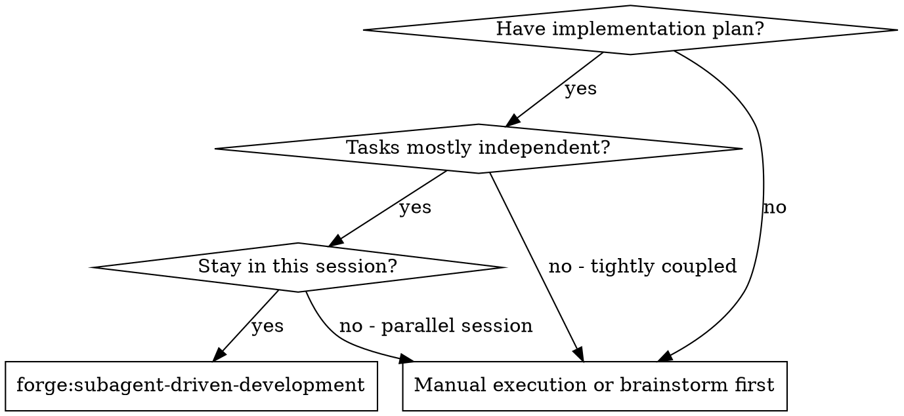
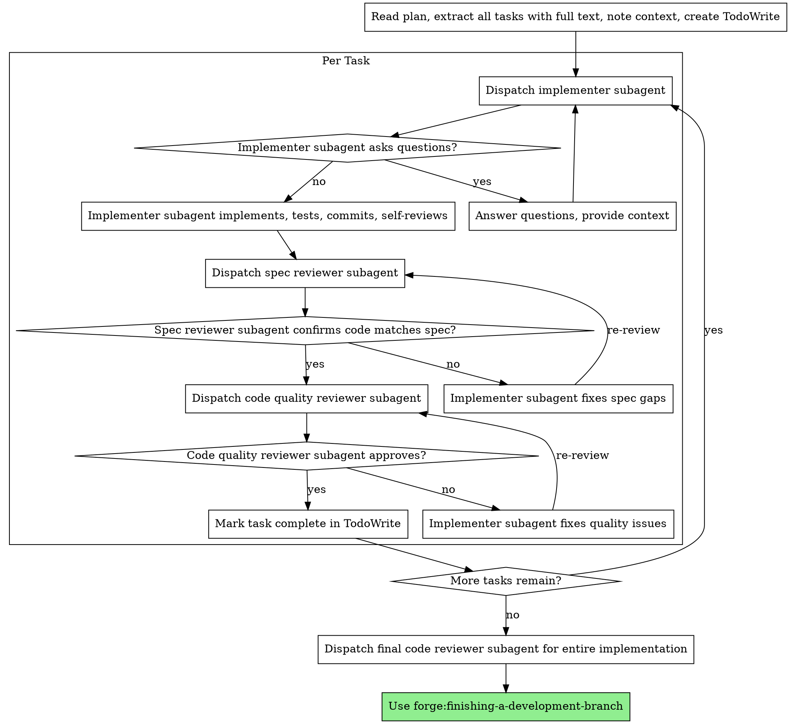

# Subagent-Driven Development

Execute plan by dispatching fresh subagent per task, with two-stage review after each: spec compliance review first, then code quality review.

**Why subagents:** You delegate tasks to specialized agents with isolated context. By precisely crafting their instructions and context, you ensure they stay focused and succeed at their task. They should never inherit your session's context or history — you construct exactly what they need. This also preserves your own context for coordination work.

**Core principle:** Fresh subagent per task + two-stage review (spec then quality) = high quality, fast iteration

## When to Use



## Companion Skill

Dispatch 前,检查环境中是否存在 `forge:subagent-driven-discipline`。

- **若存在** → 立即调用(`Skill(forge:subagent-driven-discipline)`)再开始 dispatch。它是本 skill 内联摘要的权威完整版 —— 包含完整的 subagent task-type taxonomy(§1)、cheap-model 可靠性 playbook、cross-verify 协议(§3.2)、inline-fix vs round-2 decision tree(§3.3)、以及 Trigger Type Matrix retrospect。以其 taxonomy / playbook 驱动 model-tier 选型和 review discipline。
- **若不存在** → model tier 选型回退到本 skill `## Model Selection` 的粗粒度直觉(cheap↔`haiku` / standard↔`sonnet` / most-capable↔`opus`);cross-verify 五类与 decision tree 仍由本 skill 内联段自足(这两段本就 harness/模型无关)。仅凭本 skill 继续执行即可。

## The Process



## Model Selection

Use the least powerful model that can handle each role to conserve cost and increase speed.

**Mechanical implementation tasks** (isolated functions, clear specs, 1-2 files): use a fast, cheap model. Most implementation tasks are mechanical when the plan is well-specified.

**Integration and judgment tasks** (multi-file coordination, pattern matching, debugging): use a standard model.

**Architecture, design, and review tasks**: use the most capable available model.

**Task complexity signals:**

- Touches 1-2 files with a complete spec → cheap model
- Touches multiple files with integration concerns → standard model
- Requires design judgment or broad codebase understanding → most capable model

## How to Dispatch(plan-v1.1 Task 2 加 — SDD 实操字面)

Subagents are dispatched via the **Task tool**(not `spawn_agent` or other invented tools). Specify both `subagent_type` and `model` explicitly:

```
Use Task tool with:
  subagent_type: <implementer | spec_reviewer | code_quality_reviewer>
  model: <haiku | sonnet | opus>  # 按 task subtype 选(实际模型见 forge:subagent-driven-discipline 的「Model Tier 映射」段);不传则 inherit 父 session 浪费 cost
  description: <3-5 word task summary>
  prompt: <full task text + context + DoD + verify checklist>
```

**model 选型**:每个 task 的 model tier 依据 `forge:subagent-driven-discipline` §1 task-type taxonomy。§1 的 `haiku`/`sonnet`/`opus` 是 tier 标签 —— 在 Claude Code 等直接传 `model` 参数的 harness 上,实际模型经 discipline 的 `model_tiers` 配置解析(默认恒等);在 OpenCode/Codex 等 harness 上,经 subagent agent 定义的 `model:` 解析。本 skill 不单列 model tier 摘要,以免与 discipline §1 漂移。粗粒度直觉见上方 `## Model Selection`。

**fresh subagent per task 原则**:每个 task 独立 dispatch,**不共享 context**(避免 context bloat + 责任不清);subagent return 后 controller cross-verify(`§3.2` 五类 verify 命令)再决策。

**two-stage review per task**(implementer DONE 后):

1. **spec_reviewer**(sonnet)— spec compliance(verify 字面要求被实现 + 无 extra scope)
2. **code_quality_reviewer**(sonnet)— runtime correctness / pattern adherence / latent bug

## Review Protocol(plan-v1.1 Task 3 加 — reviewer 实操字面)

When subagent reports DONE, **do not trust at face value**. Run **cross-verify** + assign **verdict 三级** before continuing.

**cross-verify 五类**(sonnet reviewer must run + report file:line evidence;沿 forge:subagent-driven-discipline §3.2):

1. **test count**(`pnpm vitest run` 实测 / `git show <SHA>` 看 test diff;不只信 implementer self-report "X tests passed")
2. **commit SHA**(`git show <SHA>`/`git log -1 --stat` 看 commit 真实改了什么文件)
3. **branch**(`git rev-parse --abbrev-ref HEAD` 确认在正确 feature branch)
4. **spec strings**(`grep -n "<key spec phrase>" <files>` 验 spec 字面要求被实现)
5. **file:line**(`cat -n <file> | sed -n '<line>,<line+10>p'` 看具体改动 line range)

**verdict 三级**(reviewer 返结果时必标):

- **Critical** — runtime bug / 安全 / **test fail(failing test count > 0)** / 测试断言静默降级 / cross-source hash mismatch → MUST inline fix or round 2 dispatch;**不允许 merge / release**(即使 PM / 上线压力);沿 `not-merge-without-test` scenario 协议
- **Important** — pattern adherence / signature 不一致 / spec 字面要求漏 → controller cross-verify file:line 后决策(inline fix 或接受 deferred)
- **Informational** — style / 命名 / 注释 polish / deferred candidates → noted不阻 release

**decision tree**(沿 forge:subagent-driven-discipline §3.3):

- Critical = 0 + Important = 0 → 跳过修改 → 下一 task
- Critical = 0 + Important ≥ 1 → controller cross-verify reviewer claim(file:line 实测)→ inline fix preferred
- Critical ≥ 1 → 阻止 commit;controller inline fix(若小 scope)或 round 2 dispatch implementer

**Never** accept subagent self-report "all tests pass / commit looks good" without running cross-verify 五类 first. Self-report ≠ evidence.

## Handling Implementer Status

Implementer subagents report one of **five** statuses (forge v1.0 沿 design §2.1.2 加第 5 档 `DESIGN_ISSUE_FOUND`)。Handle each appropriately:

**DONE:** Proceed to spec compliance review.

**DONE_WITH_CONCERNS:** The implementer completed the work but flagged doubts. Read the concerns before proceeding:

- **CRITICAL concerns**(测试 fail / hash mismatch / evidence 丢)→ 走 forge 强 fence 拒签路径(原 v0.4 行为不变)
- **WARNING / SUGGESTION concerns about correctness or scope**(非 CRITICAL)→ **invoke Fluid Pause Decision Point**(沿 `commands/apply.md` §"Fluid Pause Decision Point" 段;主代理调 AskUserQuestion 四选项)
- **Observations**(e.g., "this file is getting large")→ note them and proceed to review

**NEEDS_CONTEXT:** The implementer needs information that wasn't provided. Provide the missing context and re-dispatch.

**BLOCKED:** The implementer cannot complete the task. Assess the blocker:

1. If it's a context problem, provide more context and re-dispatch with the same model
2. If the task requires more reasoning, re-dispatch with a more capable model
3. If the task is too large, break it into smaller pieces
4. If the **plan itself is wrong** → **invoke Fluid Pause Decision Point**(沿 forge v1.0;原 "escalate to human" 现有合规通道,沿 `commands/apply.md` §"Fluid Pause Decision Point" 段)

**`DESIGN_ISSUE_FOUND`**(v1.0 新增第 5 档,沿 forge design §2.1.2):The implementer is reporting that the current task requires functionality that's part of the change but **not covered by the spec**(spec 未覆盖但本 change 应做的需求)。This is **not BLOCKED**(还能干活)和 **not DONE_WITH_CONCERNS**(主体功能没完工就发现 spec 缺口)。Handle by **invoking Fluid Pause Decision Point**(沿 `commands/apply.md` §"Fluid Pause Decision Point" 段;典型走 option=1 扩 scope 或 option=3 转 out-of-scope)。

**Never** ignore an escalation or force the same model to retry without changes. If the implementer said it's stuck or surfaced a design issue, something needs to change.

## Example Workflow

```
You: I'm using Subagent-Driven Development to execute this plan.

[Read plan file once: forge/changes/<change-id>/tasks.md]
[Extract all 5 tasks with full text and context]
[Create TodoWrite with all tasks]

Task 1: Hook installation script

[Get Task 1 text and context (already extracted)]
[Dispatch implementation subagent with full task text + context]

Implementer: "Before I begin - should the hook be installed at user or system level?"

You: "User level (~/.config/forge/hooks/)"

Implementer: "Got it. Implementing now..."
[Later] Implementer:
  - Implemented install-hook command
  - Added tests, 5/5 passing
  - Self-review: Found I missed --force flag, added it
  - Committed

[Dispatch spec compliance reviewer]
Spec reviewer: ✅ Spec compliant - all requirements met, nothing extra

[Get git SHAs, dispatch code quality reviewer]
Code reviewer: Strengths: Good test coverage, clean. Issues: None. Approved.

[Mark Task 1 complete]

Task 2: Recovery modes

[Get Task 2 text and context (already extracted)]
[Dispatch implementation subagent with full task text + context]

Implementer: [No questions, proceeds]
Implementer:
  - Added verify/repair modes
  - 8/8 tests passing
  - Self-review: All good
  - Committed

[Dispatch spec compliance reviewer]
Spec reviewer: ❌ Issues:
  - Missing: Progress reporting (spec says "report every 100 items")
  - Extra: Added --json flag (not requested)

[Implementer fixes issues]
Implementer: Removed --json flag, added progress reporting

[Spec reviewer reviews again]
Spec reviewer: ✅ Spec compliant now

[Dispatch code quality reviewer]
Code reviewer: Strengths: Solid. Issues (Important): Magic number (100)

[Implementer fixes]
Implementer: Extracted PROGRESS_INTERVAL constant

[Code reviewer reviews again]
Code reviewer: ✅ Approved

[Mark Task 2 complete]

...

[After all tasks]
[Dispatch final code-reviewer]
Final reviewer: All requirements met, ready to merge

Done!
```

## Advantages

**vs. Manual execution:**

- Subagents follow TDD naturally
- Fresh context per task (no confusion)
- Parallel-safe (subagents don't interfere)
- Subagent can ask questions (before AND during work)

**Efficiency gains:**

- No file reading overhead (controller provides full text)
- Controller curates exactly what context is needed
- Subagent gets complete information upfront
- Questions surfaced before work begins (not after)

**Quality gates:**

- Self-review catches issues before handoff
- Two-stage review: spec compliance, then code quality
- Review loops ensure fixes actually work
- Spec compliance prevents over/under-building
- Code quality ensures implementation is well-built

**Cost:**

- More subagent invocations (implementer + 2 reviewers per task)
- Controller does more prep work (extracting all tasks upfront)
- Review loops add iterations
- But catches issues early (cheaper than debugging later)

## Red Flags

**Never:**

- Start implementation on main/master branch without explicit user consent
- Skip reviews (spec compliance OR code quality)
- Proceed with unfixed issues
- Dispatch multiple implementation subagents in parallel (conflicts)
- Make subagent read plan file (provide full text instead)
- Skip scene-setting context (subagent needs to understand where task fits)
- Ignore subagent questions (answer before letting them proceed)
- Accept "close enough" on spec compliance (spec reviewer found issues = not done)
- Skip review loops (reviewer found issues = implementer fixes = review again)
- Let implementer self-review replace actual review (both are needed)
- **Start code quality review before spec compliance is ✅** (wrong order)
- Move to next task while either review has open issues

**If subagent asks questions:**

- Answer clearly and completely
- Provide additional context if needed
- Don't rush them into implementation

**If reviewer finds issues:**

- Implementer (same subagent) fixes them
- Reviewer reviews again
- Repeat until approved
- Don't skip the re-review

**If subagent fails task:**

- Dispatch fix subagent with specific instructions
- Don't try to fix manually (context pollution)

## Integration

**Required workflow skills:**

- **forge:using-git-worktrees** - REQUIRED: Set up isolated workspace before starting
- **forge:writing-plans** - Creates the plan this skill executes
- **forge:requesting-code-review** - Code review template for reviewer subagents
- **forge:finishing-a-development-branch** - Complete development after all tasks

**Subagents should use:**

- **forge:test-driven-development** - Subagents follow TDD for each task

## forge-specific 协议(v4)

forge v4 在本 skill 基础上加以下行为约束(与上游 superpowers 兼容、不冲突;v4 BREAKING 删反加固 fence + 复杂 marker 字段 + 严格 ack 协议)。

### Fluid Pause 行为约束(v4 软记录)

主代理在调 AskUserQuestion 并写入 marker `pause_decisions[]` 字段时:

1. **CRITICAL 不走 pause 路径** — 主代理判定问题严重到 abort 程度(测试 fail / 显式错误)时**禁止**调 AskUserQuestion 让用户在 1-4 间选;直接 abort 让用户修代码 / 重派 subagent。Fluid Pause 仅用于 DONE_WITH_CONCERNS / BLOCKED 第 4 项 / DESIGN_ISSUE_FOUND 三档。

2. **option=2 必勾选新 task** — `option=2` 加 task 时,主代理 append 新 task 到 tasks.md 后 subagent 重派实施;实施完成后**必须**改 `[ ]` → `[x]`(沿 SDD 写入主代理单点串行职责)。

3. **option=3 转 out-of-scope 必写 `notes`** — `notes` 字段应论证"为什么 subagent 能跳过该 issue 完成主体 task"(沿 PauseDecisionSimple `notes?` 字段,v4 marker 不再校验 `non_blocking_rationale` 等结构化字段)。

4. **`PauseDecisionSimple` 5 字段限定** — v4 marker 只接受 `paused_at` / `task_ref` / `issue_summary` / `chosen_option` / `notes?` 共 5 字段(沿 `src/core/markers/types.ts`);**不要写 v3 字段**(`severity` / `severity_acked_by` / `added_task_ref` / `capture_id` / `target_artifact` / `non_blocking_rationale` / `other_rationale` 等已删,写了 marker schema 校验拒)。

### 红旗清单(借口模式)

| AI 借口                                                  | 现实                                                                                   |
| -------------------------------------------------------- | -------------------------------------------------------------------------------------- |
| "CRITICAL 不严重,走 pause 让用户选"                      | CRITICAL 应直接 abort 让用户修(不进 Fluid Pause)— Fluid Pause 只处理 non-critical 3 档 |
| "option=3 转 out-of-scope 时 notes 写'用户决定即可'"     | notes 必须论证"为什么 subagent 能跳过"— 不是"用户决定"是答案                           |
| "把 v3 字段塞回 marker(severity / severity_acked_by 等)" | v4 `VerifyMarker` / `ReviewMarker` schema 只 5 字段,塞 v3 字段 → archive 校验直接拒    |

### DONE_REPORT 字段(v4 极简)

subagent 在 task 实施完成报 DONE 时,**必须**提供给主代理:

- `red_commit`:RED 阶段 commit sha + ISO timestamp(若走 TDD)
- `green_commit`:GREEN 阶段 commit sha
- `task_ref`:tasks.md 内对应行(如 `tasks.md#task-3`)
- (可选)`notes`:subagent 在实施中遇到的 observation,供主代理 review

**v4 BREAKING**:不再要求 subagent 提供 RED log path / hash / expected failure list / tdd-exemption ack entry 等反加固字段。evidence-helper CLI 已删;TDD 行为仍由 `forge:test-driven-development` skill 约束,但 marker 不固化 TDD 证据链。

### Main Agent STOP Triggers

主代理在 apply 阶段必须停下问用户的 **6 类触发条件**(不允许自动绕过或重试):

| 触发条件                                                                                                                   | 主代理行为                                                                                                            | cross-ref                                                                                                |
| -------------------------------------------------------------------------------------------------------------------------- | --------------------------------------------------------------------------------------------------------------------- | -------------------------------------------------------------------------------------------------------- |
| Critical Plan Review 发现 critical gap                                                                                     | 暂停 dispatch,走 AskUserQuestion 4 类 concerns                                                                        | `commands/apply.md` 步骤 3.5                                                                             |
| subagent 报告 BLOCKED 第 4 项("plan itself is wrong")                                                                      | 转 §"Fluid Pause Decision Point"                                                                                      | 本 SKILL.md §"Handling Implementer Status" BLOCKED 第 4 项(line 115)+ `commands/apply.md` §"Fluid Pause" |
| **同一 task 被 subagent BLOCKED ≥ 2 次**                                                                                   | STOP 问用户(可能任务过大需拆分,或 plan 本身错)                                                                        | —                                                                                                        |
| **verify 命令重试 ≥ 3 次仍失败**                                                                                           | STOP 问用户(可能 spec 错 / 测试本身错)                                                                                | —                                                                                                        |
| 用户主动 interrupt                                                                                                         | STOP,等下一步指令                                                                                                     | —                                                                                                        |
| **保护分支拒签**(`forge preflight branch-check` 报 exit 2,在 `main`/`master`/`develop`/`trunk` 等保护分支跑 `forge apply`) | CLI 已 fail-closed,主代理转告用户切换 `feature/<change-id>` 分支并重跑;**不允许** `--allow-protected-branch` 自动绕过 | `commands/apply.md` 步骤 0 + `forge preflight branch-check`(plan-9h Task 1 + plan-9z polish P-1)         |

#### 计数机制(plan-9h Q5 决策:接口零侵入)

主代理必须在 **session memory 内追踪**同 task BLOCKED 计数 + verify 重试计数:

- 每次接到 subagent BLOCKED 报告 → 该 task 计数 +1
- 每次 verify 命令失败 → 该次重试计数 +1
- **不依赖 marker 持久化字段**(v4 marker 极简,只 5 字段;计数纯 session-local)
- 跨 session wakeup 丢计数属 v4 known limitation;若用户手工告知"task X 已 BLOCKED N 次",主代理按用户告知值续计

#### 禁止行为(主代理 dispatch 阶段红线)

- ✗ 不允许"绕过失败 task 跑下一个"
- ✗ 不允许"修改 task 描述让它能过"(改 task 描述需经 §"Fluid Pause Decision Point" 走选项 1/2)
- ✗ 不允许"重试同一 task ≥ 3 次不停下"

#### 与现有 BLOCKED 状态处理的关系(横切补强)

本子段是 §"Handling Implementer Status" BLOCKED 4 项处理(line 110-115)的**横切补强**:

- **BLOCKED 4 项处理**:**单次** BLOCKED 报告时主代理按 context / model / 拆分 / plan-wrong 4 选 1 处理
- **本 STOP triggers**:**多次累积** BLOCKED / verify 重试 时强制 STOP 问用户(避免主代理无限循环)

两者不冲突 — 现有 BLOCKED 第 4 项 "plan itself is wrong → Fluid Pause" 仍走 Fluid Pause(单次 critical gap 即触发);本 STOP triggers 表第 3-4 行(BLOCKED ≥ 2 次 / verify ≥ 3 次)是**累积失败**的反向加固,触发 STOP 后用户决策可能是"拆 task"/"重写 spec"/"走 explore"(沿 §2.8.4 与 §2.1/§2.5 桥接)。

## Tier 2/3 Orchestration(OpenCode / Codex 路径)

当前 harness 无 `/forge:*` slash 命令时(OpenCode / Codex),你 **MUST** Read 对应 `commands/apply.md` 并**完整执行**其协议 —— 按 `skills/_shared/tier23-command-bridge.md` 的 plugin root 解析与替换规则执行。Claude Code(Tier 1)有 slash 命令,不走本段。

执行完成前核对 apply 硬门槛自检清单:

- 每个完成的 task 走 TDD red → green → refactor + 真 commit(沿 `forge:test-driven-development`;v4 marker 不固化 TDD 证据链,但行为约束仍在)。
- `forge preflight branch-check` 已跑(在 main/master 等保护分支上会 fail-closed)。
