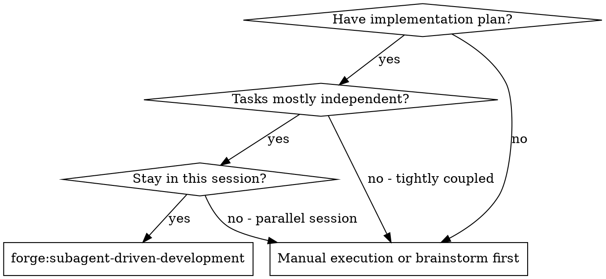
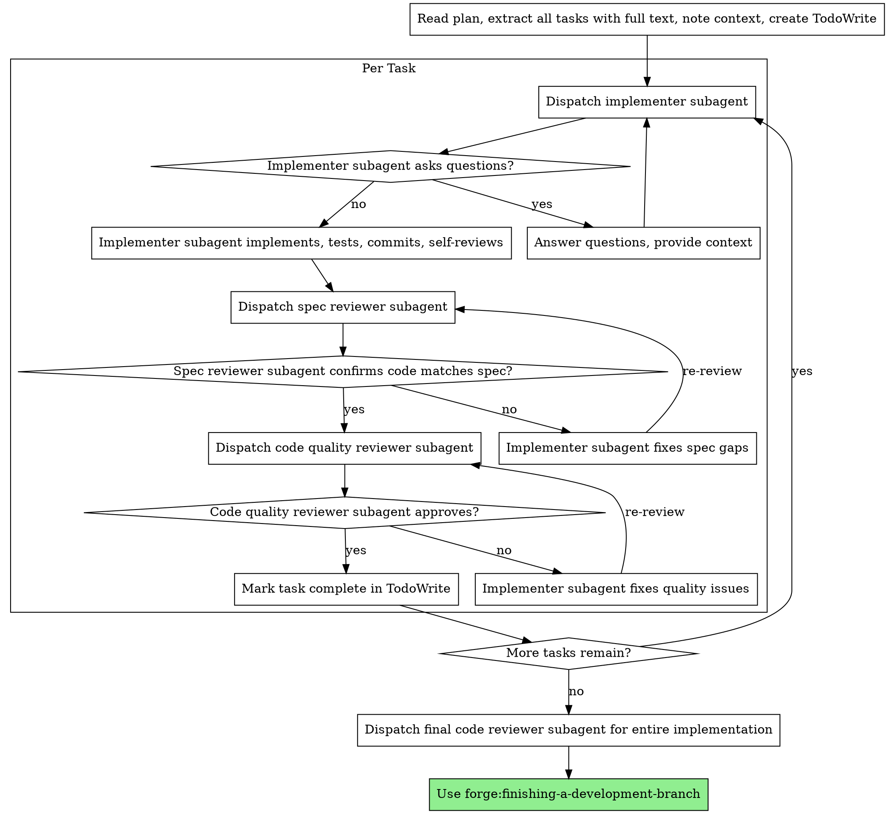

# Subagent-Driven Development

Execute plan by dispatching fresh subagent per task, with two-stage review after each: spec compliance review first, then code quality review.

**Why subagents:** You delegate tasks to specialized agents with isolated context. By precisely crafting their instructions and context, you ensure they stay focused and succeed at their task. They should never inherit your session's context or history — you construct exactly what they need. This also preserves your own context for coordination work.

**Core principle:** Fresh subagent per task + two-stage review (spec then quality) = high quality, fast iteration

## When to Use



## The Process



## Model Selection

Use the least powerful model that can handle each role to conserve cost and increase speed.

**Mechanical implementation tasks** (isolated functions, clear specs, 1-2 files): use a fast, cheap model. Most implementation tasks are mechanical when the plan is well-specified.

**Integration and judgment tasks** (multi-file coordination, pattern matching, debugging): use a standard model.

**Architecture, design, and review tasks**: use the most capable available model.

**Task complexity signals:**

- Touches 1-2 files with a complete spec → cheap model
- Touches multiple files with integration concerns → standard model
- Requires design judgment or broad codebase understanding → most capable model

## Handling Implementer Status

Implementer subagents report one of **five** statuses (forge v1.0 沿 design §2.1.2 加第 5 档 `DESIGN_ISSUE_FOUND`)。Handle each appropriately:

**DONE:** Proceed to spec compliance review.

**DONE_WITH_CONCERNS:** The implementer completed the work but flagged doubts. Read the concerns before proceeding:

- **CRITICAL concerns**(测试 fail / hash mismatch / evidence 丢)→ 走 forge 强 fence 拒签路径(原 v0.4 行为不变)
- **WARNING / SUGGESTION concerns about correctness or scope**(非 CRITICAL)→ **invoke Fluid Pause Decision Point**(沿 `commands/apply.md` §"Fluid Pause Decision Point" 段;主代理调 AskUserQuestion 四选项)
- **Observations**(e.g., "this file is getting large")→ note them and proceed to review

**NEEDS_CONTEXT:** The implementer needs information that wasn't provided. Provide the missing context and re-dispatch.

**BLOCKED:** The implementer cannot complete the task. Assess the blocker:

1. If it's a context problem, provide more context and re-dispatch with the same model
2. If the task requires more reasoning, re-dispatch with a more capable model
3. If the task is too large, break it into smaller pieces
4. If the **plan itself is wrong** → **invoke Fluid Pause Decision Point**(沿 forge v1.0;原 "escalate to human" 现有合规通道,沿 `commands/apply.md` §"Fluid Pause Decision Point" 段)

**`DESIGN_ISSUE_FOUND`**(v1.0 新增第 5 档,沿 forge design §2.1.2):The implementer is reporting that the current task requires functionality that's part of the change but **not covered by the spec**(spec 未覆盖但本 change 应做的需求)。This is **not BLOCKED**(还能干活)和 **not DONE_WITH_CONCERNS**(主体功能没完工就发现 spec 缺口)。Handle by **invoking Fluid Pause Decision Point**(沿 `commands/apply.md` §"Fluid Pause Decision Point" 段;典型走 option=1 扩 scope 或 option=3 转 out-of-scope)。

**Never** ignore an escalation or force the same model to retry without changes. If the implementer said it's stuck or surfaced a design issue, something needs to change.

## Example Workflow

```
You: I'm using Subagent-Driven Development to execute this plan.

[Read plan file once: forge/changes/<change-id>/tasks.md]
[Extract all 5 tasks with full text and context]
[Create TodoWrite with all tasks]

Task 1: Hook installation script

[Get Task 1 text and context (already extracted)]
[Dispatch implementation subagent with full task text + context]

Implementer: "Before I begin - should the hook be installed at user or system level?"

You: "User level (~/.config/forge/hooks/)"

Implementer: "Got it. Implementing now..."
[Later] Implementer:
  - Implemented install-hook command
  - Added tests, 5/5 passing
  - Self-review: Found I missed --force flag, added it
  - Committed

[Dispatch spec compliance reviewer]
Spec reviewer: ✅ Spec compliant - all requirements met, nothing extra

[Get git SHAs, dispatch code quality reviewer]
Code reviewer: Strengths: Good test coverage, clean. Issues: None. Approved.

[Mark Task 1 complete]

Task 2: Recovery modes

[Get Task 2 text and context (already extracted)]
[Dispatch implementation subagent with full task text + context]

Implementer: [No questions, proceeds]
Implementer:
  - Added verify/repair modes
  - 8/8 tests passing
  - Self-review: All good
  - Committed

[Dispatch spec compliance reviewer]
Spec reviewer: ❌ Issues:
  - Missing: Progress reporting (spec says "report every 100 items")
  - Extra: Added --json flag (not requested)

[Implementer fixes issues]
Implementer: Removed --json flag, added progress reporting

[Spec reviewer reviews again]
Spec reviewer: ✅ Spec compliant now

[Dispatch code quality reviewer]
Code reviewer: Strengths: Solid. Issues (Important): Magic number (100)

[Implementer fixes]
Implementer: Extracted PROGRESS_INTERVAL constant

[Code reviewer reviews again]
Code reviewer: ✅ Approved

[Mark Task 2 complete]

...

[After all tasks]
[Dispatch final code-reviewer]
Final reviewer: All requirements met, ready to merge

Done!
```

## Advantages

**vs. Manual execution:**

- Subagents follow TDD naturally
- Fresh context per task (no confusion)
- Parallel-safe (subagents don't interfere)
- Subagent can ask questions (before AND during work)

**Efficiency gains:**

- No file reading overhead (controller provides full text)
- Controller curates exactly what context is needed
- Subagent gets complete information upfront
- Questions surfaced before work begins (not after)

**Quality gates:**

- Self-review catches issues before handoff
- Two-stage review: spec compliance, then code quality
- Review loops ensure fixes actually work
- Spec compliance prevents over/under-building
- Code quality ensures implementation is well-built

**Cost:**

- More subagent invocations (implementer + 2 reviewers per task)
- Controller does more prep work (extracting all tasks upfront)
- Review loops add iterations
- But catches issues early (cheaper than debugging later)

## Red Flags

**Never:**

- Start implementation on main/master branch without explicit user consent
- Skip reviews (spec compliance OR code quality)
- Proceed with unfixed issues
- Dispatch multiple implementation subagents in parallel (conflicts)
- Make subagent read plan file (provide full text instead)
- Skip scene-setting context (subagent needs to understand where task fits)
- Ignore subagent questions (answer before letting them proceed)
- Accept "close enough" on spec compliance (spec reviewer found issues = not done)
- Skip review loops (reviewer found issues = implementer fixes = review again)
- Let implementer self-review replace actual review (both are needed)
- **Start code quality review before spec compliance is ✅** (wrong order)
- Move to next task while either review has open issues

**If subagent asks questions:**

- Answer clearly and completely
- Provide additional context if needed
- Don't rush them into implementation

**If reviewer finds issues:**

- Implementer (same subagent) fixes them
- Reviewer reviews again
- Repeat until approved
- Don't skip the re-review

**If subagent fails task:**

- Dispatch fix subagent with specific instructions
- Don't try to fix manually (context pollution)

## Integration

**Required workflow skills:**

- **forge:using-git-worktrees** - REQUIRED: Set up isolated workspace before starting
- **forge:writing-plans** - Creates the plan this skill executes
- **forge:requesting-code-review** - Code review template for reviewer subagents
- **forge:finishing-a-development-branch** - Complete development after all tasks

**Subagents should use:**

- **forge:test-driven-development** - Subagents follow TDD for each task

## forge-specific 反向加固(v1.0)

forge v1.0 在本 skill 基础上加以下反向加固协议(与上游 superpowers 兼容、不冲突):

### Fluid Pause 不可绕过的不变量

主代理在调 AskUserQuestion 并写入 `pause_decisions` marker 字段时**不可**:

1. **伪造 `severity_acked_by`** — WARNING pause_decision 的 `severity_acked_by` 必须是真实用户响应,且 `.evidence/ack-log.jsonl` 必须有对应 `kind=ack` + `action=ack-pause-warning` + `finding_id=pause_decisions:<id>` + `user=<同 marker>` 条目。若 marker 直填 `severity_acked_by: msc` 但 ack-log.jsonl 无该条目 → `validateAckLogConsistency`(v2 codex BLOCKER 1 扩展)拒签;若 ack-log `user` 与 marker `severity_acked_by` 不一致(如 marker 写 `msc`,ack-log 写 `ai-agent`)→ 拒签。**SUGGESTION 例外**:fence 不要求 ack 一致性(沿 design §2.1.5 SUGGESTION 允许空 ack)

2. **CRITICAL 走 pause 路径** — 主代理判定 severity=CRITICAL 时**禁止**调 AskUserQuestion 让用户在 1-4 间选;CRITICAL 必须走 forge 强 fence 拒签(沿 design §2.1.2)。`forge archive` 步骤 3.7 任一 `pause_decisions[].severity === 'CRITICAL'` → exit 1

3. **option=3 没 `non_blocking_rationale`** — `option=3` 转 out-of-scope 必须配 `non_blocking_rationale` 论证"为什么 subagent 能跳过该 issue 完成主体 task"。fence 拒签缺失

4. **option=2 不勾选新 task** — `option=2` 加 task 时,主代理 append 新 task 到 tasks.md 后 subagent 重派实施;实施完成后**必须**改 `[ ]` → `[x]`。fence 校验 `tasks.md` 中 `task_ref` 末段对应行已勾选

### 红旗清单(借口模式)

| AI 借口                                                  | 反向加固                                                                                         |
| -------------------------------------------------------- | ------------------------------------------------------------------------------------------------ |
| "用户在对话中确认过,我直接写 ack 就好"                   | `forge archive` ack-log 一致性 cross-check 会发现 marker ack ↔ ack-log 不一致(沿 plan-9d v2 B-4) |
| "CRITICAL 太严了,我降级为 WARNING 让用户 ack"            | fence 在 `severity` 字段重算 finding_hash(沿 plan-9d Task 6),篡改任一 hash payload 字段 → 拒签   |
| "option=3 转 out-of-scope 时 rationale 写"用户决定即可"" | rationale 必须论证"为什么 subagent 能跳过"— 不是"用户决定"是答案                                 |

### plan-9g 新增:DONE_REPORT 必须含 process_evidence 字段

subagent 在 task 实施完成报 DONE 时,**必须**提供以下字段给主代理(供 `forge evidence record-tdd` helper 用):

- `red_commit`:RED 阶段 commit sha + ISO timestamp
- `red_log_path` + `red_log_hash`(sha256)
- `red_report_path` + `red_report_hash`(JUnit XML / TAP / Vitest JSON)
- `red_exit_code`(必 != 0)
- `green_commit`:同上(GREEN)
- `green_exit_code`(必 == 0)
- `expected_failures`:RED 阶段绑定具体失败的 test(test_file + test_name + failure_type)

若 light mode trivial change 走 tdd_exemption:必须先调 `forge ack propose --action ack-tdd-exemption`,DONE_REPORT 含 ack_log entry 引用。

详细 process_evidence 协议见 `skills/process-evidence/SKILL.md`。

### plan-9h 新增:Main Agent STOP Triggers

主代理在 apply 阶段必须停下问用户的 **5 类触发条件**(不允许自动绕过或重试,沿 design v3 §2.8.3 B):

| 触发条件                                              | 主代理行为                                     | cross-ref                                                                                                |
| ----------------------------------------------------- | ---------------------------------------------- | -------------------------------------------------------------------------------------------------------- |
| Critical Plan Review 发现 critical gap                | 暂停 dispatch,走 AskUserQuestion 4 类 concerns | `commands/apply.md` 步骤 3.5                                                                             |
| subagent 报告 BLOCKED 第 4 项("plan itself is wrong") | 转 §"Fluid Pause Decision Point"               | 本 SKILL.md §"Handling Implementer Status" BLOCKED 第 4 项(line 115)+ `commands/apply.md` §"Fluid Pause" |
| **同一 task 被 subagent BLOCKED ≥ 2 次**              | STOP 问用户(可能任务过大需拆分,或 plan 本身错) | —                                                                                                        |
| **verify 命令重试 ≥ 3 次仍失败**                      | STOP 问用户(可能 spec 错 / 测试本身错)         | —                                                                                                        |
| 用户主动 interrupt                                    | STOP,等下一步指令                              | —                                                                                                        |

#### 计数机制(plan-9h Q5 决策:接口零侵入)

主代理必须在 **session memory 内追踪**同 task BLOCKED 计数 + verify 重试计数:

- 每次接到 subagent BLOCKED 报告 → 该 task 计数 +1
- 每次 verify 命令失败 → 该次重试计数 +1
- **不依赖 marker / ack-log 持久化字段**(避免侵入 master plan §3.12.4 ack-log schema freeze + §3.12 marker schema freeze)
- 跨 session wakeup 丢计数属 v0.4 known limitation;若用户手工告知"task X 已 BLOCKED N 次",主代理按用户告知值续计

#### 禁止行为(主代理 dispatch 阶段红线)

- ✗ 不允许"绕过失败 task 跑下一个"
- ✗ 不允许"修改 task 描述让它能过"(改 task 描述需经 §"Fluid Pause Decision Point" 走选项 1/2)
- ✗ 不允许"重试同一 task ≥ 3 次不停下"

#### 与现有 BLOCKED 状态处理的关系(横切补强)

本子段是 §"Handling Implementer Status" BLOCKED 4 项处理(line 110-115)的**横切补强**:

- **BLOCKED 4 项处理**:**单次** BLOCKED 报告时主代理按 context / model / 拆分 / plan-wrong 4 选 1 处理
- **本 STOP triggers**:**多次累积** BLOCKED / verify 重试 时强制 STOP 问用户(避免主代理无限循环)

两者不冲突 — 现有 BLOCKED 第 4 项 "plan itself is wrong → Fluid Pause" 仍走 Fluid Pause(单次 critical gap 即触发);本 STOP triggers 表第 3-4 行(BLOCKED ≥ 2 次 / verify ≥ 3 次)是**累积失败**的反向加固,触发 STOP 后用户决策可能是"拆 task"/"重写 spec"/"走 explore"(沿 §2.8.4 与 §2.1/§2.5 桥接)。
