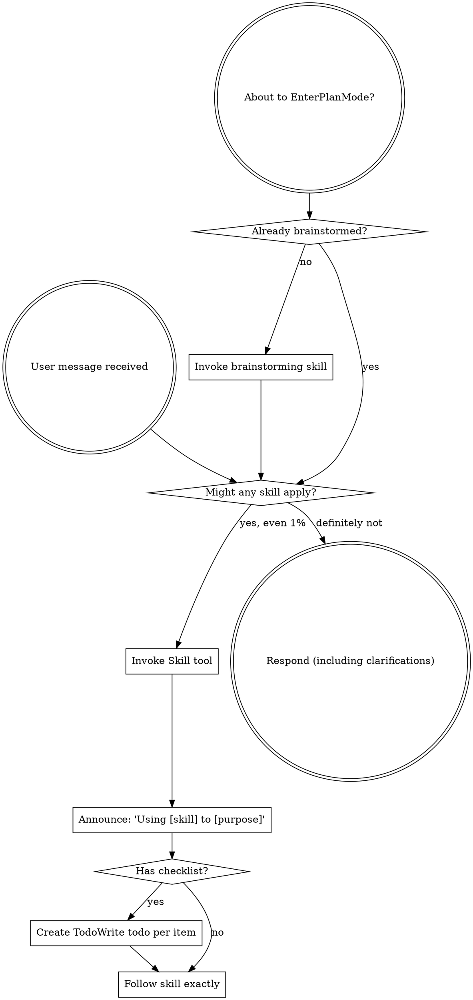

<SUBAGENT-STOP>
If you were dispatched as a subagent to execute a specific task, skip this skill.
</SUBAGENT-STOP>

<EXTREMELY-IMPORTANT>
If you think there is even a 1% chance a skill might apply to what you are doing, you ABSOLUTELY MUST invoke the skill.

IF A SKILL APPLIES TO YOUR TASK, YOU DO NOT HAVE A CHOICE. YOU MUST USE IT.

This is not negotiable. This is not optional. You cannot rationalize your way out of this.
</EXTREMELY-IMPORTANT>

## Instruction Priority

Forge skills override default system prompt behavior, but **user instructions always take precedence**:

1. **User's explicit instructions** (CLAUDE.md, AGENTS.md, direct requests) — highest priority
2. **Forge skills** — override default system behavior where they conflict
3. **Default system prompt** — lowest priority

If CLAUDE.md says "don't use TDD" and a skill says "always use TDD," follow the user's instructions. The user is in control.

## How to Access Skills

**In Claude Code:** Use the `Skill` tool. When you invoke a skill, its content is loaded and presented to you—follow it directly. Never use the Read tool on skill files.

**In OpenCode:** Use OpenCode's native `skill` tool to list and load skills. Skills are auto-discovered via `config.skills.paths`(forge plugin 自动注入,无需手动 symlink)。

**In Codex CLI:** Skills 通过 `~/.agents/skills/forge/` symlink 被 Codex 原生 discovery 扫到(安装见 `docs/codex-install.md`)。Codex 没有显式的 skill invoke 工具 — 当一个 skill 的 trigger phrase / description 匹配当前任务时,直接读它的 `SKILL.md` 并按内容执行。

## Platform Tool Mapping

Skills 是按 Claude Code 工具名写的。在其它 harness 上遇到这些名字时,按下表替换:

| Claude Code 引用          | Codex 等价                                                       | OpenCode 等价                     |
| ------------------------- | ---------------------------------------------------------------- | --------------------------------- |
| `Skill` 工具              | 直接读 `SKILL.md` 并按内容执行                                   | OpenCode 原生 `skill` 工具        |
| `Task` 工具(派 subagent)  | `spawn_agent`(需 `~/.codex/config.toml` 开 `multi_agent = true`) | OpenCode `@mention` subagent 系统 |
| `TodoWrite`               | `update_plan`                                                    | `todowrite`                       |
| `Read` / `Write` / `Edit` | 原生文件工具                                                     | 原生文件工具                      |
| `Bash`                    | 原生 shell 工具                                                  | 原生 shell 工具                   |

# Using Skills

## The Rule

**Invoke relevant or requested skills BEFORE any response or action.** Even a 1% chance a skill might apply means that you should invoke the skill to check. If an invoked skill turns out to be wrong for the situation, you don't need to use it.

## Red Flags

These thoughts mean STOP—you're rationalizing:

| Thought                             | Reality                                                |
| ----------------------------------- | ------------------------------------------------------ |
| "This is just a simple question"    | Questions are tasks. Check for skills.                 |
| "I need more context first"         | Skill check comes BEFORE clarifying questions.         |
| "Let me explore the codebase first" | Skills tell you HOW to explore. Check first.           |
| "I can check git/files quickly"     | Files lack conversation context. Check for skills.     |
| "Let me gather information first"   | Skills tell you HOW to gather information.             |
| "This doesn't need a formal skill"  | If a skill exists, use it.                             |
| "I remember this skill"             | Skills evolve. Read current version.                   |
| "This doesn't count as a task"      | Action = task. Check for skills.                       |
| "The skill is overkill"             | Simple things become complex. Use it.                  |
| "I'll just do this one thing first" | Check BEFORE doing anything.                           |
| "This feels productive"             | Undisciplined action wastes time. Skills prevent this. |
| "I know what that means"            | Knowing the concept ≠ using the skill. Invoke it.      |

## Skill Priority

When multiple skills could apply, use this order:

1. **Process skills first** (brainstorming, debugging) - these determine HOW to approach the task
2. **Implementation skills second** - these guide execution

"Let's build X" → brainstorming first, then implementation skills.
"Fix this bug" → debugging first, then domain-specific skills.

## Skill Types

**Rigid** (TDD, debugging): Follow exactly. Don't adapt away discipline.

**Flexible** (patterns): Adapt principles to context.

The skill itself tells you which.

## User Instructions

Instructions say WHAT, not HOW. "Add X" or "Fix Y" doesn't mean skip workflows.

## Multi-harness 协议状态

forge 在三 harness 下的协议支持:

| Tier | Harness     | skill auto-trigger | slash command 注册 | workflow bridge                                     | CLI 调用形态                                                                              |
| ---- | ----------- | ------------------ | ------------------ | --------------------------------------------------- | ----------------------------------------------------------------------------------------- |
| 1    | Claude Code | ✅                 | ✅                 | —(slash 直驱,无需桥接)                              | commands.md 调 `${CLAUDE_PLUGIN_ROOT}/scripts/run-forge.mjs`                              |
| 2    | OpenCode    | ✅                 | ❌(plugin 不注册)  | ✅ 经 stage skill 桥接段 Read `commands/<stage>.md` | 桥接段按 `tier23-command-bridge.md` 替换为 `node "<ROOT>/scripts/run-forge.mjs" <subcmd>` |
| 3    | Codex       | ✅                 | ❌(plugin 不注册)  | ✅ 同上                                             | 同上                                                                                      |

**OpenCode + Codex 用户提示**:即使 `/forge:*` 不可用,brainstorming / writing-plans / verify 等 skill **会按 description 自动触发**,你只需:

- 输入模糊需求 → AI 自动 invoke `forge:brainstorming`
- 输入 "完成验证 / verify" → AI 自动 invoke `forge:verification-before-completion`
- 等等

Tier 2/3 经 stage skill 的桥接段 Read `commands/<stage>.md` 执行,功能闭环但属 best-effort skill orchestration。

## forge slash commands(工作流入口)

**触发 prerequisites**:Tier 1 Claude Code 路径下可用;Tier 2/3 OpenCode/Codex 路径下不可用 — 改为 skill auto-trigger 等价路径。

触发以下任一命令时,会自动调起对应 skill 链:

| 命令                                               | 用途                                                                     | 调起 skill                                                                                                                                     |
| -------------------------------------------------- | ------------------------------------------------------------------------ | ---------------------------------------------------------------------------------------------------------------------------------------------- |
| `/forge:brainstorm <topic>`                        | 模糊想法 → forge/drafts/<date>-<topic>.md                                | forge:brainstorming                                                                                                                            |
| `/forge:propose <change-id> [--from-draft <name>]` | draft → 4 个 change 产物                                                 | forge:writing-plans                                                                                                                            |
| `/forge:apply [--parallel]`                        | tasks.md → 实施                                                          | forge:subagent-driven-development + forge:test-driven-development(--parallel 加 forge:dispatching-parallel-agents + forge:using-git-worktrees) |
| `/forge:review`                                    | 派 review subagent + 收反馈,写 .review-passed v2 marker                  | forge:requesting-code-review + forge:receiving-code-review                                                                                     |
| `/forge:verify`                                    | 跑 forge validate + 三维度 prose check,写 .verify-passed v2 marker       | forge:verification-before-completion + forge:verifying-three-dimensions                                                                        |
| `/forge:archive`                                   | 归档 change 到 forge/changes/archive/(校验 v2 marker + 应用 spec deltas) | (CLI `forge archive`,无 skill 链)                                                                                                              |
| `/forge:explore [<topic> \| --change <id>]`        | 非线性思考空间(任何阶段,非产物驱动)                                      | forge:exploring                                                                                                                                |
| `/forge:upgrade`                                   | 清理 v0.2 legacy harness adapter 产物(forge/ 100% 不动)                  | (CLI `forge upgrade`)                                                                                                                          |

## meta-development entry — writing-skills

forge 框架自身的 skill 开发流程(用户主动 invoke,不走 slash command 路径):

| 触发                                                  | 调起 skill             |
| ----------------------------------------------------- | ---------------------- |
| 创建一个新 forge skill(`skills/<name>/SKILL.md`)      | `forge:writing-skills` |
| 修订一个 forge skill 的 behavior(不是 typo)           | `forge:writing-skills` |
| 跑 forge-eval baseline 重跑发现 skill 失效 → REFACTOR | `forge:writing-skills` |

`forge:writing-skills` 自身的初次开发使用 superpowers 上游 writing-skills 完成(bootstrap exception);后续修订使用 forge:writing-skills 自身。详 `skills/writing-skills/SKILL.md`。

## forge 红旗清单(覆盖 superpowers 红旗清单的 forge 专属补充)

除了 superpowers 通用红旗,forge 多以下条目:

| 想法                                                               | 现实                                                                                                                                                                                           |
| ------------------------------------------------------------------ | ---------------------------------------------------------------------------------------------------------------------------------------------------------------------------------------------- |
| "用户需求看起来很清晰,直接写 propose 吧"                           | 用户原话有 "大概 / 也许 / 不太确定 / 看着办" 任一关键词 → 必须先 `/forge:brainstorm`,不允许直接 `/forge:propose`                                                                               |
| "实施中模糊 / 觉得需要重新想想,直接改 `design.md` 或跳 forge 流程" | 错。**开放思考**走 `/forge:explore --change <id>`(skill 强制显式收尾 + capture offer + 不写 artifacts);**阻塞 issue**走 Fluid Pause(`commands/apply.md`);**都不是**在 apply 中直接改 artifacts |
| "explore 是 thinking time,可以无限发散,不需要 capture offer"       | 错(forge 反向加固)。即使 OpenSpec 上游允许"不 reach conclusion",forge 加显式收尾约束 — skill 末尾必须输出 `## Exploration Summary` + 至少一个具体 `file:section` 的 capture offer              |
